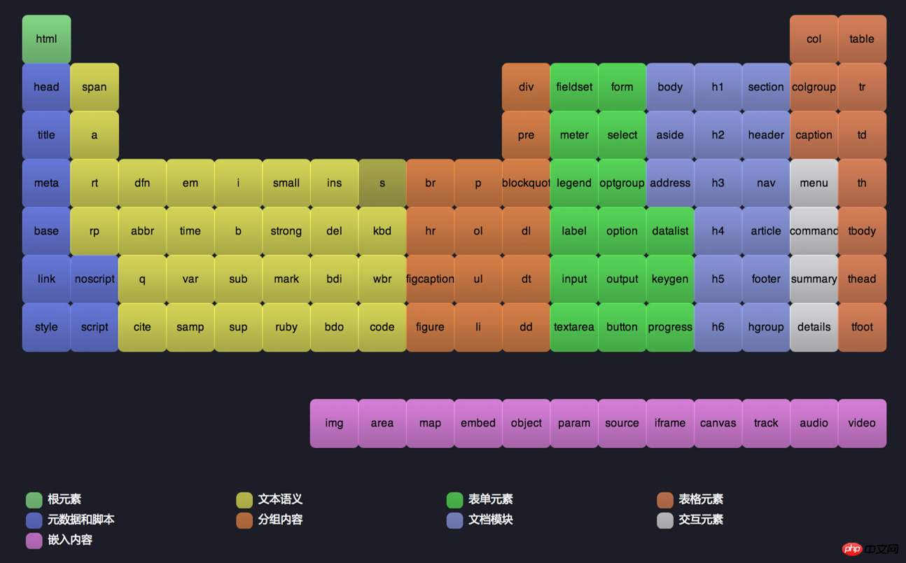

# 对语义化的理解

## 理解
- 用正确的标签做正确的事情

## 优点
- 在没有样式CCS情况下也以一种文档格式显示
- 便于`开发人员,屏幕阅读器,爬虫`阅读源码，解析源码

## 常用
即可指标签名，也可以指id以及class的命名
- h1 ~ h6
- p
- ul  ol  li
- dl  dt  dd
- em  strong 
- header  nav  article  section  aside  footer
- th  tbody
- address  
- dfn  code  samp  kbd  var  cite

&nbsp;  
* 头部：header
* 内容：content/container
* 尾部：footer

* 导航：nav
* 侧栏：sidebar
* 栏目：column
* 整体布局：wrapper
  
* 登录条：loginbar
* 标志：logo
* 广告：banner
  
* 页面主体：main
* 热点：hot
* 新闻：news
* 下载：download
* 子导航：subnav
* 菜单：menu
* 子菜单：submenu
* 搜索：search
* 功能区：shop
* 友情链接：friendlink
* 页脚：footer
* 版权：copyright
* 滚动：scroll
* 标签页：tab
* 文章列表：list
* 提示信息：msg
* 小技巧：tips
* 栏目标题：title
* 加入：join
* 指南：guild
* 服务：service
* 注册：regsiter
* 状态：status
* 投票：vote
* 合作伙伴：partner

## H5的语义化标签以及他们的作用和在浏览器的表现
- 

## 参考
- [浅谈web语义化](https://www.cnblogs.com/p2227/p/3586725.html)
- [web前端命名规范整理](https://www.jianshu.com/p/6417143c4b18)
- [语义化标签详解](https://www.php.cn/div-tutorial-372442.html)