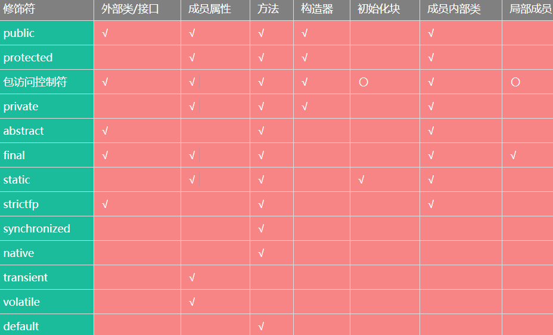

# Java基础

## 基础
- java源文件的命名:
  * 后缀必须是.java
  * 一般源文件命名是任意的,但假入源文件里定义了一个public类,则该源文件的主文件名必须与public类类名相同（即,一个源文件里最多只能有一个public类）
  * 另外建议:
    - 一个java源文件里只定义一个类,不同的类用不同的源文件定义
    - 每个源文件中单独定义的类都定义成public
- 面向对象
  * 继承:出现子类,意味着继承
  * 封装:把对象的实现细节隐藏起来,通过一些公用的方法来暴露该对象的功能
  * 多态:父类 = 子类,将子类对象赋给父类对象,但运行时依然表示出子类的特征,这意味着同一类型的对象在运行时可能表示出不同的行为特征
  * 抽象:并不了解全部,仅提取自己需要的部分（如Person类只定义人的部分属性）
- 装箱与拆箱
  * 在java语言中,除了8个基本数据类型值之外,一切皆对象。
    ```java
    boolean	Boolean
    byte	  Byte
    short	  Short
    int	    Integer
    long	  Long
    char	  Character
    float	  Float
    double	Double
    ```
  * 写法
    ```java
    Integer i1 = 5;  //自动装箱
    int i2 = i1;    //自动拆箱
    ```
    - 除此之外,包装类还能实现基本类型变量和字符串之间的转换,除了Character之外的所有包装类都提供了一个    parseXxx(String s)静态方法,用于将一个特定字符串转换成基本类型变量；
    除此之外,在String类也提供了多个重载valueOf()方法,用于将基本类型变量转换成字符串。
    ```java
    String intStr = “123”;
    int it = Integer.parseInt(intStr);          //把一个特定字符串转换成int变量
    String doubleStr = String.valueOf( 3.34 );  //把一个double变量转换成String变量
    ```
- 类型
  * 数字
    - 整型:byte（1字节 == `8 bit`） short（2字节） int（4字节） long（8字节）
    - 浮点型:float（4字节） double（8字节）
    - 当需要精确保存一个浮点数时,可以考虑使用BigDecimal类
    - 在char类型中,可以直接使用 \uXXXX 的Unicode值来表示字符常量
    - 以 0 开头的是八进制；以 0x 或 0X 开头的是十六进制
    - 引用类型:类（包括字符串）、接口、数组
    - boolean只能用true/ false表示
    - 注意整数除以0会抛出除零异常,而浮点数除以零则会得到正/负无穷大
    - 注意long、float需要后缀（L, F）
- java的标识符可以包含字符（包括中文字符、日文字符等）、下划线、数字、$（美元符号）,它采用Unicode编码
- foreach操作的是数组的副本（临时变量）
- Java的接口里能定义字段,但它是常量。就是默认public static final,必须声明它的值
- `==` 和 `equals` 比较运算符
  * ==用于基本数据类型变量的数值大小的比较（数据类型可以不同）
  * 当==用于引用类型时,比较的是引用地址
  * equals用于引用类型变量,它们必须指向同一对象；
  * 但当用于String类型变量时,String已经重写了equals（）方法,比较的是字符序列是否一致
  * 当用于Set集合(元素不可重复)时,equals( )比较的也是元素的值是否一致,而非对象的地址

## package & import 
- 一旦在java源文件中使用了这个package语句,则意味着该源文件里定义的所有类都属于这个包；
  * 位于包中的每个类的完整类名都应该是包名和类名的组合,如果其他人需要使用该包下的类,也应该是包名加类名的组合；
  * 写法
    ```java
    package lee;      //中有class Hello
    package lee.sub;  //中有class Tree
    虽然lee是lee.sub的父包,lee.sub是lee的子包
    但是Hello类在使用Tree类时,还是需要 new lee.sub.Tree( )
    同样的,Tree类在使用Hello类时,也需要 new lee.Hello( )
    ```
- import出现在package之后,class之前
  * 一个java源文件只能有一个package语句,但可以有多个import语句
  * import可以导入某个java文件的指定包层次下的某个类或全部类
  * import主要是为了省略类的前缀
  * java默认为所有的源文件导入java.lang包下的所有类
  * import有两种方式:
    - import java.util.*;  //表示导入java.util下的所有的类
    - import lee.sub.Hello;  //表示导入lee.sub包下的Hello类
  * import static 导入静态字段
    * 有两种方式:
      - import static packageName.ClassName.fileName;
      - import static packageName.ClassName.*;

## Enum
- enm默认继承java.lang.Enum类,且实现了java.lang.Serializable和java.lang.Comparable接口。enum不是继承Object类
- enum是一种特殊的类,若使用public修饰,则源文件也与其同名
- enum的构造器仅能使用private,若省略,则系统默认添加private
- enum的实例仅能使用public static final,若省略,则系统默认添加public static final
- enum类里默认添加了values方法,它可以方便地遍历所有的枚举值,如:
  ```java
  public enum SeasonEnum {
  	spring,summer,fall,winter;   //spring, fall, winter… 这些就是enum类的实例
  }
  可以直接SeasonEnum.spring, SeasonEnum.summer, SeasonEnum.fall…
  或者SeasonEnum.values() //表示Season的所有实例,可以用于foreach循环
  ```

## 类
- 访问控制级别：private < default ( 即无修饰符 ) < protected < public
- 类的定义,通常包含字段、方法、构造器、初始化块、内部类、枚举类六种成员,在其中只有`字段、方法、初始化块、内部类、枚举类`可以被`static`修饰
- 字段修饰符
  * 三选一	public、protected、private
  * 其他附加	static、final
  * 其他	abstract
- 构造器修饰符
  * 三选一：public、protected、private
- 重载&重写
  * java方法的重载“两同,一不同”:同一类中,同一方法名,但参数列表不同。至于其他的,如方法的返回值类型,修饰符等,与方法的重载无关。
  * 子类重写父类方法时应遵循”两同两小一大”:
    - 方法名同,形参列表同；
    - 子类方法返回值类型应比父类方法返回值类型更小或相等,
    - 子类方法声明抛出的异常应比父类方法声明抛出的异常类更小或相等,
    - 子类方法的访问权限应比父类方法更大或相等。
- 子类调用被覆盖的父类方法`super.fly( );`  `//fly( )是被覆盖的方法`
  * 同理,super还能用于调用父类的被覆盖的属性
- java默认构造器,把所有的数值设为0或false,所有引用类型设为null。
  * java里一旦定义了有参的构造器,那么系统将不再提供默认的无参构造器,因此一般最好再自己手动补上无参的构造器
- final
  ```js
  final修饰类,变量以及方法
  final修饰的无法被改变,它将保持初始化的状态(一般在初始化块、构造器中赋初值)
  final修饰的变量系统不会为其进行隐式初始化,需要你手动初始化
  final修饰的基本数据类型变量无法重新赋值,但引用类型变量只要引用的地址不变即可
  final修饰的基本数据类型相当于常量,命名规则为MAX_RATE （全部大写,有下划线）
  final修饰的方法无法被子类重写,但private final修饰的方法可以被子类重写,因为private,所以其本质不是重写,只是子类的一个与父类及其相似的方法
  final修饰的方法不能被子类重写,但可以在同一类中被重载
  final修饰的类不能有子类
  当用final修饰引用类型的变量(如String类型)时,仅表示该引用变量无法被重新赋值,但引用类型所指向的对象仍可以被改变(如指向一个数组,数组可被重新排序)
  ```
- java修饰符适用范围表
  * 

## 接口
- 接口让规范与实现分离
- 接口用到的关键字:interface  extends  implements
- 接口修饰符为:public以及无（default）
- 接口内只能包含:常量字段、抽象方法、内部接口、枚举类
- 接口成员默认public
- 接口里的字段（常量）默认添加public static final
- 接口里的方法默认添加public abstract
- 接口可以当作一个特殊的类,因为在一个java源文件里最多只能有一个public接口

## 输入
- Scanner获取键盘输入
  * 一个基于正则表达式的文本扫描器
  * 它可以从文件、输入流、字符串中解析出基本类型值和字符串值
  * Scanner类提供多个构造器,用于从不同数据源(文件、输入流、字符串)中解析数据
  * 默认情况下,Scanner使用空白(空格、Tab、回车)作为多个输入项之间的分隔符
  * Scanner有两种方法来扫描输入:
    - hasNextXxx(): 是否还有下一个输入项；
      * 其中Xxx可为Int、Long等代表基本数据类型的字符串
      * 若需要判断是否包含下一个字符串,则可以省略Xxx 
      * 同理boolean hasNextLine():返回输入源中是否还有下一行
    - nextXxx(): 获取下一个输入项
      * Xxx的含义与hasNextXxx()中的含义相同，如:
        ```java
        public static void main(String[] args) {
          Scanner sc = new Scanner(System.in);  //System.in代表标准输入,就是键盘输入
          //sc.useDelimiter(“\n”); //增加此一行将只把回车作为分隔符
          //判断是否还有下一个输入项
          while(sc.hasNext()) {
            System.out.println(“键盘输入的是:” + sc.next());
          }
        }

        useDelimiter(“\n”)这样程序会把每行输入当作一个输入项,同理空格、Tab空白
        ```
      * Scanner还可以读取文件输入:
        ```java
        public static void main(String[] args) throws Exception {
          Scanner sc = new Scanner( new File(“a.txt”) );  //程序会读取a.txt的内容
          System.out.println(“a.txt文件内容如下:”);
          while(sc.hasNextLine()) {
            //判断是否还有下一个输入项
            System.out.println(sc.nextLine());
          }
        }
        ```

## 数组
- 数组的初始化
  ```java
  静态初始化:int[] array = new int[]{1,2,3};
  静态初始化:int[] array = {1,2,3};         //不指定长度,但指定数组元素
  动态初始化:int[] array = new int[3];      //指定长度,不指定数组元素
  静态初始化与动态初始化不能同时进行,也就是说不能同时指定数组长度,又指定数组元素
  静态初始化不能分成两行写,动态初始化可以分两行写,如:int[] array; array = new int[5];
  ```
- 数组默认:整型默认为0,浮点型默认为0.0,字符型默认为‘\0’,布尔类型默认为false,引用类型默认为null
- 为了在强制类型转换时避免ClassCaseException异常,需要了解一下instanceof运算符
  * instanceof前一个操作数是一个引用类型的实例变量,后一个操作数是一个类（或接口,接口可以理解为特殊的类）。
  * 它用于判断前面的对象的类型是否是后面的类,或者是后面类的父类。它返回true或false
