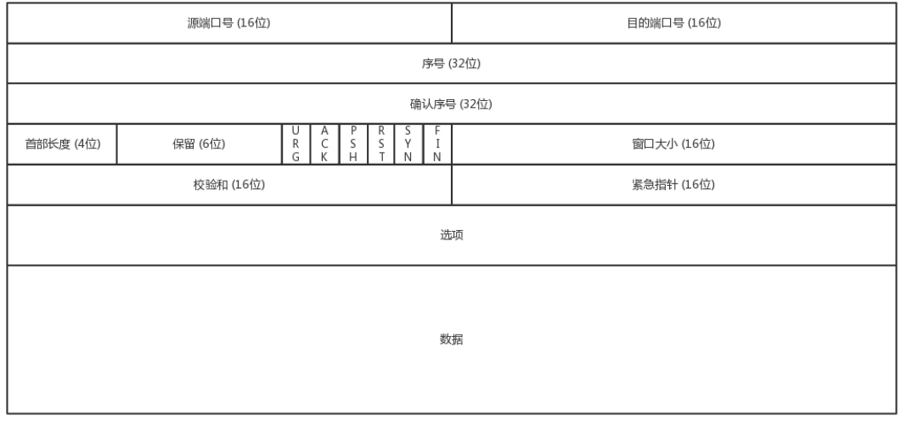
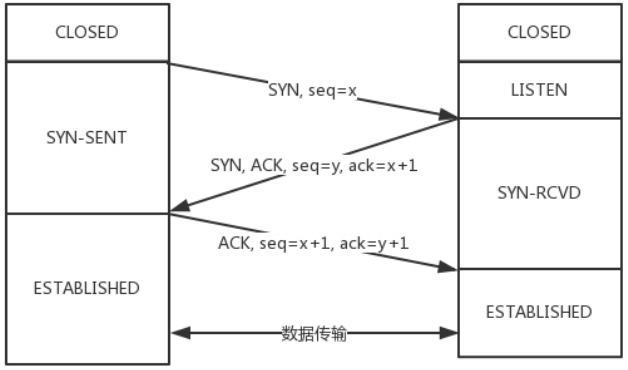
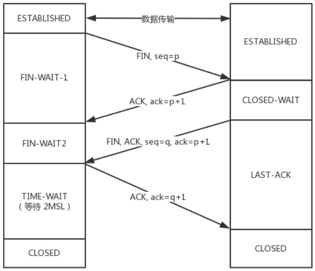
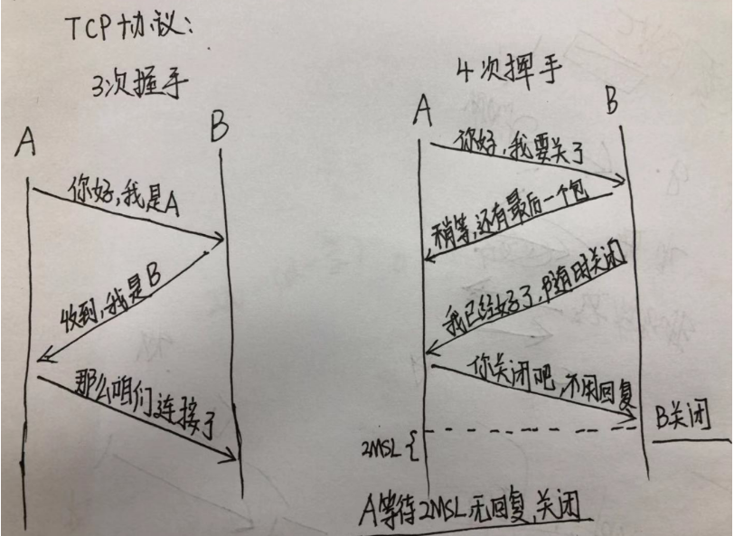

# TCP
## OSI(Open Systems Interconncection，开放系统互联)网络分层
- 应用层(Application)
- 表示层(Presentation)
- 会话层(Session)
- 传输层(Transport)
- 网络层(Network)    -- 路由器
- 数据链路层(Data Link) -- 交换机
- 物理层(Physical) -- 网卡、集线器（Hub）

## TCP携带的内容
### 内容

### 简析
- `端口号`：tcp协议层是不关心ip的，具体ip的定位是由ip层来决定的，但是tcp层需要确定端口号，所以他会携带source 和 destination的port信息，以便能找到对应的端口号；
- `包的序号 - sequence number `：解决数据的乱序问题
   - 实际中使用的SEQ，也就是序号，这个序号起了很重要的作用  
   - 我们都知道tcp和udp最大的区别在于tcp是稳定并且有序的，(`TCP在传输数据包时,并非一个个地传送,而是多个同时一起传输,因此需要保证数据的顺序`)
   - 其中seq就可以保证有序，当A向B发送一个数据包的时候，seq会叠加，
   - 每一个传输方在传送数据的时候都会带上这个信息，另一端能按照这个序号来排序收到信息的顺序，从未保证了信息的传递是有序的，也能通过它来确认有没有出现丢包的情况；
   - seq不是从1开始的，它与当前时间相关(可以看成一个 32 位的计数器，每 4ms 加一，如果到重复，需要 4 个多小时, 大于IP包头的 TTL,即生存时间),避免了重复：
     * 例如，A 连上 B 之后，发送了 1、2、3 三个包，但是发送 3 的时候，中间丢了，或者绕路了，于是重新发送
     * 后来 A 掉线了，重新连上 B 后，序号又从 1 开始，然后发送 2，但是压根没想发送 3，
     * 但是上次绕路的那个 3 又回来了，发给了 B，B 自然认为，这就是下一个包，于是发生了错误
   - 另外要注意的是当有数据需要发送的时候，seq会随该序列号为原点，对自己将要发送的每个字节的数据进行编号，比如当前seq = 10，本次要发送的数据包大小是200字节，那么实际发送的时候会更新seq=210，以便保证传输的数据的顺序；
   - 
- `确认序号 - acknowledge number`：解决丢包问题，确认发出去的包对方已经收到
  * 实际中使用的ACK，是另一端对对方seq的一个回应，一般会把对方给的seq+1然后下一次发包的时候带上，这样的话对方就知道我们是收到前面的消息的；
- 状态位（TCP 是面向连接的，因而双方要维护连接的状态，这些带状态位的包的发送，会引起双方的状态变更）：
  * SYN 是发起一个连接
  * ACK 是回复
  * RST 是重新连接
  * FIN 是结束连接
- windown代表的是滑动窗口，实际中用win来表示
  * 表示流量控制，通信双方各声明一个窗口，标识自己当前能够的处理能力，别发送的太快，也别发的太慢
  * win的大小很重要，win越大的传输越快，因为win的大小直接决定了某一端一次可以同时发送多少个数据包，而不用等待对方的应答ACK回来，但是win会随着每一个数据包的发送而变小(稍后解释);

## 三次握手 - （请求 -> 应答 -> 应答之应答）
- A：B，你好，我是A 请求建立连接，我的seq是0，我的win是65535，我希望本次回应我的内容长度len为0，我本次能接收的最大内容是1460，over；
- B：A，你也好，收到你的信息了，我是B，我本次的seq是0（注意，双方的序号是独立计算的，这里都从0开始的），我回应你的ack是1(A的seq+1，代表我收到你seq是0的消息了)，我的窗口大小是8192，我希望你回应我本次消息的len也是0，我这边能接收的最大回应大小是1452，over；
- A：好的，我收到你的回应了，我现在给你发送的seq是1(上一次是0，这次是1)，我回应你的ack是1(B的seq+1)，我当前的窗口大小是25984，我希望的回应长度是0；我们建立好连接了，over
- syn / syn + ack / ack
  
### 为什么不是1次,2次或4次
### 简单理解
- 首先，1次肯定不行，1次的话 一方无法确认另一方的情况，所以最少都是2次起步，
- 2次：
  * A：喂喂喂，我是A，你听的到吗？
  * B：在在在，我能听到，我是B，你能听到我吗?
  * A：(听到了，老子不想理你)
  * B：喂喂喂？听不听到？我X，对面死了，我挂了。。
- 4次：
  * A：喂喂喂，我是A，你听的到吗？
  * B：在在在，我能听到，我是B，你能听到我吗?
  * A：听到了，你呢？你能听到吗？
  * B：？？你是智障？我不是说了我能听到吗，不想跟xx说话。。。
### 详细解释
- TCP的核心是认为网络一定是不可靠的，一定会丢包，一定会重复，一定会乱序
- 考虑一种最差的情况(无状态连接下可能遇到的各种意外)：
  * > A 要发起一个连接，会有很多的可能性，比如第一个请求包丢了，再如没有丢，但是绕了弯路，超时了，还有 B 没有响应，不想和A连接。
  * > A 不能确认结果，于是再发，再发。终于，有一个请求包到了 B，但是请求包到了 B 的这个事情，目前 A 还是不知道的，A 还有可能再发。
  * > B 收到了请求包，就知道了 A 的存在，并且知道 A 要和它建立连接。如果 B 不乐意建立连接，则 A 会重试一阵后放弃，连接建立失败，没有问题；如果 B 是乐意建立连接的，则会发送应答包给 A。
  * 当然对于 B 来说，这个应答包也会重复刚刚 A 发给 B 时候遇到的困难，不知道能不能到达 A。`这个时候 B 自然不能认为连接是建立好了`，因为应答包仍然会丢，会绕弯路，或者 A 已经挂了(被用户关闭了)都有可能。`因此两次握手不够`
 * > 而且这个时候 B 还能碰到一个诡异的现象就是，A 和 B 原来建立了连接，做了简单通信后，结束了连接。还记得吗？A 建立连接的时候，请求包重复发了几次，有的请求包绕了一大圈又回来了，B 会认为这也是一个正常的的请求的话，因此建立了连接，可以想象，这个连接不会进行下去，也没有个终结的时候（`B一直重发给A,但也要么超时要么丢包,之后B放弃了。过了一段时间, A终于收到这些连接请求, A回复这些请求, 确认建立连接。一直循环重复?`）。因而两次握手肯定不行。
- 因此就需要为这些连接请求添加状态，同时对于`请求 -> 应答 -> 应答之应答`中的`应答`要添加一个`应答之应答`
- 当然四次握手也是可以的，但作用和三次握手一样，且即便1000次握手也不能保证数据百分百可靠，只是尽量可靠(`毕竟TCP协议在传输层做的再好,也可能被其他层拖累,例如网络层的IP协议是无状态的连接`)
  
## 四次挥手
-   
  * A（左侧）在收到B（右侧）的`ACK`后，假如此时B跑路,那么A将一直处于`FIN-WAIT2`的状态(但一般会设置超时的)
  * 在B发送`FIN, ACK`之后,假如A没有回复而是选择跑路,那么将导致：
    - B会继续发送`FIN, ACK`
    - A跑路后端口就会空余出来，并可能被新应用占用该端口。但此时B并不知情，所以可能产生混乱
  * 在最后A发送`ACK`后，A还需要等待2MSL, MSL是`Maximum Segment Lifetime`
- 我们知道tcp的连接是全双工的
  * A和B是可以互相通信的，不理解的话，可以想想打电话（类比，不要当真），打电话的场景就是单双工的，因为同一时间只能一个人说话，另一个人听(`假设`)，如果2个人一起说话，那谁都听不清楚了，
  * 但是tcp是全双工的，就是A 正在给 B发信息的同时，B也在给A发信息，所以当断开的时候，必须要求双方都得知道，如果只有一方知道，肯定不行，因此，断开的时候，就需要4次挥手
  * 

## 问题
### 为什么握手需要三次，而挥手却需要四次
- 握手的时候，A和B打个招呼，B可以直接把自己的SYN信息和对A的回应ACK信息一起带上;
- 但是挥手的时候，A说我要断开了，B还没发完最后的数据，因此需要先回应一下A，我收到你的断开的请求了，但是你要等我把最后的内容给你，所以这里分开了2步：
  * 回应A;
  * 发送自己的最后一个数据
### 网络本身是不稳定的,tcp是如何在尽可能少的时间内实现稳定和有序传输的(滑动窗口)
- SYN信息中会带上自己的seq，序号，这样可以保证另一方接受到后知道如何排序，
- 但是如果发送必须都是同步的，例如：
  * A 给 B发送的时候，需要给B 1，2，3，4，5个包，发了1后，死等1的ack回来，再给2，死等2的ack回来，
  * 在linux下每个tcp的timeout最大是2^5 - 1 = 63s
    - (默认的retrytime是5次)的时间，
    - 因为当发了一个包出去后，在一定时间内没收到ACK回应，为了确认不能丢包的问题，会启动重试机制，
    - 重试5次，它们的延迟分别是：1 秒、3 秒、7 秒、15 秒、31 秒，
    - 其中31s是前5次重试的时间1+2+4+8+16=31s，最后的32s是等待最后一次重试也超时(等待的时间是2的N次方秒)，所以一共就是63s，
    - 如果一个一个等，万一网络环境比较差，所以为了能在不丢包的情况下，尽量减少时间的损耗，引入了滑动窗口的概念，window
- 由于窗口由16位bit所定义，所以接收端TCP，窗口能最大提供65535个字节的缓冲，其实这个滑动窗口主要就是做限流和缓冲用的，
- 每一个tcp传输中的win提供的是对方的窗口大小，当A向B发数据的时候，超过B的win长度的数据会被丢掉，同时窗口还可以提高发送数据的效率，通过类似于并发的行为
### 滑动窗口介绍
- TCP将数据归类为4类，包括：
  * > 第一部分：发送了并且已经确认的。这部分是应该划掉的。
  * > 第二部分：发送了并且尚未确认的。这部分是还没做完的，需要等待做完的回复之后，才能划掉。 
  * > 第三部分：没有发送，但是已经等待发送的。
  * > 第四部分：没有发送，并且暂时还不会发送的。
  * > 滑动窗口包括的是第二以及第三部分 
- 早期的网络通信中，通信双方不会考虑网络的拥挤情况直接发送数据。由于大家不知道网络拥塞状况，同时发送数据，导致中间节点阻塞掉包，谁也发不了数据，所以就有了滑动窗口机制来解决此问题。
- 滑动窗口协议是用来改善吞吐量的一种技术，即容许发送方在接收任何应答之前传送附加的包。接收方告诉发送方在某一时刻能送多少包（称窗口尺寸）。
- TCP中采用滑动窗口来进行传输控制，滑动窗口的大小意味着接收方还有多大的缓冲区可以用于接收数据。发送方可以通过滑动窗口的大小来确定应该发送多少字节的数据。
- 当滑动窗口为0时，发送方一般不能再发送数据报，但有两种情况除外，一种情况是可以发送紧急数据，
  * 例如，允许用户终止在远端机上的运行进程。
  * 另一种情况是发送方可以发送一个1字节的数据报来通知接收方重新声明它希望接收的下一字节及发送方的滑动窗口大小。
### 丢包与快速超时重试机制（TCP的流量控制）
```
假如A给的分别是1，2，3，4到5 5个包，
B这边收到1，Ack一个2（代表收到1了），
然后2丢了，3、4和5收到了，能直接ACK = 6吗？
```
这样的话tcp就是不稳定的了，考虑超时重传的2种方案：
1. timeout后只重新传2；
2. timeout后重新给2、3、4、5；
- 2种方案有好有坏，第一种比较慢，第二种浪费带宽，所以tcp引入了一种快速超时重试机制(Fast Retransmit算法)
  * 不以时间计算，而以数据做驱动重新传送，如果包没有连续到达，比如1到了，2没到，3，4，5也到了，这个时候，B始终返回ACK=2，代表只确认1，然后A就知道2没到，重新发2，
  * 但是B一旦收到2会直接ACK=6给A，这个的意思就是说2拿到后，345也收到了，直接给6就ok
### TCP的拥塞控制
- 拥塞控制是为了避免丢包以及超时重传的
- TCP在传送数据包时，一开始会很慢，假如网络状态良好，那么它会逐渐增大速度，直到效率最高，这叫`慢启动`


### DDos攻击
- tcp的握手环节是比较耗时的，当client端发起连接请求的时候，server端会回应，然后等待client的最终确认信息，默认情况下的linux会等待1到63s
- 这段时间内属于半连接的状态，服务器不会丢弃掉这些连接，而是会等
- 若攻击者客户端瞬间向服务器发起几千万个连接请求(SYN)，但对SYN-ACK不做回应(不返回ACK),让服务端处于等待状态(正常的用户无法访问)


# UDP
- 和TCP一样，主要是包含`源端口，目标端口`
- UDP包头
  
- 适用场景：
  * 对丢包不敏感，要求实时性强
  * 多用于视频直播，在线游戏，物联网(设备限制,难以维护TCP)
  * `DHCP、VXLAN、QUIC`等协议利用`udp`快速的特点,将拥塞控制等功能放到应用层解决

# 区别
### 连接
- TCP 是面向连接的，UDP 是面向无连接的
  * 什么是连接?在客户端,服务器互通之前,面向连接的协议会先建立连接,例如,TCP的三次握手
  * 所谓连接，即为了在客户端和服务端维护连接，而建立一定的数据结构来维护双方交互的状态(保证数据不丢失,不重复,有次序)
- TCP是面向字节流。而UDP 继承了 IP 的特性，基于数据报的，一个一个地发，一个一个地收。
- TCP有拥塞控制,当包丢弃或者网络环境不好,会有相应的措施。UDP没有拥塞控制。
- TCP 其实是一个有状态服务，精确地记着发送了没有，接收到没有，发送到哪个了，应该接收哪个了。而UDP 则是无状态服务。

## 参考
- [作为前端的你了解多少tcp的内容](https://juejin.im/post/5c078058f265da611c26c235)