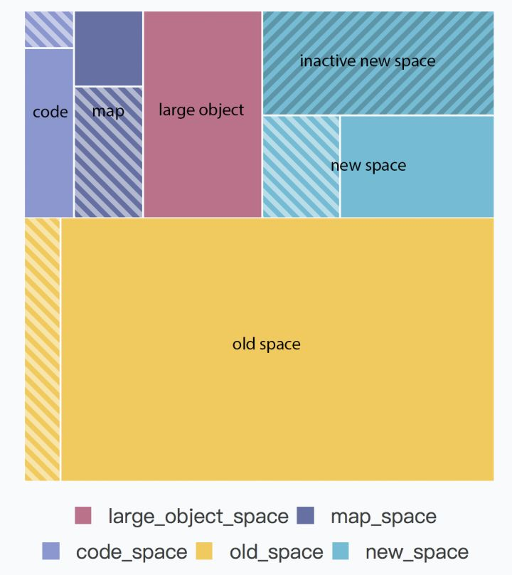

# 内存控制

## 概念
- 有了GC, 开发人员不需要关心内存操作, 不需要像C语言一样自己动手管理内存
- 内存控制只在服务器上讲才有意义  
  因为在浏览器端，一个网页不会运行太久(一般浏览十几分钟就关了),且以及内存泄漏也只会影响个别用户,无内存管理的必要  
  然而在服务器上资源寸土寸金,对`CPU`以及`I/O`的内存控制,垃圾回收都十分敏感
- NodeJS因V8而性能卓越,也因V8而倍受限制  
  NodeJS在64位系统下最多支持1.4GB内存，为何作此限制：  
  * 表层原因：V8最初是用于浏览器的,没有考虑大文件
  * 深层原因：V8的垃圾回收机制(堆内存越大,垃圾回收时间越长,且会完全阻塞JS线程,所以干脆限制V8内存在一个较小值以避免长时间阻塞)
- 若需操作大文件,不能使用`fs.readFile()`与`fs.writeFile()`这些,改用`fs.createReadStream()`以及`fs.createWriteStream()`
- NodeJS的默认内存限制是可以修改的

## V8垃圾回收机制
### V8内存构成
- 新生代内存区（new space）  
  大多数的对象都会被分配在这里，这个区域很小但是垃圾回收比较频繁；  
  默认最大 32 MB; 分为: inactive(非活跃区) 以及 active(活跃区) 两种  
- 老生代内存区（old space）  
  属于老生代，这里只保存原始数据对象，这些对象没有指向其他对象的指针；  
  默认最大 1400 MB  
- 大对象区（large object space）  
  这里存放体积超越其他区大小的对象，每个对象有自己的内存，垃圾回收其不会移动大对象区；
- 代码区（code space）  
  代码对象，会被分配在这里。唯一拥有执行权限的内存；
- map 区（map space）  
  存放 Cell 和 Map，每个区域都是存放相同大小的元素，结构简单。
- V8内存构成  
  
### 内存生命周期
- 假设代码中有一个对象 jerry ，这个对象从创建到被销毁，刚好走完了整个生命周期，通常会是这样一个过程：
  * 这个对象被分配到了 new space；
  * 随着程序的运行，new space 塞满了，gc 开始清理 new space 里的死对象，jerry 因为还处于活跃状态，所以没被清理出去；
  * gc 清理了两遍 new space，发现 jerry 依然还活跃着，就把 jerry 移动到了 old space；
  * 随着程序的运行，old space 也塞满了，gc 开始清理 old space，这时候发现 jerry 已经没有被引用了，就把 jerry 给清理出去了。
- 第二步里，清理 new space 的过程叫做 `Scavenge`，这个过程采用了空间换时间的做法，用到了上面图中的 inactive new space，过程如下：
  * 当活跃区满了之后，交换活跃区和非活跃区，交换后活跃区变空了；(活跃区的`活跃`不是指对象活跃,而是指`Scavenge`算法活跃)
    - 分配新对象时,先将对象分配到活跃区
    - 回收时,先扫描活跃区,将活跃区的`存活的`对象复制到非活跃区内,然后将活跃区的内存全部释放,然后交换活跃区与非活跃区角色
    - `Scavenge`判断某一对象是否存活(是否应将其从活跃区移动至非活跃区)(以下两个条件任取一个)
      1. 某一对象是否已经有过一次`Scavenge`回收
      2. 非活跃区空间已经使用了 25%
  * 将非活跃区的两次清理都没清理出去的对象移动到 old space；
  * 将还没清理够两次的但是活跃状态的对象移动到活跃区。
- 第四步里，清理 old space 的过程叫做 Mark-sweep (标记阶段 - 清除阶段)，这块占用内存很大，所以没有使用 Scavenge，这个回收过程包含了若干次标记过程和清理过程：
  * 标记从根（root）可达的对象为黑色；
  * 遍历黑色对象的邻接对象，直到所有对象都标记为黑色；
  * 循环标记若干次；
  * 清理掉非黑色的对象。
  * 简单来说，Mark-sweep 就是把从根节点无法获取到的对象清理掉了
  * Mark-Sweep 会导致内存碎片(内存空间之间不连续,零碎的空间无法存储大对象),需要依靠`Mark-Compact`进行内存整理
### 垃圾回收算法
- V8的垃圾回收算法是将内存划分为`新生代`以及`老生代`
- 没有适合所有场景的垃圾回收算法,只有最适合某一场景的垃圾回收算法
  
## 参考
- [深入浅出NodeJS]()
- [V8 内存浅析](https://zhuanlan.zhihu.com/p/33816534)
- [浅谈V8引擎中的垃圾回收机制](https://segmentfault.com/a/1190000000440270)
- [V8内存管理机制](https://new.qq.com/omn/20180727/20180727G11BRC.html)