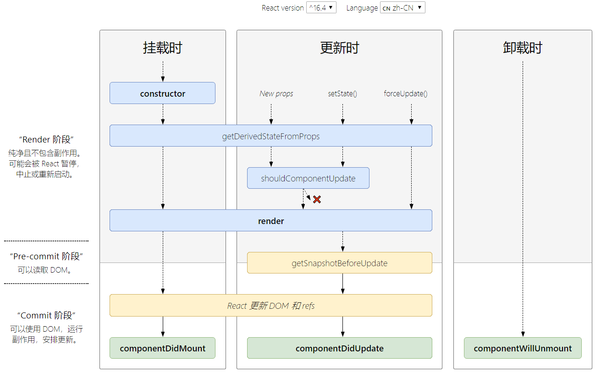

# React入门

## 安装与使用
- npm install -g create-react-app
- cd 到目录
- create-react-app `[demo名字]`
- cd 到项目文件夹
- yarn start
- 整理目录结构`src`以及`public`
  * 删除多余的文件`public`下只剩`index.html`,`src`下只剩`index.js`
  * `npm run eject`
  * 添加`src/common`以及`src/pages`以及`src/router`以及`src/statics`以及`src/store`以及`src/style.js`
  * 安装`cnpm i -S react-loadable react-redux react-transition-group redux redux-immutable redux-thunk styled-components react-dom`
- 文件撰写
  * src/index.js
  * src/store
  * src/router/index.js
  * src/store/index.js
- 新建一个组件
  * src/pages/list/index.js
  * src/pages/list/style.js
  * src/pages/list/loadable.js
  * src/pages/list/store/index.js
  * src/pages/list/store/reducer.js
  * src/pages/list/store/constants.js
  * src/pages/list/store/actionCreators.js
- [文件目录结构参考](https://github.com/soitwaterdemos/react-jianshu)

## 文件目录
- `src/index.js`
  * 整个项目的入口
- `public/manifest.json`
  * PWA 的配置信息

## JSX
- JSX默认防止XSS跨站脚本攻击，因为React DOM 在渲染所有输入内容之前，默认会进行转义。
- JSX与vue的后缀为`vue`的文件的`<template>`很像
- JSX内写注释
  ```js
  render() {
    return (
      <Fragment>
        { /*注释*/ }
        {
          // 单行注释
        }
      </Fragment>
    )
  }
  ```
- JSX语法会被babel转译
  ```js
  const element = (
    <h1 className="greeting">
      Hello, world!
    </h1>
  );
  ```
  ```js
  const element = React.createElement(
    'h1',
    {className: 'greeting'},
    'Hello, world!'
  );
  ```
- JSX的最外层和vue的模板`template`一样，必须且只能存在一个父元素。若不想要父元素还可以使用占位符`Fragment`：
  ```js
  import React, { Component, Fragment } from 'react'
  class TodoList extends Component {
    render () {
      return (
        <Fragment></Fragment>
      )
    }
  }
  export default TodoList
  ```
- 样式类名不使用'class'，而使用'className'
- react禁用掉默认的字符串转译，即`<h1>标题一</h1>`应该显示为`标题一`
  ```js
  <ul>
    {
      this.state.list.map((item, index) => {
        return (
          <li 
            key={index} 
            onClick={this.handleItemDelete.bind(this, index)}
            {/* item是需要显示的html元素 */}
            dangerouslySetInnerHTML={{__html: item}}
          >
            {/* {item} */}
          </li>
        )
      })
    }
  </ul>
  ```
- 关于一个应用场景
  * 要求点击`<label>`标签后，光标自动转入`input`框内
  * 写法
    ```js
    { /* 在react是 htmlFor 而不是 for */ }
    <label htmlFor='insertArea'>输入内容</label>
    <input
      id='insertArea'
      value={this.state.inputValue}
      onChange={this.handleInputChange.bind(this)}
    />
    ```
- 内联样式的写法
  ```js
  <Input style={{'width': '300px', 'marginRight': '10px'}}/>
  ```

## 函数的this绑定
- 最基础的方法是在JSX中：
  ```js
  (<div onClick={ this.handleClick.bind(this) }></div>)
  ```
- 更好的方法是在constructor()中,性能更佳：
  ```js
  class TodoList extends Component {
    constructor(props) {
      super(props)
      this.handleClick = this.handleClick.bind(this)
    }
  }
  ```

## react的双向绑定
- vue中的双向绑定有api提供，react中则需要手动实现
- 例子
  ```js
  import React, { Component, Fragment } from 'react'
  
  class TodoList extends Component {
    constructor(props) {
      super(props)
      this.state = {
        inputValue: '?',
      }
    }
    handleInputChange(e) {
      this.setState({
        inputValue: e.target.value
      })
    }
    render () {
      return (
        <Fragment>
          <div>
            <input 
              value={this.state.inputValue}
              onChange={this.handleInputChange.bind(this)}
            />
            <button>提交</button>
          </div>
          <ul>
            <li>{this.state.inputValue}</li>
          </ul>
        </Fragment>
      )
    }
  }
  
  export default TodoList
  ```

## `ReactDOM.render()`
- react与vue一样，都是将虚拟dom用对象表示，在所有操作完成后，调用渲染函数，将整个文档渲染出来。
- 一个应用一般调用一次`ReactDOM.render()`,相当于vue项目中`src/main.js`里的：
  ```js
  new Vue({
    router,
    store,
    render: h => h(App)
  }).$mount('#app')
  ```
- 当virtual dom改变，`ReactDOM.render()`只会渲染有差异的部分
- 和vue的vdom算法类似
- 代码
  ```js
  const element = <h1>Hello, world</h1>;
  ReactDOM.render(
    element, // 相当于vue中的自定义组件
    document.getElementById('root') // 相当于vue项目中的'src/App.vue'
  );
  ```

## 组件
- 组件名字的首字母大写，首字母小写的会被react视为原生DOM标签
### 函数组件
```js
function Welcome(props) {
  return <h1>Hello, {props.name}</h1>;
}
```
### 使用ES6的class定义组件
```js
class Welcome extends React.Component {
  render() {
    return <h1>Hello, {this.props.name}</h1>;
  }
}
```
### 组合组件
```js
function Welcome(props) {
  return <h1>Hello, {props.name}</h1>;
}

function App() {
  return (
    <div>
      <Welcome name="Sara" />
      <Welcome name="Cahal" />
      <Welcome name="Edite" />
    </div>
  );
}

ReactDOM.render(
  <App />,
  document.getElementById('root')
);
```
### UI组件(渲染)与容器组件(业务逻辑)的拆分
- UI组件也称傻瓜组件
- 容器组件也称聪明组件
- 容器组件通过`props`将数据/函数传给UI组件, UI组件通过`this.props.属性`获取
### 无状态组件
- 即使用 `function` 的方式创建组件，而不是使用 `class` 的方式创建
- 若一个`class`有状态组件内仅有一个`render()`函数,那么它可以被改写为无状态组件
- 无状态组件的性能更高，因为`class`组件还有生命周期函数等消耗

### props
- 传入组件的参数props不应该被修改，若要修改应该使用state
- props相当于vue中单文件上`template`上的写在元素标签的属性，如：``
- 类组件的props通过类似于`this.props.src`的方法来获取
- prop-type
  * 校验props的数据类型
  * 写法
    ```js
    import PropTypes from 'prop-types'
    
    组件类名.propTypes = {
      // 接收的 props 的数据类型
      content: PropTypes.string,
      // 类型可以是其中之一
      deleteItem: PropTypes.oneOfType(PropTypes.func, PropTypes.number), 
      index: PropTypes.number
    }

    组件类名.propTypes = {
      // 必须传值
      content: PropTypes.string.isRequired,
    }

    组件类名.defaultProps = {
      // 默认 props 值
      content: 'default value'
    }
    ```

### state
- State 与 props 类似，但是 state 是私有的，并且完全受控于当前组件
- state 相当于 vue 中的组件中的`data`
- 构造函数是唯一可以给`this.state`赋值的地方，其他地方修改state应该使用`this.setState({comment: 'Hello'})`
  ```js
  class Clock extends React.Component {
    constructor(props) {
      super(props);
      this.state = {
        date: new Date()
      };
    }
  
    render() {
      return (
        <div>
          <h1>Hello, world!</h1>
          <h2>It is {this.state.date.toLocaleTimeString()}.</h2>
        </div>
      );
    }
  }
  ```
- `this.setState()`会异步更新，因此`this.setState()`应该接受一个函数，避免state未更新
  ```js
  // state 表示上一个未更新的 state, props 表示此次更新被应用时的 props 
  // 使用箭头函数或者普通函数没有影响
  this.setState((state, props) => ({
    counter: state.counter + props.increment
  }));
  ```
- 如果需要在setState()异步更新后继续执行回调操作, setState() 提供第二个回调函数
  ```js
  this.setState((prevState, props) => {
    return {
      list: [...prevState.list, prevState.inputValue]
    }
  }, () => {
    // 异步更新后的其他操作
  })
  ```
- 状态提升
  * 在 React 中，将多个组件中需要共享的 state 向上移动到它们的最近共同父组件中，再通过`props`发给各个子组件，便可实现共享 state。这就是所谓的`状态提升`。
  * [参考](https://www.baidu.com/link?url=BSMAYPCeJsUbV10NZ_CMWe7pH9HqV1zwcbscWk22mpfQ6HtAXp8gFNKSWxyyjtpY&wd=&eqid=cf24142b00006ecb000000065e0eb248)

## 组件间传值
- 父组件传递数据给子组件：props（与vue写在模板`template`上的属性类似）
- 子组件传递数据给父组件：通过在子组件中调用父组件的函数来完成(类似于vue中的`emit`)
  ```java
  // 父组件
  class CommentApp extends Component{
    constructor(){
      super();
      this.state = {comment:[]}
    }
    printContent(comment){
      this.setState({comment});
    }
    render(){
      return (
        <div>
          { /* 
              onSubmit将父组件的函数 printContent 传递给子组件；
              注意这里需要写 .bind(this) 传递的是父组件的 printContent 函数   
            */ }
          <CommentInput 
            onSubmit={this.printContent.bind(this)} 
          />
        </div>
      )
    }
  }
  // 子组件
  class CommentInput extends Component{
    constructor() {
        super();
        this.state = {};
    }
    submit() {
      this.props.onSubmit(['name'])
    }
    render() {
      return (
        <button onClick={this.submit.bind(this)}>submit</button>
      )
    }
    }
  ```
- 兄弟组件之间的传值
  * 兄弟A传值给共同的父组件，父组件再传递给兄弟B
- redux
- Component Composition
  * React 中的`props`可以接受`React元素`，相当于VUE中的`slot`
  * 这样可以让组件间传值更加简便（通过一个父组件实现各个`props(React元素组件)`间的传值）
- Render Prop 模式
  * 它告知组件需要渲染什么内容
  * 它是一个写在标签上的，指一种在React组件之间使用一个值为函数的`prop`共享代码的简单技术
  * 它可以把特定行为或功能封装成一个组件，提供给其他组件使用让其他组件拥有这样的能力
  * 属性的名不一定是`render`，可以是其他的名字
  * `react-router`框架源码里为每一组件增加路由属性就是这个方法
  * [官方文档](https://zh-hans.reactjs.org/docs/render-props.html#___gatsby)
  * 官方例子
    ```java
    class Cat extends React.Component {
      render() {
        const mouse = this.props.mouse;
        return (
          
        );
      }
    }
    
    class Mouse extends React.Component {
      constructor(props) {
        super(props);
        this.handleMouseMove = this.handleMouseMove.bind(this);
        this.state = { x: 0, y: 0 };
      }
    
      handleMouseMove(event) {
        this.setState({
          x: event.clientX,
          y: event.clientY
        });
      }
    
      render() {
        return (
          <div style={{ height: '100%' }} onMouseMove={this.handleMouseMove}>
            {this.props.render(this.state)}
          </div>
        );
      }
    }
    
    class MouseTracker extends React.Component {
      render() {
        return (
          <div>
            <h1>移动鼠标!</h1>
            <Mouse render={mouse => (
              <Cat mouse={mouse} />
            )}/>
          </div>
        );
      }
    }
    ```
  - `render prop`还能与`HOC`搭配
    ```js
    function withMouse(Component) {
      return class extends React.Component {
        render() {
          return (
            <Mouse render={mouse => (
              <Component {...this.props} mouse={mouse} />
            )}/>
          );
        }
      }
    }
    ```
- context api 
  * [参考](https://segmentfault.com/a/1190000021323434?utm_source=tag-newest)
  * [官方文档](https://zh-hans.reactjs.org/docs/context.html)
  * 举例，设置网页的主题颜色配置
    - 在组件树的根节点设置一次属性A之后，该组件树内的其他节点均不必再设置属性A
    - 适用于不同层级的组件需要访问相同的数据
    - context会让组件的复用性变差，更好的解决方法是`Component Composition`
    - 写法
      ```js
      const {Provider, Consumer} = React.createContext(/*默认的共享数据*/);
      
      // Provider - 生产者,用于生产共享数据的地方
      <Provider value={/*共享的数据*/}>
        /*里面可以渲染对应的内容*/
      </Provider>

      // Consumer - 消费者,消费Consumer所提供的数据
      // 一般嵌套在生产者下
      // 若单独使用，则之只能消费到`React.createContext(/*默认的共享数据*/);`这里的`默认的共享数据`
      <Consumer>
        {value => /*根据上下文  进行渲染相应内容*/}
      </Consumer>
      ```
    - 写法实例
      * Yeye.js
        ```js
        import React from 'react';
        import Son from './son'; // 引入子组件
        // 创建一个 theme Context,
        export const { Provider, Consumer } = React.createContext("默认名称");
        export default class App extends React.Component {
          render() {
            let name = "小人头"
            return (
              //Provider共享容器 接收一个name属性
              <Provider value={name}>
                <div style={{ border: '1px solid red', width: '30%', margin: '50px auto', textAlign: 'center' }}>
                  <p>父组件定义的值:{name}</p>
                  <Son />
                </div>
              </Provider>
            );
          }
        }
        ```
      * son.js
        ```js
        import React from 'react';
        import { Consumer } from "./Yeye";//引入父组件的Consumer容器
        import Grandson from "./grandson.js";//引入子组件
        function Son(props) {
          return (
            //Consumer容器,可以拿到上文传递下来的name属性,并可以展示对应的值
            <Consumer>
              {(name) =>
                <div style={{ border: '1px solid blue', width: '60%', margin: '20px auto', textAlign: 'center' }}>
                  <p>子组件。获取父组件的值:{name}</p>
                  {/* 孙组件内容 */}
                  <Grandson />
                </div>
              }
            </Consumer>
          );
        }
        export default Son;
        ```
      * grandson.js
        ```js
        import React from 'react';
        import { Consumer } from "./Yeye";//引入父组件的Consumer容器
        function Grandson(props) {
          return (
            //Consumer容器,可以拿到上文传递下来的name属性,并可以展示对应的值
            <Consumer>
              {(name) =>
                <div style={{ border: '1px solid green', width: '60%', margin: '50px auto', textAlign: 'center' }}>
                  <p>孙组件。获取传递下来的值:{name}</p>
                </div>
              }
            </Consumer>
          );
        }
        export default Grandson;
        ```

## ref
- react 不推荐在普通业务中使用 ref，因为直接操作dom总是不好的
- ref 作用类似于vue上的ref，但使用上比vue复杂
- 写法
  ```js
  // 写在JSX标签上 + 回调函数
  // 下面的回调函数的参数`input`表示ref所在的dom元素
  // 之后在函数中想调用`<input>`时直接使用`this.inputElement`即可
  // 调用时机：
  // 1. 组件渲染后，即componentDidMount后
  // 2. 组件卸载后，即componentWillMount后，此时，入参为null
  // 3. ref改变后
  <input 
    ref={(el) => { this.inputElement = el }}
  />
  ```
  ```js
  // 跨两级，祖辈组件获取孙子辈组件
  // Grandparent组件可以通过 `this.inputElement` 获取到 CustomTextInput组件，即<div>123</div>
  function CustomTextInput(props) {
    return (
      <div ref={props.inputRef}>123</div>
    );
  }
  function Parent(props) {
    return (
      <div>
        My input: <CustomTextInput inputRef={props.inputRef} />
      </div>
    );
  }
  class Grandparent extends React.Component {
    render() {
      return (
        <Parent
          inputRef={el => this.inputElement = el}
        />
      );
    }
  }
  ```
  ```js
  // 写在 constructor()： React.createRef()
  // 通过 current 属性获取 dom 节点
  class Child extends React.Component{
    constructor(props) {
      super(props);
      this.myRef=React.createRef();
    }
    componentDidMount() {
      console.log(this.myRef.current);
    }
    render() {
      return <input ref={this.myRef}/>
    }
  }
  ```

## 生命周期
### 常用
- 生命周期函数：在运行到某一时刻组件会自动调用的函数
- 
  
- `componentWillMount()` 在渲染前调用,在客户端也在服务端。
- `componentDidMount()` : 在第一次渲染后调用，只在客户端。之后组件已经生成了对应的DOM结构(已经渲染过了)，可以通过this.getDOMNode()来进行访问。
- `componentWillUnmount()`在组件从 DOM 中移除之前立刻被调用。
   
- `componentWillReceiveProps(newPops)` 在组件接收到一个新的 prop (更新后)时被调用。这个方法在初始化render时(第一次存在于父组件中)不会被调用。
  
- `shouldComponentUpdate(newPops, newState)` 返回一个布尔值。在组件接收到新的props或者state时被调用。在初始化时或者使用forceUpdate时不被调用。 
- `componentWillUpdate(newPops, nextState)`在组件接收到新的props或者state但还没有render时被调用。在初始化时不会被调用。
- `componentDidUpdate(prevProps, prevState)` 在组件完成更新后立即调用。在初始化时不会被调用。
  
### 父组件渲染时,若无必要,子组件不渲染
- 在子组件添加生命周期回调
  ```js
  shouldComponentUpdate(newPops, newState) {
    if (newPops有改变) return true
    else return false
  }
  ```
  
### AJAX请求放在哪个生命周期中呢 
- 一般AJAX请求放在`componentDidMount()`
- 也可以放在`constructor()`
- 放在`componentWillMount()`也可以,但会与`RN / 服务端渲染`等产生冲突


## 事件
### 写法
```html
<button onClick={activateLasers}>
  Activate Lasers
</button>
```

## 条件渲染
- 阻止渲染 / 隐藏直接`return null`即可

## 代码分割与动态引入
- 需要借助`webpack`，一般有：`拆分入口entry`以及`代码去重CommonsChunkPlugin`以及`动态引入`
- [官方文档](https://zh-hans.reactjs.org/docs/code-splitting.html#reactlazy)
### 代码分割
- import()
  * 使用之前
    ```js
    import { add } from './math';
    console.log(add(16, 26));
    ```
  * 使用之后
    ```js
    import("./math").then(math => {
      console.log(math.add(16, 26));
    });
    ``` 
### 动态引入
- `react-loadable`(16.6之前使用的库,对于服务端渲染仍推荐使用该库)
- `React.lazy()`(适用于16.6后的web app)[参考](https://www.jianshu.com/p/61d6920c9e8f)
  ```js
  import { Suspense } from 'react'
  const LazyPDFDocument = React.lazy(() => import("./PDFPreview"));

  return (
    <div>
      {this.state.showPDFPreview && (
        <Suspense fallback={<div>Loading...</div>}>
          <LazyPDFDocument title={greeting} />
        </Suspense>
      )}
    </div>
  )
  ```
- 基于路由的代码分割
  ```js
  import { BrowserRouter as Router, Route, Switch } from 'react-router-dom';
  import React, { Suspense, lazy } from 'react';
  
  const Home = lazy(() => import('./routes/Home'));
  const About = lazy(() => import('./routes/About'));
  
  const App = () => (
    <Router>
      <Suspense fallback={<div>Loading...</div>}>
        <Switch>
          <Route exact path="/" component={Home}/>
          <Route path="/about" component={About}/>
        </Switch>
      </Suspense>
    </Router>
  );
  ```

## 动画
### 实现vue的v-show
```js
<span className={this.state.show ? 'show' : 'hide'}>v-show实现</span>
<div onClick={ this.showOrHide.bind(this)}>
  show or hide
</div>

showOrHide() {
  this.setState(
    (prev) => {
      return {
        show: !prev.show
      }
    }
  )
}

.show {
  opacity: 1;
}
.hide {
  opacity: 0;
}
```
### react-transition-group 的 CSSTransition
- CSSTransition 所依赖属性改变,则触发??
```js
// 安装
npm i -S react-transition-group
// 使用
import { CSSTransition } from 'react-transition-group'

<CSSTransition 
  in={this.state.show} // 依赖的 state 属性值
  timeout={1000} // 动画时间
  classNames='test' // test 可以自定义
>
  <div>显示 or 隐藏</div>
</CSSTransition>

// 在css文件中写：
// 这里的 test 是自定的,也可以是其他
// enter 表示出场
// exit 表示第一次出场
.test-enter {
  opacity: 0;
}
.test-enter-active {
  opacity: 1;
  transition: opacity 1s ease-in;
}
.test-enter-done {
  opacity: 1;
}
.test-exit {
  opacity: 1;
}
.test-exit-active {
  opacity: 0;
  transition: opacity 1s ease-in;
}
.test-exit-done {
  opacity: 0;
}
```
### react-transition-group 的 TransitionGroup
- TransitionGroup 写在 CSSTransition 之外
- TransitionGroup 是其内部子元素增删时触发??
- 写法
  ```js
   <TransitionGroup>
    {
      this.state.list.map((item) => {
        return (
          // CSSTransition 不需要参数 in
          <CSSTransition  timeout={1000} classNames='test'>
            <div>{item}</div>
          </CSSTransition>
        )
      })
    }
  </TransitionGroup>
  ```

## 扩展 webpack 配置
### 3种方法
- Create React App 隐藏了Webpack的配置(`/node_modules/react-scripts/config/webpack.config.js`),修改方法有三种
- `react-app-rewired`
- 直接到`/node_modules/react-scripts/config/webpack.config.js`修改
- `npm run eject` 获取当前项目的 webpack 配置
  * 将出现文件夹`/config`以及`/scripts`     
  * 删除`yarn.lock`以及`node_moudules`, 重新安转依赖
### 注意
- 当执行`npm run build`时，实际运行的是`/scripts/build.js`
- 打包时注意修改`webpack.config.js`的`const shouldUseSourceMap`为`false`
- 防止`build`后打开后页面空白
  * 在`package.json`中添加` "homepage": "." `
  * 用`HashRouter`替换`BrowserRouter`

## 样式与`styled-components`
### 理解
- styled-components 相当于在`style.js`中创建`UI组件`
### 安装
```
cnpm i -S styled-components
```
### 使用
- 将`style.css`改名为`style.js`
- 全局样式的写法（一般在全局样式中使用`reset.css`）
  ```js
  import {createGlobalStyle} from 'styled-components';
  export const GlobalStyled = createGlobalStyle`
    body {
      margin: 0;
    }
  `
  ```
- 局部样式的写法
  ```js
  // 在 style.js
  import styled from 'styled-components'
  export const HeaderWrapper = styled.div`
    background: red;
  `

  // 在组件中引入
  import { HeaderWrapper } from './style.js'
  ......
  render() {
    return (
      <HeaderWrapper>
        `被修饰的元素`
      </HeaderWrapper>
    )
  }
  ```
- 一些注意事项
  * 在`style.js`引入图片
    ```js
    import logo from '../../statics/logo.png'
    export const HeaderWrapper = styled.div`
      background: url(${logo});
    `
    ```
  * 在`style.js`中除了写`css`样式，还能写`html`标签的`attr`属性
    ```js
    export const HeaderWrapper = styled.div.attrs({
      name: 'header'
    })`
      background: url(${logo});
    `
    ```
  * 注意`&`的使用（区分下面两种写法）
    ```js
    export const HeaderWrapper = styled.div`
      background: url(${logo});
      &.item {
        height: 20px;
      }
      .item {
        height: 20px;
      } 
    `
    ```
    
## react-loadable
- 做代码分割，即懒加载用的
- [参考链接](https://www.jianshu.com/p/871de188adf6)
- 普通使用方法
  ```js
  // 在组件的 index.js 的同级目录下新建一个`loadable.js`
  import React from 'react';
  import Loadable from 'react-loadable';
  
  const LoadableComponent = Loadable({
    loader: () => import('./index.js'), // 需要被懒加载的组件
    loading() {
      return <div>正在加载</div>
    }
  });
  
  export default () => <LoadableComponent />
  
  // 在实际需要用到该组件的地方时（如：router/index.js ）的引用方式是：
  import Detail from '../pages/detail/loadable.js';
  ```
- 普通使用方法的`loadable.js`需要写在每一个需要懒加载的组件的同级目录下，非常繁琐.因此可以写成一个工具
  ```js
  // 在 src/util/loadable.js
  import React from 'react';
  import Loadable from 'react-loadable';
  
  //通用的过场组件
  const loadingComponent =()=>{
      return (
          <div>loading</div>
      ) 
  }
  
  //过场组件默认采用通用的，若传入了loading，则采用传入的过场组件
  export default (loader,loading = loadingComponent)=>{
      return Loadable({
          loader,
          loading
      });
  }
  ```
  ```js
  // 在 src/router/index.js
  import loadable from '../util/loadable'
  const Home = loadable(()=>import('@/pages/home'))
  const Routes = () => (
    <BrowserRouter>
      <Route path="/home" component={Home}/>
    </BrowserRouter>
  );
  
  export default Routes
  ```

## this.props.children 实现插槽
- 插槽
  ```js
  <Content style={{background: '#f00'}}>
    Welcome!
    { this.props.children }
  </Content>
  ```
- 内容(不需要是父子组件)
  ```js
  import Content from '../*'
  
  <Content>
    <div>1</div>
    <div>12</div>
    <div>123</div>
  </Content>
  ```

## HOC 高阶组件
- 设计模式中的`装饰器模式`


## 参考
- [官方文档](https://react.docschina.org/docs/getting-started.html)
- [react-transition-group 官方文档](https://reactcommunity.org/react-transition-group/)