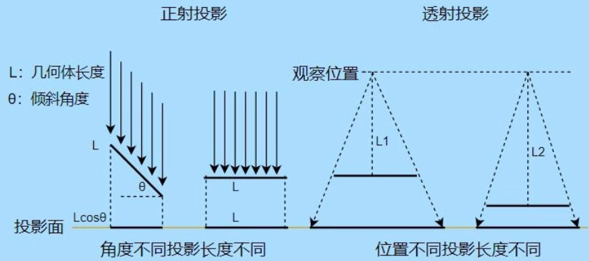
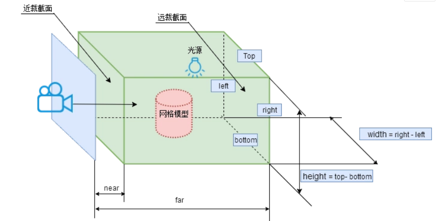
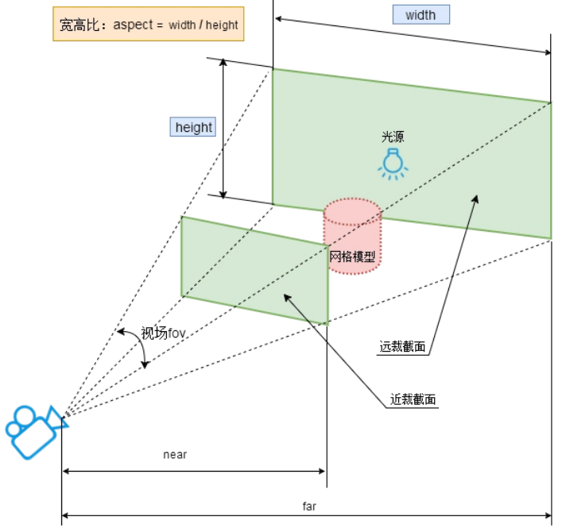

# 相机

## demo
```html
<!doctype html>
<html>
  <head>
    <meta charset="utf-8">
    <title>正方形</title>
    <style>
      html, body { margin: 0; padding: 0; width: 100%; height: 100%; }
      #content { width: 100%; height: 100%; }
    </style>
  </head>
  <body>
    <div id="content"></div>
    <!-- <script src="https://cdn.bootcss.com/three.js/r83/three.js"></script> -->
    <script src="../three.min.js"></script>
    <script>
      let scene = new THREE.Scene(), 
        camera = new THREE.PerspectiveCamera(45, window.innerWidth / window.innerHeight, 1, 1000)
        renderer = new THREE.WebGLRenderer()
      renderer.setSize(window.innerWidth, window.innerHeight)

      // 添加一个正方体
      let box = new THREE.Mesh(
        new THREE.BoxGeometry(2,2,2),
        new THREE.MeshBasicMaterial({
          color: "#ff0"
        })
      )
      // 将正方体放在原点处
      box.position.set(0,0,0)
      scene.add(box) 

      camera.position.set(5,5,5)
      camera.lookAt(box.position)

      document.getElementById("content").appendChild(renderer.domElement)
      renderer.render(scene, camera)
    </script>
  </body>
</html>
```

## 概念
- 场景：我们搭建的三维空间
- 相机：观察我们搭建的三维空间
- 渲染：将观察到的场景渲染到web

## 投影
- 分类：
  * 正射投影：平行光以一定角度照射到物体后，物体在(垂直于平行光的)平面上所形成的投影
  * 透射投影：一束放射光照射物体后，物体在(垂直于平行光的)平面上所形成的投影
  * 
- API
  * 正射投影 OrthographicCamera
    - OrthographicCamera构造函数参数列表，参数的数据类型都是number。
      * left——渲染空间的左边界
      * right——渲染空间的右边界
      * top——渲染空间的上边界
      * bottom——渲染空间的下边界
      * near——near属性表示的是从距离相机多远的位置开始渲染，一般情况会设置一个很小的值。 默认值0.1
      * far——far属性表示的是距离相机多远的位置截止渲染，如果设置的值偏小小，会有部分场景看不到。 默认值1000
    - 参数left与right、参数式top与bottom一般互为相反数，这样做的目的是能够是lookAt指向的对象能够显示在canvas画布的中间位置
      ```js
      var width = window.innerWidth; //窗口宽度
      var height = window.innerHeight; //窗口高度
      var k = width / height; //窗口宽高比
      var s = 200; //三维场景显示范围控制系数，系数越大，显示的范围越大
      //创建相机对象
      var camera = new THREE.OrthographicCamera(-s * k, s * k, s, -s, 1, 1000);
      camera.position.set(200, 300, 200); //设置相机位置
      camera.lookAt(scene.position); //设置相机方向(指向的场景对象)
      ```
    - 
  * 透视投影相机对象PerspectiveCamera
    - PerspectiveCamera构造函数参数列表，参数的数据类型都是number。
      * fov——fov表示视场，所谓视场就是能够看到的角度范围，人的眼睛大约能够看到180度的视场，视角大小设置要根据具体应用，一般游戏会设置60~90度。 默认值45
      * aspect——aspect表示渲染窗口的长宽比，如果一个网页上只有一个全屏的canvas画布且画布上只有一个窗口，那么aspect的值就是网页窗口客户区的宽高比 window.innerWidth/window.innerHeight
      * near——near属性表示的是从距离相机多远的位置开始渲染，一般情况会设置一个很小的值。 默认值0.1
      * far——far属性表示的是距离相机多远的位置截止渲染，如果设置的值偏小小，会有部分场景看不到。 默认值1000
    - 
    - 代码
      ```js
      var width = window.innerWidth; //窗口宽度
      var height = window.innerHeight; //窗口高度
      /**透视投影相机对象*/
      var camera = new THREE.PerspectiveCamera(60, width / height, 1, 1000);
      camera.position.set(200, 300, 200); //设置相机位置
      camera.lookAt(scene.position); //设置相机方向(指向的场景对象)
      ```
## camera
- 相机比较重要的属性是 `.position`, 比较重要的方法是 `.lookAt()`
  * `.position`: 设置相机的位置
  * `.lookAt()`:指定相机拍摄对象的坐标位置

## 参考
- [Three.js相机对象(正投影OrthographicCamera、透视投影PerspectiveCamera)](https://segmentfault.com/a/1190000019487074)
- [threejs - 1 - 介绍&入门](https://www.jianshu.com/p/1071cb82b81c)