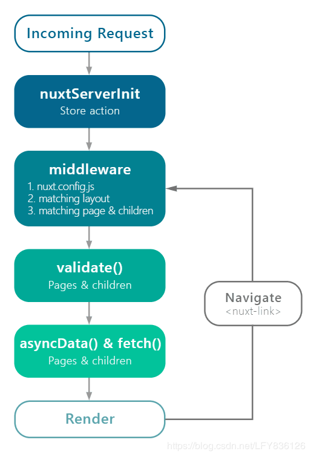

# Nuxt

## 参考
- [官网](https://zh.nuxtjs.org/guide/installation)
- 安装命令直接看官网的
- 创建即配置: 
  * Nuxt.js 会依据 pages 目录中的所有 *.vue 文件生成应用的路由配置。
  * 创建了相应的文件夹,相当于配置了相应的功能,如项目中有文件夹`store/index.js`,相当于配置的新功能`vuex`
- 工作流
  
- 别名
  ~ 或 @ 表示项目根路径

## 文件夹
```js
.nuxt               :临时编译生成的文件
README .md          :辅助文档
assets              :放置静态资源文件，比如说css文件等
backpack.config.js  :后端编译脚本
build               :所有编译完后的目录
components          :放置vue组件
layouts             :模板
node_modules        :安装包
nuxt.config.js      :nuxt配置文件
package-lock.json   :
package.json        :
pages               :页面入口
server              :koa相关程序
static              :放置静态文件
store               :放置vuex
```
- pages文件夹与layouts文件夹的区别


## nuxt.config.js
- 最外层是：`module.exports = {}`
- head: HTML模板的`<head></head>`
- 待补充

## 路由
- NuxtJS遵循的是创建即配置,在文件夹`pages`下创建的新文件夹即为路由
- 动态路由
  * 文件夹前带一个 `_` (下划线是动态路由的标识)
  * 例如  
    文件夹的目录结构  
    ```
    pages/
    --| _slug/
    -----| comments.vue
    -----| index.vue
    --| users/
    -----| _id.vue
    --| index.vue
    ```
    等价于创建的路由(可以在文件夹`.nuxt/router.js`找到编译生成的路由)  
    ```js
    router: {
      routes: [
        {
          name: 'index',
          path: '/',
          component: 'pages/index.vue'
        },
        {
          name: 'users-id',
          path: '/users/:id?',
          component: 'pages/users/_id.vue'
        },
        {
          name: 'slug',
          path: '/:slug',
          component: 'pages/_slug/index.vue'
        },
        {
          name: 'slug-comments',
          path: '/:slug/comments',
          component: 'pages/_slug/comments.vue'
        }
      ]
    }
    ```
  * 注意一个坑
    - 假如上例的`users`文件夹里同时创建`_id.vue`以及`_age.vue`,  
      那么不管路由`/users/:id?`还是`/users/:age?`都是显示`_age.vue`(显示在`.nuxt/router.js`里更早出现的那一个)
    - 是不是动态路由不是由文件前的下划线`_`决定的,而是可以在`package.json`里配置的
      * 例如把`_id.vue`的文件名修改为`id.vue`,在`package.json`里这么修改：
        ```js
        module.exports = {
          router: {
            extendRoutes(routes, resolve) {
              routes.push({
                name: 'users-id',
                path: '/users/:id', // 实际在浏览器中输入的网址 "/user/3"
                component: resolve(__dirname, 'pages/users/id.vue')
              })
            }
          },
        }
        ```
      * 实际在`users`文件夹里同时创建`_id.vue`以及`_age.vue`,本身就不符合逻辑,因为动态路由不管是`/users/:id?`还是`/users/:age?`,其实都能匹配到`/users/2`
    - [网上的解决方法](https://www.cnblogs.com/epines/p/10039637.html)
  * `validate`方法
    - 用于检验动态路由参数的有效性
    - [官方文档](https://zh.nuxtjs.org/api/pages-validate/)
    - 
- 嵌套路由
  * 若有文件"pages/users.vue",想创建其子路由,则新建一个新的同名文件夹`pages/users/id.vue`
  * 动态嵌套路由
    - 待补充
  * 未知嵌套深度的动态嵌套路由
    - 待补充


## layout
- 文件夹下有`default.vue`,表示默认的layout
- 自定义模板
  * 在layout文件夹下新建 second.vue
    ```html
    <template>
      <div>
        <h2>Second Layout</h2>
        <!--相当于SPA里的 router-view -->
        <nuxt />
      </div>
    </template>
    
    <style>
    html {
      margin: 0;
    }
    </style>
    ```
  * 在pages文件夹下,选择需要更换模板的文件,设置
    ```js
    export default {
      layout: 'second'
    }
    ```

## `asyncData()`与`fetch()`
- 在SSR中,`mounted`函数在客户端执行的,`created`函数是在服务端被执行的  
- 为了让`mounted`可以在服务端`render`之前执行,Nuxt多了一个api`asyncData()`,使用同`mounted`
- `asyncData()`不能使用`this`,因为并没有vue实例,那该如何修改当前vue实例里的`data`呢,方法是：
  ```js
  return {
    list: [] // 需要被修改的data里的变量
  }
  ```
- `asyncData()`主要处理组件的数据,`fetch`主要处理`vuex`

## 别名
- src目录  
  `~`或`@`
- 项目根路径  
  `~~`或`@@`

## vuex
- NuxtJS的状态管理是文件夹`store`
- 使用方式：(使用方式是2种,推荐如下的模块写法)
  * 新建
    - `store/index.js`

## SSR原理
- 为什么需要SSR:解决SPA的SEO问题
- 实现过程:看工作流
- SSR渲染流程:


## 参考
- [nuxt-相同目录下的多个动态路由跳转](https://www.cnblogs.com/epines/p/10039637.html)