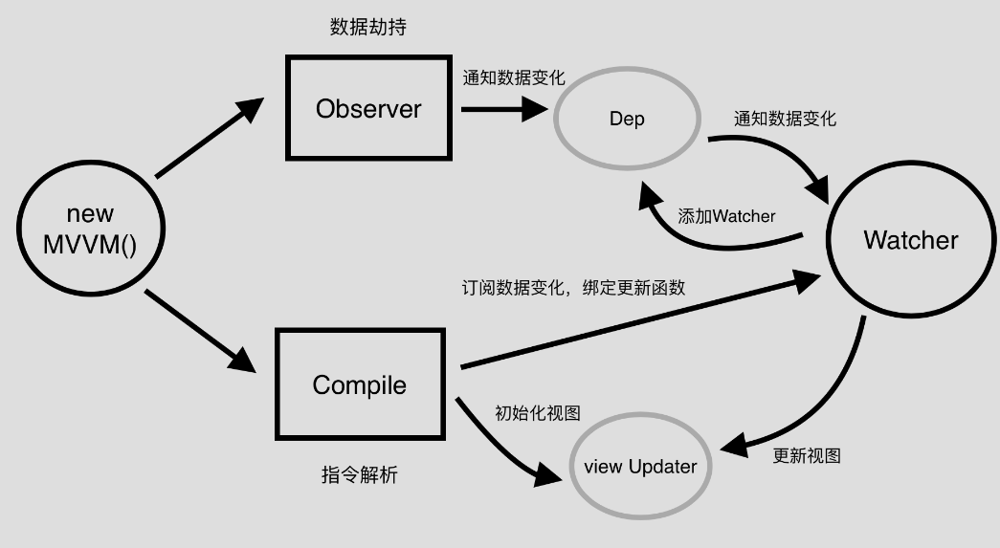

# 实现MVVM
* 常见的MVVM实现方式：  
  - 数据劫持(vue)：通过Object.defineProperty() 去劫持数据每个属性对应的getter和setter
  - 脏值检测(angular)：通过特定事件比如input，change，xhr请求等进行脏值检测。
  - 发布-订阅模式(backbone)：通过发布消息，订阅消息进行数据和视图的绑定监听。  
* 流程
  - 第一步：需要 observe 的数据对象进行递归遍历，包括子属性对象的属性，都加上 setter 和 getter 这样的话，给这个对象的某个值赋值，就会触发 setter，那么就能监听到了数据变化
  - 第二步：compile 解析模板指令，将模板中的变量替换成数据，然后初始化渲染页面视图，并将每个指令对应的节点绑定更新函数，添加监听数据的订阅者，一旦数据有变动，收到通知，更新视图
  - 第三步：Watcher 订阅者是 Observer 和 Compile 之间通信的桥梁，主要做的事情是:
    * 在自身实例化时往属性订阅器(dep)里面添加自己
    * 自身必须有一个 update()方法
    * 待属性变动 dep.notice()通知时，能调用自身的 update() 方法，并触发 Compile 中绑定的回调，则功成身退。
  - 第四步：MVVM 作为数据绑定的入口，整合 Observer、Compile 和 Watcher 三者，通过 Observer 来监听自己的 model 数据变化，通过 Compile 来解析编译模板指令，最终利用 Watcher 搭起 Observer 和 Compile 之间的通信桥梁，达到数据变化 -> 视图更新；视图交互变化(input) -> 数据 model 变更的双向绑定效果。

## 一道面试题
实现一个类,使其可以完成以下输出
```js
class Observer {
  $on() {}

  $emit() {}
}

const data = new Observer({ a: 1 });
console.log(data.a); // 输入: 1
data.$on("a", (newValue, oldValue) => {
  console.log(newValue, oldValue);
});
data.a = 2; // 输入: 2 1
```
答案
```js
class Observer {
  constructor(data){
    this.data = data;
    let keys = Object.keys(data);
    this.observer = {};//调用了$on 的对象的属性
    for(let key of keys){
      Object.defineProperty(this,key,{
      	set(val){
          this.$emit(key,val,this.data[key]);
          this.data[key] = val;
      	},
      	get(){
          return this.data[key];
      	}
      })
    }
  }

  $on(name,callBack) {
    if(!this.observer[name]){
      this.observer[name] = callBack;
    }	
  }	

  $emit(name,...args){
    if(this.observer[name]){
      this.observer[name](...args);
      return;
    }
    return;
  }
}

let data = new Observer({a:1,b:2});
console.log(data.a);//1
data.$on('a',(newVal,oldVal)=>{
  console.log(`newValue:${newVal},oldValue:${oldVal}`);
});
data.a = 2;//newValue:1,oldValue:2
data.b = 4;
console.log(data.b);//4
data.$on('b',(newVal,oldVal)=>{
  console.log(`第一次:${newVal},第二次:${oldVal}`);
});
data.b = 5;//第一次:4,第二次:5
```

## 更完整的例子
```html
<!DOCTYPE html>
<html lang="en">
<head>
  <meta charset="UTF-8">
  <meta name="viewport" content="width=device-width, initial-scale=1.0">
  <meta http-equiv="X-UA-Compatible" content="ie=edge">
  <title>example</title>
  <!-- <script src="./mvvm.js" charset="utf-8"></script> -->
  <script src="./a.js" charset="utf-8"></script>
</head>
<body>
  <div id="mvvm">
    <h2>{{b}}</h2>
    <input type="text" x-model="a">
    <input type="text" name="" value="" x-model="a">
    <p x-html="a">{{ a }}</p>
    <button type="button" name="button" x-on:click="testToggle">change b</button>
  </div>
</body>
<script>
var vm = new MVVM({
  el: '#mvvm',
  data: {
    a: 'test model',
    b: 'hello MVVM',
    flag: true
  },
  methods: {
    testToggle: function () {
      this.flag = !this.flag;
      this.b = this.flag ? 'hello MVVM' : 'test success'
    }
  }
});
</script>
</html>
```
```js
function observe(value) {
  if (!value || typeof value !== 'object') {
    return;
  }
  return new Observer(value);
}
// Observer -----------------------------------------------------------------
class Observer {
  constructor(value) {
    this.value = value;
    this.walk(value);
  }

  walk(obj) {
    let self = this;
    Object.keys(obj).forEach(key => {
      self.observeProperty(obj, key, obj[key]);
    });
  }

  observeProperty (obj, key, val) {
    let dep = new Dep();
    let childOb = observe(val);
    Object.defineProperty(obj, key, {
      enumerable: true,
      configurable: true,
      get: function () {
        if (Dep.target) {
          // 有人(即this)[[Get]]这一属性，那么就把this添加到subs里，相当于添加订阅者。
          // 以后在该数据变动时，遍历订阅者，更新视图。
          dep.depend(); 
        }
        if (childOb) {
          childOb.dep.depend();
        }
        return val;
      },
      set: function (newVal) {
        if (val === newVal || (newVal !== newVal && val !== val)) {
          return;
        }
        val = newVal;
        // 监听子属性
        childOb = observe(newVal);
        // 通知数据变更
        dep.notify();
      }
    })
  }
}

// Dep --------------------------------------------------------------------------
let uid = 0;
class Dep {
  constructor() {
    this.id = uid++;
    this.subs = []; // 存储Watcher
  }

  addSub(sub) { // 添加订阅者
    this.subs.push(sub);
  }

  removeSub(sub) { // 移除订阅者
    let index = this.subs.indexOf(sub);
    if (index !== -1) {
      this.subs.splice(index, 1);
    }
  }

  notify() { // 通知数据变更
    this.subs.forEach(sub => {
      // 执行sub的update更新函数
      sub.update();
    });
  }

  depend() { // add Watcher
    Dep.target.addDep(this);
  }
}
Dep.target = null;

// Compile -------------------------------------------------------------------
class Compile { // element节点  mvvm实例
  constructor(el, vm) {
    this.$vm = vm;
    this.$el = this.isElementNode(el) ? el : document.querySelector(el);

    if (this.$el) {
      this.$fragment = this.nodeFragment(this.$el);
      this.compileElement(this.$fragment);
      // 将文档碎片放回真实dom
      this.$el.appendChild(this.$fragment)
    }
  }

  compileElement(el) {
    let self = this;
    let childNodes = el.childNodes;
    [].slice.call(childNodes).forEach(node => {
      let text = node.textContent;
      let reg = /\{\{((?:.|\n)+?)\}\}/;
  
      // 如果是element节点
      if (self.isElementNode(node)) {
        self.compile(node);
      }
      // 如果是text节点
      else if (self.isTextNode(node) && reg.test(text)) {
        // 匹配第一个选项
        self.compileText(node, RegExp.$1);
      }
      // 解析子节点包含的指令
      if (node.childNodes && node.childNodes.length) {
        self.compileElement(node);
      }
    });
  }

  // 文档碎片，遍历过程中会有多次的dom操作，为提高性能我们会将el节点转化为fragment文档碎片进行解析操作
  // 解析操作完成，将其添加回真实dom节点中
  nodeFragment(el) {
    let fragment = document.createDocumentFragment();
    let child;

    while (child = el.firstChild) {
      fragment.appendChild(child);
    }
    return fragment;
  }

  // 指令解析
  compile(node) {
    let nodeAttrs = node.attributes;
    let self = this;

    [].slice.call(nodeAttrs).forEach(attr => {
      var attrName = attr.name;
      if (self.isDirective(attrName)) {
        var exp = attr.value;
        var dir = attrName.substring(2);
        // 事件指令
        if (self.isEventDirective(dir)) {
          compileUtil.eventHandler(node, self.$vm, exp, dir);
        }
        // 普通指令
        else {
          compileUtil[dir] && compileUtil[dir](node, self.$vm, exp);
        }

        node.removeAttribute(attrName);
      }
    });
  }

  // {{ test }} 匹配变量 test
  compileText(node, exp) {
    compileUtil.text(node, this.$vm, exp);
  }
  // element节点
  isElementNode(node) {
    return node.nodeType === 1;
  }
  // text纯文本
  isTextNode(node) {
    return node.nodeType === 3
  }
  // x-XXX指令判定
  isDirective(attr) {
    return attr.indexOf('x-') === 0;
  }
  // 事件指令判定
  isEventDirective(dir) {
    return dir.indexOf('on') === 0;
  }
}


// 定义$elm，缓存当前执行input事件的input dom对象
let $elm;
let timer = null;
// 指令处理集合
const compileUtil = {
  html: function (node, vm, exp) {
    this.bind(node, vm, exp, 'html');
  },
  text: function (node, vm, exp) {
    this.bind(node, vm, exp, 'text');
  },
  class: function (node, vm, exp) {
    this.bind(node, vm, exp, 'class');
  },
  model: function (node, vm, exp) {
    this.bind(node, vm, exp, 'model');

    let self = this;
    let val = this._getVmVal(vm, exp);
    // 监听input事件
    node.addEventListener('input', function (e) {
      let newVal = e.target.value;
      $elm = e.target;
      if (val === newVal) {
        return;
      }
      // 设置定时器  完成ui js的异步渲染
      clearTimeout(timer);
      timer = setTimeout(function () {
        self._setVmVal(vm, exp, newVal);
        val = newVal;
      })
    });
  },
  bind: function (node, vm, exp, dir) {
    let updaterFn = updater[dir + 'Updater'];

    updaterFn && updaterFn(node, this._getVmVal(vm, exp));

    new Watcher(vm, exp, function (value, oldValue) {
      updaterFn && updaterFn(node, value, oldValue);
    });
  },
  // 事件处理
  eventHandler: function (node, vm, exp, dir) {
    let eventType = dir.split(':')[1];
    let fn = vm.$options.methods && vm.$options.methods[exp];

    if (eventType && fn) {
      node.addEventListener(eventType, fn.bind(vm), false);
    }
  },
  /**
   * [获取挂载在vm实例上的value]
   * @param  {[type]} vm  [mvvm实例]
   * @param  {[type]} exp [expression]
   */
  _getVmVal: function (vm, exp) {
    let val = vm;
    exp = exp.split('.');
    exp.forEach(key => {
      key = key.trim();
      val = val[key];
    });
    return val;
  },
  /**
   * [设置挂载在vm实例上的value值]
   * @param  {[type]} vm    [mvvm实例]
   * @param  {[type]} exp   [expression]
   * @param  {[type]} value [新值]
   */
  _setVmVal: function (vm, exp, value) {
    let val = vm;
    exps = exp.split('.');
    exps.forEach((key, index) => {
      key = key.trim();
      if (index < exps.length - 1) {
        val = val[key];
      }
      else {
        val[key] = value;
      }
    });
  }
}

// 指令渲染集合
const updater = {
  htmlUpdater: function (node, value) {
    node.innerHTML = typeof value === 'undefined' ? '' : value;
  },
  textUpdater: function (node, value) {
    node.textContent = typeof value === 'undefined' ? '' : value;
  },
  classUpdater: function () { },
  modelUpdater: function (node, value, oldValue) {
    // 不对当前操作input进行渲染操作
    if ($elm === node) {
      return false;
    }
    $elm = undefined;
    node.value = typeof value === 'undefined' ? '' : value;
  }
}
// Watcher -------------------------------------------------------------
/**
 * @class 观察类
 * @param {[type]}   vm      [vm对象]
 * @param {[type]}   expOrFn [属性表达式]
 * @param {Function} cb      [回调函数(一半用来做view动态更新)]
 */
function Watcher(vm, expOrFn, cb) {
  this.vm = vm;
  expOrFn = expOrFn.trim();
  this.expOrFn = expOrFn;
  this.cb = cb;
  this.depIds = {};

  if (typeof expOrFn === 'function') {
    this.getter = expOrFn
  }
  else {
    this.getter = this.parseGetter(expOrFn);
  }
  this.value = this.get();
}
Watcher.prototype = {
  update: function () {
    this.run();
  },
  run: function () {
    let newVal = this.get();
    let oldVal = this.value;
    if (newVal === oldVal) {
      return;
    }
    this.value = newVal;
    // 将newVal, oldVal挂载到MVVM实例上
    this.cb.call(this.vm, newVal, oldVal);
  },
  get: function () {
    Dep.target = this;  // 将当前订阅者指向自己
    let value = this.getter.call(this.vm, this.vm); // 触发getter，将自身添加到dep中
    Dep.target = null;  // 添加完成 重置
    return value;
  },
  // 添加Watcher to Dep.subs[]
  addDep: function (dep) {
    if (!this.depIds.hasOwnProperty(dep.id)) {
      dep.addSub(this);
      this.depIds[dep.id] = dep;
    }
  },
  parseGetter: function (exp) {
    if (/[^\w.$]/.test(exp)) return;

    let exps = exp.split('.');

    // 简易的循环依赖处理
    return function (obj) {
      for (let i = 0, len = exps.length; i < len; i++) {
        if (!obj) return;
        obj = obj[exps[i]];
      }
      return obj;
    }
  }
}
// MVVM ------------------------------------------------------

/**
 * @class 双向绑定类 MVVM
 * @param {[type]} options [description]
 */
function MVVM(options) {
  this.$options = options || {};
  let data = this._data = this.$options.data;
  let self = this;

  Object.keys(data).forEach(key => {
    self._proxyData(key);
  });
  observe(data, this);
  new Compile(options.el || document.body, this);
}
MVVM.prototype = {
  /**
   * [属性代理]
   * @param  {[type]} key    [数据key]
   * @param  {[type]} setter [属性set]
   * @param  {[type]} getter [属性get]
   */
  _proxyData: function (key, setter, getter) {
    let self = this;  // Vue实例里的data里的键值，看起来是挂载在data上的，其实是挂载在Vue实例上的
    setter = setter ||
      Object.defineProperty(self, key, {
        configurable: false,
        enumerable: true,
        get: function proxyGetter() {
          return self._data[key];
        },
        set: function proxySetter(newVal) {
          self._data[key] = newVal;
        }
      })
  }
}
```

## 参考图


## 参考
- [my-mvvm](https://github.com/xuqiang521/overwrite/tree/master/src/my-mvvm)
- [vue响应式系统之observe、watcher、dep的源码解析](https://www.jb51.net/article/159330.htm)