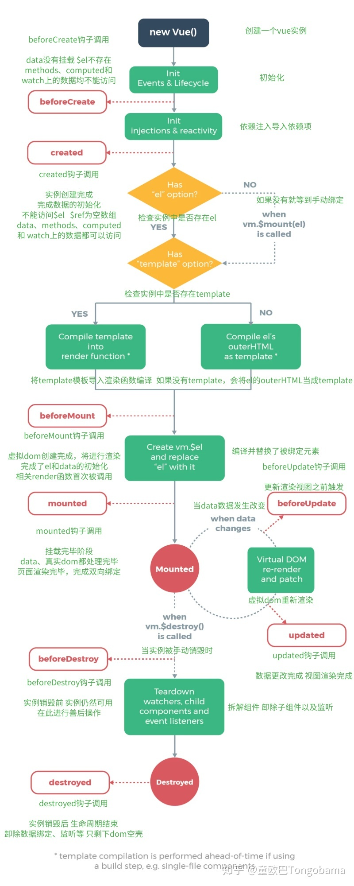

# 生命周期

## 答案1
- 总共分为 8 个阶段创建前/后，载入前/后，更新前/后，销毁前/后
- 创建前/后： 在 beforeCreate 阶段，vue 实例的挂载元素 el 还没有。
- 载入前/后：在 beforeMount 阶段，vue 实例的 $el 和 data 都初始化了，但还是挂载之前为虚拟的 dom 节点，data.message 还未替换。在 mounted 阶段，vue 实例挂载完成,  
  data.message 成功渲染。
- 更新前/后：当 data 变化时，会触发 beforeUpdate 和 updated 方法。
- 销毁前/后：在执行 destroy 方法后，对 data 的改变不会再触发周期函数，说明此时 vue 实例已经解除了事件监听以及和 dom 的绑定，但是 dom 结构依然存在

## 注意
- 生命周期函数不能用箭头函数（箭头函数的 this 上下文 将为 父组件的上下文）

## 生命周期
- beforeCreate
  * 官方说明：在实例初始化之后，数据观测(data observer) 和 event/watcher 事件配置之前被调用。
  * 解释说明：这个时期，this变量还不能使用，在data下的数据，和methods下的方法，watcher中的事件都不能获得到；
- created
  * 官方说明：实例已经创建完成之后被调用。在这一步，实例已完成以下的配置：数据观测(data observer)，属性和方法的运算， watch/event 事件回调。然而，挂载阶段还没开始，$el 属性目前不可见。
  * 解释说明： 这个时候可以操作vue实例中的数据和各种方法，但是还不能对"dom"节点进行操作；
- beforeMount
  * 官方说明：在挂载开始之前被调用：相关的 render 函数首次被调用。
- mounted
  * 官方说明：el 被新创建的 `vm.$el` 替换，并挂载到实例上去之后调用该钩子。如果root实例挂载了一个文档内元素，当 mounted 被调用时 `vm.$el` 也在文档内。
  * 解释说明：挂载完毕，这时dom节点被渲染到文档内，一些需要dom的操作在此时才能正常进行
  * 常配合 vm.$nextTick，异步更新组件数据  
    (vue 是异步执行 DOM更新的, 当观测到数据变化, vue将开启一个队列, 缓冲同一事件循环中发生的所有数据变化以去掉不必要的DOM操作,事件结束后再执行nextTick里的回调)
- beforeUpdate
- updated
- activated
- deactivated
- beforeDestroy
- destroyed

## 图片

## 参考
- [对vue生命周期/钩子函数的理解](https://www.cnblogs.com/xkloveme/p/7435271.html)
- [简单理解Vue中的nextTick](https://www.jianshu.com/p/a7550c0e164f)
- [从源码解读Vue生命周期，让面试官对你刮目相看](https://zhuanlan.zhihu.com/p/71958016)