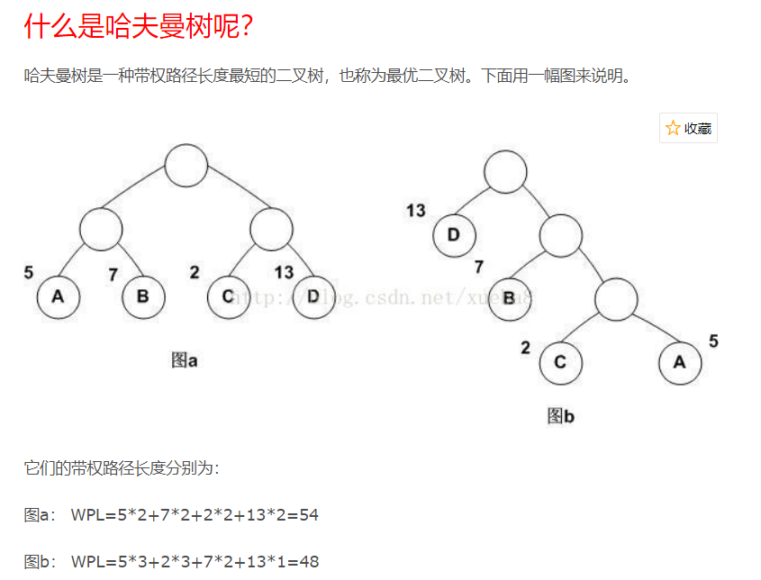

# 二叉树


## 二叉树节点
### 1
一颗二叉树的叶子节点有5个，出度为1的结点有3个，该二叉树的结点总个数是？  12  
叶子节点=度为2节点+1  
度为2节点=叶子节点-1=5-1=4  
总节点=叶子节点+度为1节点+度为2节点=5+3+4=12

### 2
- 二叉树的第i层最多有2^(i-1)个节点(i≥1)
- 深度为k的二叉树至多有`2^k - 1`个节点(k≥1)
- 满二叉树：(顾名思义)
- 二叉排序树：所有的左子树都小于根节点,所有的右子树都大于根节点的二叉树
- 最优二叉树(哈夫曼树)：
  * 从树的一个节点到另一个节点之间的分支构成这两个节点之间的路径,路径上的分支数目称作"路径长度"
  * 树的路径长度：从树根到每一节点的路径长度之和
  * 树的带权路径长度：树中所有叶子节点的带权路径长度之和
  * 
  * 带权路径长度最小的二叉树,即为哈夫曼树
  * 构建哈夫曼树：不断找到最小的两个节点，形成新的左右子树;将上一步的两个节点的和放回数组;递归......[参考](https://blog.csdn.net/xueba8/article/details/78477892)
  * 哈夫曼树没有度为1的节点
  * 哈夫曼编码：如果一组编码中任一编码都不是其他任何一个编码的前缀，我们称这组编码为前缀编码。哈夫曼树可用于构造最短的不等长编码方案(一般左分支0,右分支1)
  * 
- 完全二叉树：
  * (很有规律的,叶子节点只可能在层次最大的两层上出现)
  * 具有N个节点的完全二叉树的深度为`Math.floor(log(2)N) + 1`
- 先序遍历; 中序遍历; 后序遍历
  * 思路是遇到节点,先思考它是否是根;为根,例如先序遍历
    - 遇见一个节点先思考它是否为根
    - 为根,则跳过找下一级
    - 之后是递归思想,一层层往下,再一层层往上
    - 不管先/中/后,其实都是从根开始的(只是找到了根,不一定去访问根)
- 将树转化为二叉树 
  
- 森林转二叉树
  

### 3
#### 先序遍历
```js
var node4 = { left: null, right: null, val: 4 };
var node5 = { left: null, right: null, val: 5 };
var node6 = { left: null, right: null, val: 6 };
var node7 = { left: null, right: null, val: 7 };
var node3 = { left: node6, right: node7, val: 3 };
var node2 = { left: node4, right: node5, val: 2 };
var node1 = { left: node2, right: node3, val: 1 };

console.log(preorder(node1))

//     1
//    /\
//   2  3
//  /\  /\
// 4 5 6  7

function Node(val) {
  this.left = this.right = null;
  this.val = val;
}

function preorder(root) {
  var res = [];
  var s = [root]; // 栈
  var p = root;
  while (s.length > 0) {
    p = s.pop()
    res.push(p.val)
    if (p.right) s.push(p.right)
    if (p.left) s.push(p.left)
  }
  return res;
}
```
#### 中序遍历 - 栈实现(递归版本在本文搜`inOrderTraverseNode`)
```js
var inorderTraversal=function(root){
  var  res=[];
  //栈  
  var s=[];
  var p = root;
  while (p || s.length>0) {
    //直至左节点为空，即没有左节点为止
    while (p) {
      s.push(p);
      p = p.left;
    }
    //出栈，存放根节点
    p = s.pop();
    res.push(p.val);
    p = p.right;
  }
  return res;
}
```

### 后序遍历(三种遍历方式中最难的一种) - 非递归
```js
// 使用两个栈结构
var postOrderUnRecur = function(root){
  var list = [];
  if(root !== undefined){
    var s1 = [];
    var s2 = [];
    s1.push(root);
    while(s1.length !== 0){
      head = s1.pop();
      s2.push(head);
      if(head.left !== undefined){
        s1.push(head.left);
      }
      if(head.right !== undefined){
        s1.push(head.right);
      }
    }
    while(s2.length !== 0){
      var item = s2.pop();
      list.push(item.val);
    }
  }
  return list;
}
```

## 二叉搜索树
```js
function BinarySearchTree() {
  // 此处的key相当于'结点'，理解为'键'
  let Node = function (key) {
    this.key = key
    this.left = null
    this.right = null
  }
  let root = null

  // 插入键 - 递归, 私有函数
  let insertNode = function (node, newNode) {
    if (newNode.key < node.key) {
      if (node.left === null) {
        node.left = newNode
      } else {
        insertNode(node.left, newNode)
      }
    } else {
      if (node.right === null) {
        node.right = newNode
      } else {
        insertNode(node.right, newNode)
      }
    }
  }

  // 插入键
  this.insert = function (key) {
    let newNode = new Node(key)
    if (root === null) {
      root = newNode
    } else {
      insertNode(root, newNode)
    }
  }

  // 树的遍历 (中序、先序、后序)
  let inOrderTraverseNode = function (node, callback) {
    if (node !== null) {
      inOrderTraverseNode(node.left, callback)
      callback(node.key)
      inOrderTraverseNode(node.right, callback)
    }
  }
  this.inOrderTraverse = function (callback) {
    inOrderTraverseNode(root, callback)
  }

  // 先序
  let preOrderTraverseNode = function (node, callback) {
    if (node !== null) {
      callback(node.key)
      preOrderTraverseNode(node.left, callback)
      preOrderTraverseNode(node.right, callback)
    }
  }
  this.preOrderTraverse = function (callback) {
    preOrderTraverseNode(root, callback);
  }

  // 后序
  let postOrderTraverseNode = function (node, callback) {
    if (node !== null) {
      postOrderTraverseNode(node.left, callback)
      postOrderTraverseNode(node.right, callback)
      callback(node.key)
    }
  }
  this.postOrderTraverse = function (callback) {
    postOrderTraverseNode(root, callback);
  }

  // 树的值的搜索 - 最小值
  this.minNode = function (node) {
    if (node) {
      while (node && node.left !== null) {
        node = node.left
      }
      return node.key
    } else {
      return null
    }
  }
  // 树的值的搜索 - 最大值
  this.maxNode = function (node) {
    if (node) {
      while (node && node.right !== null) {
        node = node.right
      }
      return node.key
    } else {
      return null
    }
  }
  // 树的值的搜索 - 搜索一个特定的值
  this.searchNode = function (node, key) {
    if (node === null) {
      return false
    }
    if (key < node.key) {
      return searchNode(node.left, key)
    } else if (key > node.key) {
      return searchNode(node.right, key)
    } else {
      return true
    }
  }

  // 移除一个结点
  this.removeNode = function (node, key) {
    if (node === null) {
      return null
    }

    if (key < node.key) {
      node.left = removeNode(node.left, key)
      return node
    } else if (key > node.key) {
      node.right = removeNode(node.right, key)
      return node
    } else {
      //键等于node.key, 找到了需要被移除的点, 但我们仍需要考虑在它被移除之后它的子节点该怎么办
      //第一种情况——一个叶节点
      if (node.left === null && node.right === null) {
        node = null
        // 因为仅仅让node为null是不够的，我们需要的是让这个被删的结点的父节点指向null，所以我们 return null
        return node
      }
      //第二种情况——一个只有一个子节点的节点
      if (node.left === null) {
        node = node.right
        return node
      } else if (node.right === null) {
        node = node.left
        return node
      }
      //第三种情况——一个有两个子节点的节点
      let aux = findMinNode(node.right)
      node.key = aux.key
      node.right = removeNode(node.right, aux.key)
      return node
    }
  }
  this.remove = function (key) {
    root = removeNode(root, key)
    return root
  }
}

let binarySearchTree = new BinarySearchTree()
binarySearchTree.insert(5)
binarySearchTree.insert(1)
binarySearchTree.insert(2)
binarySearchTree.insert(3)
binarySearchTree.insert(4)
binarySearchTree.insert(6)
binarySearchTree.insert(7)
binarySearchTree.insert(8)
binarySearchTree.insert(9)
binarySearchTree.inOrderTraverse((value) => console.log(new Date(), value))
console.log('_____')
binarySearchTree.preOrderTraverse((value) => console.log(new Date(), value))
console.log('_____')
binarySearchTree.postOrderTraverse((value) => console.log(new Date(), value))
```

## 平衡二叉树
- 将BST（不平衡的二叉搜索树）转化为AVL（平衡的二叉搜索树），依赖的方法有：左单旋,右单旋,左-右双旋,右-左双旋


## 红黑树
- 红黑树是自平衡的二叉查找树
- 特点：
  * 根节点：黑色
  * 叶子节点都为 NULL, 都为黑色（即便你以为的叶子节点是4(假设), 但其实节点`4`还指向了节点`NULL`）
  * 从任一节点到叶子节点的所有路径都含有相同数量的黑色节点
  * 红色节点的2个子节点都是黑色的(即从根到叶子节点的路径上,不能有2个连续的红色节点)
- 根据上述特点,有了如下的特性
  * 从根节点到任意叶子节点的路径中,最长路径不会超过最短路径2倍
  * 黑色节点完美自平衡(重要)
- 要求
  * 插入节点为：红色
  * 检测是否破坏规则。若破坏,使用`变色`或者`旋转`(左旋/右旋)
    - 左旋（逆时针）（目标节点L，其右子节点 L右）
      * L `左下`移动，L右 代替原 L 的位置
      * L右 是否有`左节点`。若有,移动到 L 的`右子节点`位置
      * 总结：L逆时针转动带动了 L右;判断 L右 是否有左。若有,跟在L的右子节点

### 参考
- [漫画：什么是红黑树？](https://zhuanlan.zhihu.com/p/31805309)
- [30张图带你彻底理解红黑树](https://www.jianshu.com/p/e136ec79235c)
- [js实现红黑树](https://segmentfault.com/a/1190000017577946)
- [数据结构算法 - 红黑树](https://www.jianshu.com/p/1bbb19156454)