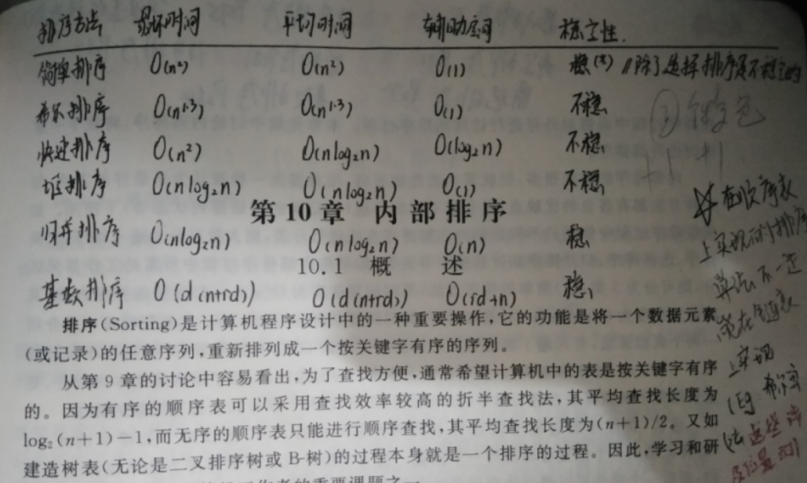

# 排序
(以下均为升序)  
- 排序的时间/空间/稳定性(排序后Ra仍领先于Rb,则称为稳定)
- 如图
- 


## 分类
- 冒泡排序, 

## 冒泡排序 (稳定)
- 特点
  * 时间复杂度高，但容易理解，适合小数据
- 思路
  * 两个`for`循环,或者说两个指针
  * 外层`for`从数组尾部开始，往数组头部遍历; 内层`for`从数组头部开始指向外层`for`循环的前一个
  * 比较两个相邻的元素,如果前者 > 后者, 则交换
- 实现
  ```js
  function sort(arr) {
    for(let i = arr.length - 1;i > 0;i--) { // 每次需要排序的长度
      for (let j = 0;j < i;j++) { // 从第1个到第i个
        if (arr[j] > arr[j + 1]) {
          [arr[j], arr[j + 1]] = [arr[j + 1], arr[j]]
        }
      }
    }
    return arr;
  }
  let arr = [2, 5, 10, 7, 10, 32, 90, 9, 11, 1, 0, 10];
  console.log(sort(arr));
  ```

## 选择排序
- 与冒泡排序类似，可看作冒泡排序的改进
- 将数组划分为已经排序和未排序，流程为不断遍历数组，每次都选出最小（大）的放入数组的头（尾）部
- 实现
  ```js
  function sort(arr) {
    let min
    for (let i = 0; i < arr.length;i++) { 
      min = i
      for (let j = i + 1;j < arr.length;j++) { // 从第1个到第i个
        if (arr[min] > arr[j]) {
          [arr[min], arr[j]] = [arr[j], arr[min]]
        }
      }
    }
    return arr;
  }
  let arr = [2, 5, 10, 7, 10, 32, 90, 9, 11, 1, 0, 10];
  console.log(new Date(), sort(arr));
  ```

## 插入排序
* 实现
  - 把待排序的数组分成已排序和未排序两部分，初始的时候把第一个元素认为是已排好序的。
  - 从第二个元素开始，在已排好序的子数组中寻找到该元素合适的位置并插入该位置。
  - 重复上述过程直到最后一个元素被插入有序子数组中
* 实现
  ```js
  function sort(arr) {
    for (let i = 1; i < arr.length;i++) {
      let pos = i, value = arr[i]
      while(pos > 0 && arr[pos - 1] > value) {
        arr[pos] = arr[pos - 1]
        pos--
      }
      arr[pos] = value
    }
    return arr;
  }
  let arr = [2, 5, 10, 7, 10, 32, 90, 9, 11, 1, 0, 10];
  console.log(new Date(), sort(arr));
  ```

## 归并排序
- 与希尔排序类似，但归并排序是划分为若干的子序列，先每个子序列内部排序，再递归让合并后的序列有序;而希尔排序是按间隔划分为多组
- 体现了分治的思想
- 实现（递归法）
  ```js
  function sort(arr) {
    // 设置终止的条件，
    if (arr.length < 2) {
      return arr;
    }
    //设立中间值
    var middle = parseInt(arr.length / 2);
    //第1个和middle个之间为左子列
    var left = arr.slice(0, middle);
    //第middle+1到最后为右子列
    var right = arr.slice(middle);
    if (left == "undefined" && right == "undefined") {
      return false;
    }
    return merge(sort(left), sort(right)); // 注意递归的函数名与当前的函数名需要一致
  }
  
  function merge(left, right) {
    var result = [];
  
    while (left.length && right.length) {
      if (left[0] <= right[0]) {
        //把left的左子树推出一个，然后push进result数组里
        result.push(left.shift());
      } else {
        //把right的右子树推出一个，然后push进result数组里
        result.push(right.shift());
      }
    }
    //经过上面一次循环，只能左子列或右子列一个不为空，或者都为空
    while (left.length) {
      result.push(left.shift());
    }
    while (right.length) {
      result.push(right.shift());
    }
    return result;
  }
  let arr = [2, 5, 10, 7, 10, 32, 90, 9, 11, 1, 0, 10];
  console.log(new Date(), sort(arr));
  ```

## 快速排序
- 思路
  * 从数列中挑出一个元素，称为"基准"（pivot），
  * 重新排序数列，所有比基准值小的元素摆放在基准前面，所有比基准值大的元素摆在基准后面（相同的数可以到任何一边）。在这个分区结束之后，该基准就处于数列的中间位置。这个称为分区（partition）操作。
  * 递归地（recursively）把小于基准值元素的子数列和大于基准值元素的子数列排序
- 实现
  ```js
  function sort (arr) {
    if (arr.length <= 1) { return arr; }
    var pivot = arr.splice(Math.floor(arr.length / 2), 1)[0]; // 从数组中删除 基准值
    var left = [];
    var right = [];
    for (var i = 0; i < arr.length; i++) {
      if (arr[i] < pivot) {
        left.push(arr[i]);
      } else {
        right.push(arr[i]);
      }
    }
    return sort(left).concat([pivot], sort(right));
  };
  let arr = [2, 5, 10, 7, 10, 32, 90, 9, 11, 1, 0, 10];
  console.log(new Date(), sort(arr));
  ```

## 堆排序
* 可以把堆排序看作选择排序的进阶版
* 建立过程就直接看网上的动画即可,[参考](https://visualgo.net/zh/heap)
* 具体流程是：  
  - ① 写成完全二叉树;  
  - ② 从第`Math.floor(n/2)`个元素开始筛选;  
  - ③ 若为大顶堆,就将大的往上筛,若为小顶堆,则将小的网上筛
* 小顶堆：递减;大顶堆：递增(在大顶堆建立过程中,最大的元素是放在顺序表的最后一个); 
* 堆，其实是有特殊性质的完全二叉树：
  - 每个节点的值都(大于或等于 / 小于或等于)其左右孩子节点的值，成为（大 / 小）顶堆
* 我们看到的是堆,但其实堆的存储是数组,相当于对我们看到的堆进行层序遍历存储进数组内;
* 实现
  ```js
  //调整函数
  function headAdjust(elements, pos, len) {
    //定位到当前节点的左边的子节点
    var child = pos * 2 + 1;
    //递归，直至没有子节点为止
    while (child < len) {
      //如果当前节点有右边的子节点，并且右子节点较大的场合，采用右子节点和当前节点进行比较
      if (child + 1 < len && elements[child] < elements[child + 1]) {
        child += 1;
      }
      
      //比较当前节点和最大的子节点，小于则进行值交换，交换后将当前节点定位于子节点上
      if (elements[pos] < elements[child]) {
        [elements[pos], elements[child]] = [elements[child], elements[pos]]
        pos = child;
        child = pos * 2 + 1;
      }
      else {
        break;
      }
    }
  }
  
  //构建堆
  function buildHeap(elements) {
    //从最后一个拥有子节点的节点开始，将该节点连同其子节点进行比较，
    //将最大的数交换与该节点,交换后，再依次向前节点进行相同交换处理，
    //直至构建出大顶堆（升序为大顶，降序为小顶）
    for (var i = elements.length / 2; i >= 0; i--) {
      headAdjust(elements, i, elements.length);
    }
  }
  
  function sort(elements) {
    //构建堆
    buildHeap(elements);
  
    //从数列的尾部开始进行调整
    for (var i = elements.length - 1; i > 0; i--) {
      // console.log(elements);
      //堆顶永远是最大元素，故，将堆顶和尾部元素交换，将最大元素保存于尾部，并且不参与后面的调整
      [elements[i], elements[0]] = [elements[0], elements[i]];
      //进行调整，将最大）元素调整至堆顶
      headAdjust(elements, 0, i);
    }
  }
  
  var elements
  elements = [3, 1, 5, 7, 2, 4, 9, 6, 10, 8];
  console.log('before: ' + elements);
  sort(elements);
  console.log(' after: ' + elements);
  ```

## 计数排序
- 特性
  * 计数排序不是基于比较的排序算法
  * 其核心在于将输入的数据值转化为键存储在额外开辟的数组空间中。
  * 作为一种线性时间复杂度的排序，计数排序要求输入的数据必须是有确定范围的整数
- 多用于年龄排序，分数排序等
- 实现
  * 找出待排序的数组中最大和最小的元素；
  * 统计数组中每个值为i的元素出现的次数，存入数组C的第i项；
  * 对所有的计数累加（从C中的第一个元素开始，每一项和前一项相加）；
  * 反向填充目标数组：将每个元素i放在新数组的第C(i)项，每放一个元素就将C(i)减去1。

## 桶排序
- 计数排序的升级版

## 基数排序
- 特性
  * 基数排序(Radix Sort)是桶排序的扩展，
  * 它的基本思想是：将整数按位数切割成不同的数字，然后按每个位数分别比较。
  * 一般用于非负整数 / 字符串的比较


## 希尔排序 
- 插入排序的改良版
- 希尔排序本是对数列进行了等间隔分组处理，在每一组中做插入排序，随后逐次缩小间隔，在每一个分组中做插入排序...直到间隔等于1
- 这一优化使得原本 O(n^2) 的时间复杂度一下降为 O(nlogn)
- 通常我们去取初始间隔为数列长度的一半：gap = length/2，以 gap = gap/2 的方式缩小
- 实现
  ```js
  // 内层循环使用的插入排序与普通的插入排序基本一致，只是每次移动的步长变为 gap 而不是 1
  function shellSort(arr) {
    for(let gap = Math.floor(arr.length/2); gap > 0; gap = Math.floor(gap/2)) {
      for(let i = gap; i < arr.length; i++) {
        let j = i;
        let temp = arr[j];
        for(; j> 0; j -= gap) {
          if(temp >= arr[j-gap]) {
            break;
          }
          arr[j] = arr[j-gap];
        }
        arr[j] = temp;
      }
    }
    return arr;
  }
  
  // example
  let arr = [2,5,10,7,10,32,90,9,11,1,0,10];
  console.log(shellSort(arr));
  ```

## 参考
- [`[算法总结] 十大排序算法`](https://zhuanlan.zhihu.com/p/42586566)
- [选择排序---堆排序算法（Javascript版）](https://www.cnblogs.com/kongxianghai/p/4004469.html)
- [JS实现希尔排序](https://www.jianshu.com/p/fe5ccc63d523)
- [《啊哈算法》的快速排序]()