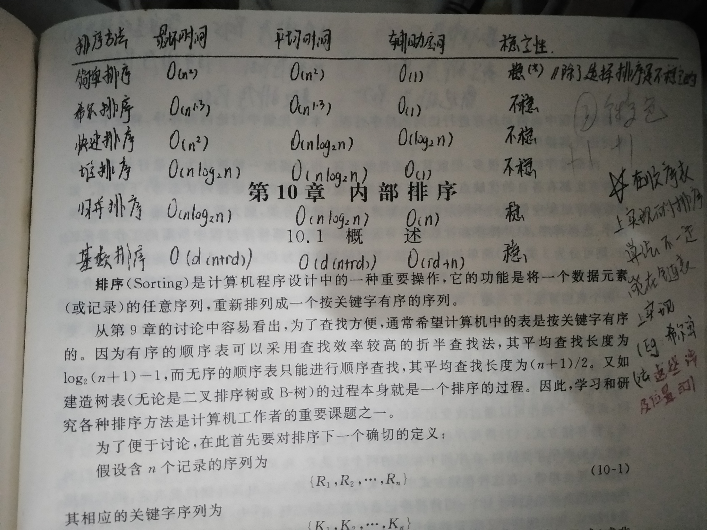

# 知识点

## 子串
若串S=”UP!UP!JD”，则其子串的数目—— 31  
子串公式（n*(n+1)）/2 + 1  
题中字符串有8个字符，若字符各不相同，有8*（8+1）/2+1=37个字串，减去6个重复子串"U" "P" "!" "UP" "P!" "UP!"

## 哈希表
- 核心是确定映射关系
- 映射关系的确定：
  * 直接定址法：H(key)=key或H(key)=a·key+b
  * 数字分析法：对关键字进行分析，取关键字的若干位或其组合作哈希地址(适于关键字位数比哈希地址位数大，且可能出现的关键字事先知道的情况)
  * 平方取中法：取关键字平方后中间几位作哈希地址(适于不知道全部关键字情况)
  * 折叠法：将关键字分割成位数相同的几部分，然后取这几部分的叠加和（舍去进位）做哈希地址(适于关键字位数很多，且每一位上数字分布大致均匀情况)
(移位叠加、间界叠加)
  * 除留余数法：取关键字被某个不大于哈希表表长m的数p除后所得余数作哈希地址，即H(key)=key MOD p，p≤m
(p的选取很重要；p选的不好，容易产生同义词
一般情况下，可以选p为质数或不包含小于20的质因素的合数)
  * 随机数法：H(key)=random(key)适于关键字长度不等的情况

- 处理冲突的方法
  * 开放定址法
  * 再哈希法：若冲突,则后退一格;若还冲突,则后退2格;以此类推
  * 链地址法：若冲突,则冲突位置指向一个数组(数组内是所有冲突的元素)
  * 公共溢出区法

## 排序
- 排序的时间/空间/稳定性(排序后Ra仍领先于Rb,则称为稳定)
- 如图
- 
- 堆排序
  * 建立过程就直接看网上的动画即可,[参考](https://visualgo.net/zh/heap)
  * 具体流程是：①写成完全二叉树;②从第`Math.floor(n/2)`个元素开始筛选;③若为大顶堆,就将大的往上筛,若为小顶堆,则将小的网上筛
  * 小顶堆：递减;大顶堆：递增(在大顶堆建立过程中,最大的元素是放在顺序表的最后一个); 
  * 我们看到的是堆,但其实堆的存储是数组,相当于对我们看到的堆进行层序遍历存储进数组内;