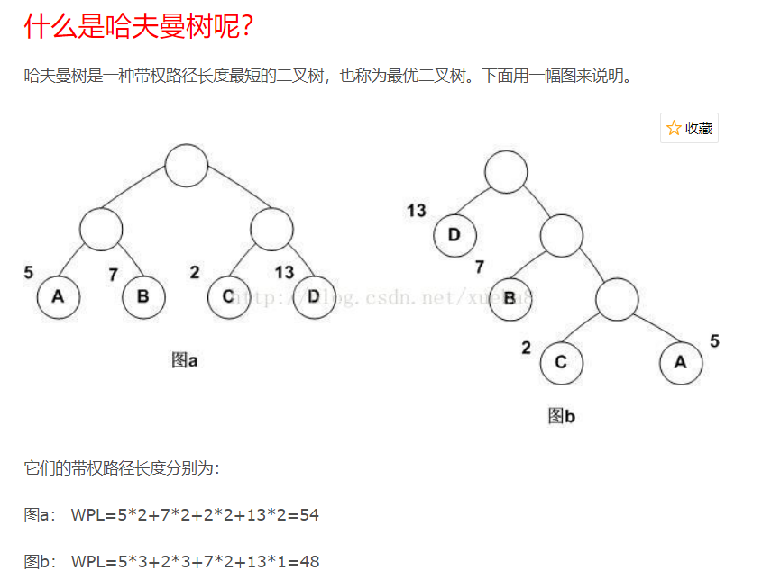
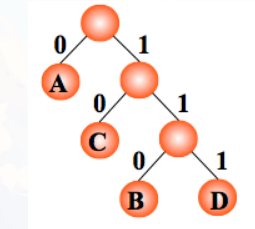
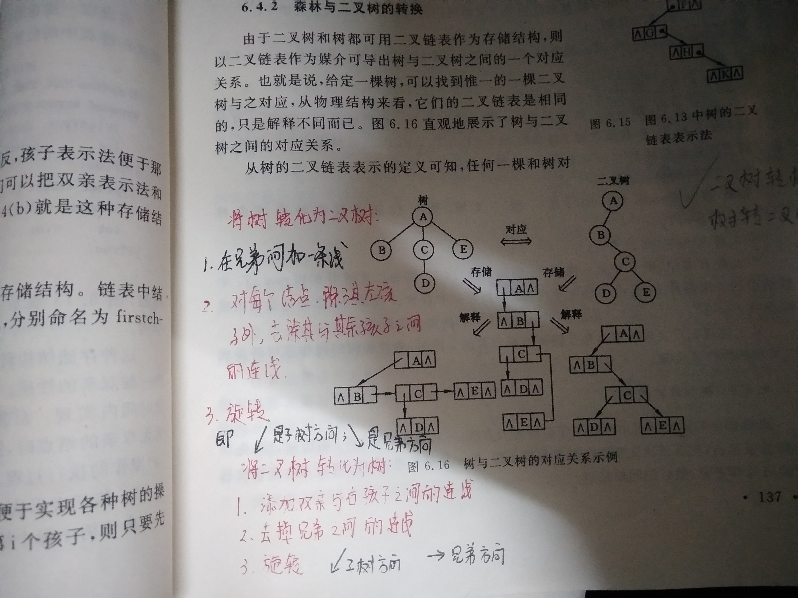
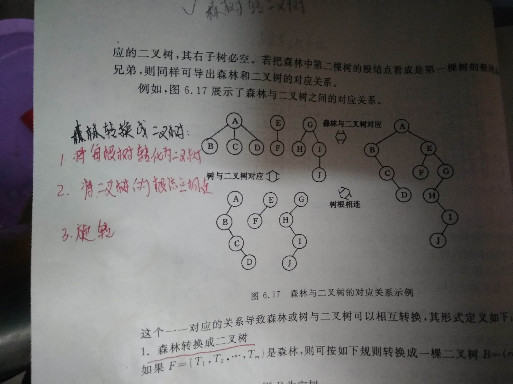

# 知识点

## 子串
若串S=”UP!UP!JD”，则其子串的数目—— 31  
子串公式（n*(n+1)）/2 + 1  
题中字符串有8个字符，若字符各不相同，有8*（8+1）/2+1=37个字串，减去6个重复子串"U" "P" "!" "UP" "P!" "UP!"

## 二叉树节点
### 1
一颗二叉树的叶子节点有5个，出度为1的结点有3个，该二叉树的结点总个数是？  12  
叶子节点=度为2节点+1  
度为2节点=叶子节点-1=5-1=4  
总节点=叶子节点+度为1节点+度为2节点=5+3+4=12

### 2
- 二叉树的第i层最多有2^(i-1)个节点(i≥1)
- 深度为k的二叉树至多有`2^k - 1`个节点(k≥1)
- 满二叉树：(顾名思义)
- 二叉排序树：所有的左子树都小于根节点,所有的右子树都大于根节点的二叉树
- 最优二叉树(哈夫曼树)：
  * 从树的一个节点到另一个节点之间的分支构成这两个节点之间的路径,路径上的分支数目称作"路径长度"
  * 树的路径长度：从树根到每一节点的路径长度之和
  * 树的带权路径长度：树中所有叶子节点的带权路径长度之和
  * 
  * 带权路径长度最小的二叉树,即为哈夫曼树
  * 构建哈夫曼树：不断找到最小的两个节点，形成新的左右子树;将上一步的两个节点的和放回数组;递归......[参考](https://blog.csdn.net/xueba8/article/details/78477892)
  * 哈夫曼树没有度为1的节点
  * 哈夫曼编码：如果一组编码中任一编码都不是其他任何一个编码的前缀，我们称这组编码为前缀编码。哈夫曼树可用于构造最短的不等长编码方案(一般左分支0,右分支1)
  * 
- 完全二叉树：
  * (很有规律的,叶子节点只可能在层次最大的两层上出现)
  * 具有N个节点的完全二叉树的深度为`Math.floor(log(2)N) + 1`
- 先序遍历; 中序遍历; 后序遍历
  * 思路是遇到节点,先思考它是否是根;为根,例如先序遍历
    - 遇见一个节点先思考它是否为根
    - 为根,则跳过找下一级
    - 之后是递归思想,一层层往下,再一层层往上
    - 不管先/中/后,其实都是从根开始的(只是找到了根,不一定去访问根)
- 将树转化为二叉树 
  
- 森林转二叉树
  

## 哈希表
- 核心是确定映射关系
- 映射关系的确定：
  * 直接定址法
  * 数字分析法
  * 平方取中法
  * 折叠法
  * 除留余数法
  * 随机数法
- 处理冲突的方法
  * 开放定址法
  * 再哈希法：若冲突,则后退一格;若还冲突,则后退2格;以此类推
  * 链地址法：若冲突,则冲突位置指向一个数组(数组内是所有冲突的元素)
  * 公共溢出区法

## 排序
- 排序的时间/空间/稳定性(排序后Ra仍领先于Rb,则称为稳定)
- 如图
- 
- 堆排序
  * 建立过程就直接看网上的动画即可,[参考](https://visualgo.net/zh/heap)
  * 具体流程是：①写成完全二叉树;②从第`Math.floor(n/2)`个元素开始筛选;③若为大顶堆,就将大的往上筛,若为小顶堆,则将小的网上筛
  * 小顶堆：递减;大顶堆：递增(在大顶堆建立过程中,最大的元素是放在顺序表的最后一个); 
  * 我们看到的是堆,但其实堆的存储是数组,相当于对我们看到的堆进行层序遍历存储进数组内;