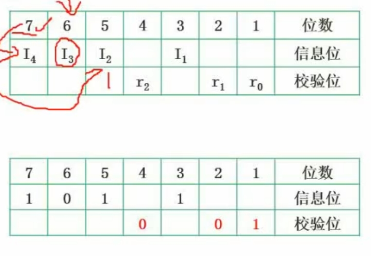

# 软件设计师

- 通过率20% - 30%
- 来自日本
- 上午下午考试时间150分钟, 选择题 + 问答题
  ```js
  软件设计师
  5-29
  9:00-11:30
  基础知识
  14:00-16:30
  应用技术
  http://www.ruankao.org.cn
  考试说明
  http://rsks.gd.gov.cn/zwgk/gzdt/content/post_3248561.html

  网上缴费成功的考生在规定时间内（上半年5月24日9:00－5月28日 17:00，下半年11月1日 9:00－11月5日17:00）登录中国计算机技术职业资格网（http://www.ruankao.org.cn）下载并打印准考证。考生打印准考证后，须认真核对姓名、证件号码、性别等个人信息，如发现有误，要在规定时间（上半年5月28日17:00，下半年11月5日17:00）前通过广东人事考试网“广东省专业技术人员职业资格考试业务办理系统”（http://182.92.48.72:82/）在线申办更正。

  《基础知识》、《综合知识》科目为客观题，在答题卡上填涂作答；《应用技术》、《案例分析》和《论文》科目为主观题，在专用答题卡上作答。信息处理技术员《基础知识》和《应用技术》2个科目合并组织，采用上机方式进行考试。
  　　（一）所有应试人员须严格按照防疫相关要求（详见广东人事考试网－工作动态栏目）参加考试。
  　　（二）报考期间，全省各地级以上市人事考试机构开通咨询服务电话（详见附件）。

  系统架构设计师：11 - 6 日，2021年8月13日9:00－8月23日17:00；
  ```

## 计算机组成与体系结构
### 数据的表示
- R进制转换为十进制的方法都是`按权展开法`, 具体操作方式为：
  * 将R进制的每一位数值用R^k形式表示, 即幂的底数是R, 指数为k, 
  * k与该位和小数点之间的距离有关
    - 当该位位于小数点左边, k值是该位和小数点之间数码的个数
    - 当该位位于小数点右边, k值是负值, 其绝对值是该位和小数点之间数码的个数加1
- 十进制转换为二进制的方法
  ```js
  // 如: 11 转换为 1011
  11 除以 2, 商 5, 余数 1    // 这里的 商5 将作为下一次的被除数
   5 除以 2, 商 2, 余数 1
   2 除以 2, 商 1, 余数 0
  // 将所有的`余数`逆序排列, 最前面加上最后一个`商数`, 即为答案, 如上述的 `1-0-1-1`
  ```
- 将二进制快速转换为八进制或十六进制
  * 从右到左, 每3个二进制位对应一个8进制位
  * 从右到左, 每4个二进制位对应一个16进制位
  * 例如
    ```js
      二进制 = ' 10 001 110'
      八进制 = '  2   1   6'
      二进制 = ' 1000 1110'
    十六进制 = '    8    E'
    ```
- 原码
  * 把一个数转换成二进制
  * 最左边的那一位是符号位, 0 表示 正数, 1 表示 负数
  * 一般是8位数字
- 反码: (`方便原码和补码的相互转换`)
  * 正数的`原码`与`反码`与`补码`是一样的
  * 负数除了`符号位`,其他位上的数字全部取反
- 补码: (`将加减运算统一为加法运算`)
  * 正数的`原码`与`反码`与`补码`是一样的
  * 负数的`补码`是在其`反码`的基础上加`1`
- 移码: (`用作浮点数的阶码`)
  * 将`正数`与`负数`的最高位(符号位)取反
- 数值的表示范围
  ```js
  // 限整数
  // 一个字节, 8个位, 下面的 n 表示 8
  原码：-(2^(n - 1) - 1) ~ 2^(n - 1) - 1
  反码：-(2^(n - 1) - 1) ~ 2^(n - 1) - 1
  补码：-2^(n - 1) ~ 2^(n - 1) - 1
  // 
  ```
- 浮点数运算
  * 浮点数表示：即数学中的科学计数法, `1000`的浮点数是`1.0 x 10^3`
  * 浮点数的加法
    ```js
    // 例如: 1.0 * 10^3 + 1.19 * 10^2
    // 第一步：对阶, 将 1.19 * 10^2 变为 0.119 * 10^3
    1.0 * 10^3 + 0.119 * 10^3
    // 第二步：尾数计算, 1.119*10^3 与 1.0*10^3 与 0.119*10^3 中的 1.0、 0.119、1.119 称为尾数
    1.0 + 0.119 = 1.119
    // 第三步：结果格式化
    尾数的整数部分是`几点几`, 且十进制的尾数的整数部分最大不能超多9
    ```
### 计算机结构
- 结构包括
  ```js
  - 主机
    * 主存储器(内存)
    - CPU
      * 运算器
        - 算术逻辑单元 ALU
        - 累加寄存器 AC
        - 数据缓冲寄存器 DR
        - 状态条件寄存器 PSW
      * 控制器
        - 程序计数器 PC
        - 指令寄存器 IR
        - 程序译码器
        - 时序部件
  ```
- Flynn分类法
  * Flynn根据不同的指令流和数据流组织方式，把计算机系统分成如下4类
  * 单指令流单数据流（SISD）
    - 结构：控制部分 一个; 处理器：一个; 主存部分：一个
    - 特性：
    - 代表：单核处理器系统、386、486、大多数单片机
  * 单指令流多数据流（SIMD）
    - 结构：控制部分 一个; 处理器：多个; 主存部分：多个
    - 特性：各处理器以异步的形式执行同一条指令
    - 代表：并行处理器、`阵列处理器`(典型, 用于处理数组)、超级向量处理器
  * 多指令流单数据流（MISD）
    - 结构：控制部分 多个; 处理器：一个; 主存部分：多个
    - 特性：被证明是不可能, 至少是不实际的
    - 代表：目前不存在, 有文献称流水线计算机为此类
  * 多指令流多数据流（MIMD）
    - 结构：控制部分 多个; 处理器：多个; 主存部分：多个
    - 特性：能够实现作业、任务、指令等各级全面并行
    - 代表：多处理机系统、多计算机
- CISC与RISC
  * CISC
    - Complex Instruction Set Computers, 复杂指令集计算集
    - 指令：数量多, 使用频率差别大, 可变长格式
    - 寻址方式：支持多种
    - 实现方式：微程序控制技术（微码）
    - 其他：研制周期长
  * RISC
    - Reduced Instruction Set Computers, 精简指令集计算集
    - 指令：数量少, 使用频率差别小, 定长格式, 大部分为单周期指令，操作寄存器，只有`Load / Store`操作内存 
    - 寻址方式：支持方式少
    - 实现方式：增加了通用寄存器; 硬布线逻辑控制为主; 适合采用流水线;
    - 其他：优化编译, 有效支持高级语言
- 流水线
  * 考察流水线的计算问题
  * 概念
    ```js
    // 未使用流水线执行指令情况
    —— 取址 ——————— 取址 ————————— 取址
    ——————— 分析 ——————— 分析 ———————— 分析
    —————————— 执行 ————————— 执行 ———————— 执行
    // 使用流水线执行指令情况
    —— 取址-分析-执行
    ———— 取址-分析-执行
    —————— 取址-分析-执行
    ```
  * 例题
    ```js
    // 若指令流水线把一条指令分为取值、分析和执行三部分,且三部分的时间分别是t取值=2ns,t分析=2ns,t执行=1ns。
    // 则流水线周期是多少? 100条指令全部执行完毕需()ns?
    
    流水线周期 = 执行时间最长的一段 = 2纳秒、2纳秒、1纳秒, 这里面最长的是 2纳秒, 故流水线周期是 2纳秒;
    // 优先使用理论情况的公式
    (理论)流水线的计算公式为 = 1条指令执行的时间 + (指令条数 - 1) * 流水线周期 = (2 + 2 + 1) + (100 - 1) * 2 = 203 纳秒
    (实际)流水线的计算公式为 = (一条指令被分成几个部分 + 指令条数 - 1) * 流水线周期 = (3 + 100 - 1) * 2 =  204 纳秒
    该流水线的吞吐率 = 100 / 203
    ```
- 流水线的吞吐率(`单位时间内流水线所完成的任务数量或输出的结果数量`)
  * 公式：
    - 吞吐率 = 指令条数 / 流水线执行时间
    - 最大吞吐率 = 1 / 流水线周期
- 流水线的加速比计算(`完成同样的一批任务, 不使用流水线所用的时间与使用流水线所用的时间之比, 称为流水线的加速比`)
  * 不使用流水线所用的时间
    - 以上述例题为背景, 不使用流水线所用的时间 = (2 + 2 + 1) * 100 = 500
  * 加速比越大越好
- 流水线的效率
  * 例题
    ```js
    // 若指令流水线把一条指令分为4部分,各部分消耗的时间分别是：1纳秒、1纳秒、1纳秒、3纳秒, 执行4条该指令, 则其流水线效率为?
    // 方案：画时空图, 图中的数字表示真正工作的时间, 数字相同表示同一条指令
    流水线效率 = 有数字的格子的面积 / 全部格子的面积 = (1ns + 1ns + 1ns + 3ns) * 4 / 15 * 4 = 2 / 5
    ```
  * 
- 层次化存储结构
  * 速度由快到慢
    - `寄存器`(位于CPU)
    - `Cache`(不是必须的, 因为CPU可以直接与内存交换数据; 但没有Cache, 交换速度极慢)
    - `内存`(主存)
    - `外存`(辐存)：硬盘、光盘、U盘
- Cache
  * 功能
    - 提高CPU数据输入输出的速率,突破冯诺伊曼瓶颈(即CPU与存储系统间数据传送带宽限制)
    - 在计算机存储体系中, Cache是访问速度最快的层次(选项中有`寄存器`的时候,选择`寄存器`)
    - Cache改善系统性能依据的是程序的局部性原理
  * 公式
    - 如果以`h`代表对Cache的访问命中率，`t1`代表Cache的周期时间，`t2`代表主存储器周期的时间，以读操作,使用'Cache＋主存储器'的系统的平均周期为`t3`，则
      * t3 = h * t1 + (1 - h) * t2
    - 其中：`1 - h`又称为失效率
- 局部性原理
  * 概念：相当于程序运行到一个函数体内时,此时访问的变量都是局部作用域里的变量,这些局部变量会被频繁访问
  * 时间局部性：被引用过一次的存储器位置在未来会被多次引用 (将经常被访问的变量声明为全局变量,让所有函数都能访问)(通常是在循环体中)  
  * 空间局部性：如果一个存储器的位置被引用，那么将来他附近的位置也会被引用 (操作数组时, 程序先访问其中一个元素, 又立即访问该元素相邻的元素) 
  * 工作集理论：工作集是进程运行时被频繁访问的页面的集合
- 主存 - 分类
  * 随机存取存储器 `RAM` (断电后存储的信息就丢失)
    - DRAM (Dynamic RAM, 动态RAM) SDRAM
    - SRAM (Static RAM, 静态RAM)
  * 只读存储器 `ROM`
    - MROM
    - PROM
    - EPROM
    - 闪存存储器(flash memory, 闪存)
- 主存 - 编址
  * 概念
    - 内存编址：存储器由一块块存储单元组成，对每一存储单元进行标识，即为内存编址
    - 存储器由若干个芯片组成
    - `存储器大小 = 芯片个数 x 每个芯片的容量`
    - `每个芯片的容量 = 一个地址代表的容量 x 编址总数`
    - 数据总线：
      * 计算机一次处理`n位`的数据,其数据总线的长度为`n`;
      * 数据总线的长度，并不一定代表一个地址的长度
      * 数据总线`宽度`有`z位`，一个`字`就由`z位`组成，如`64位`计算机，一次可以处理`64位`数据
    - 地址总线
      * 需要`x位`二进制数来表示所有的地址, 则地址总数的个数为`x`;
  * 题目
    - 一
      ```js
      // 假如某个存储器只有一个芯片（8*4bit），该芯片的容量为32bit（位）；
      // 计算机每次处理4bit（位）数据；
      // 内存按4bit（位）来编址，那个该芯片有多少个地址，数据总线的长度和地址总线的个数分别是多少？
      - 题目中的`内存按4bit（位）来编址`表示`一个地址代表的容量`;若没有提及,则按`8bit`;
      - 内存容量 = 一个地址代表的容量 * 地址的个数
      - 故,地址的个数 = 32 / 4 = 8个
      - `计算机每次处理4bit（位）数据`, 表示数据总线的长度是`4`
      - 求`地址总数的个数`，需先求`地址的个数`(8个), 看`8`是`几个二进制`表示的, 答案就是`几`
      ```
      * 
      * 
    - 二
      ```js
      // 内存按字节编址，地址从 A4000H 到 CBFFFH ，共有多少个字节?
      CBFFF - A4000 + 1 = 28000 (十六进制)
      28000 (十六进制) 转化为 十进制 = 2 * 16^4 + 8 * 16^3 = 163840 个
      163840 个 / 1024 = 160k 个地址
      // 若用存储容量为32k x 8bit 的存储芯片构成该内存, 至少需要几片?
      因为内存按字节编址, 故总存储 160k * 8bit
      32k x 8bit 表示单片芯片容量, (160k * 8bit)/ (32k * 8bit) = 5(片)
      ```
- 磁盘结构与参数
  * 磁头，磁道(存数据的圆环)，扇区（磁道的某一段）
  * 磁盘存取时间 = 寻道时间 + 等待时间 (即：平均定位时间 + 转动延迟)
    - 寻道时间：磁头移动到磁道所需的时间
    - 等待时间：等待读写的扇区转到磁头下方所用的时间
  * 题目
    - 
    - 
    - 
    - 
    - 磁盘一旦开始工作,就不会停止,会一直匀速转动
    - 题解中的最后一个特殊，其实应该理解称第一个是特殊的，磁头一开始就在`R0`,`R0`只需要`3 + 3`ms
- 总线
  * 分类(根据所处位置不同)
    - 内部总线
    - 系统总线
      * 数据总线：
      * 地址总线：
      * 控制总线：
    - 外部总线
- 系统可靠性分析(串联系统与并联系统)
  * 常考计算题
  * 串联：R1与R2与R3与R4串联，则其可靠性为(一直相乘)：`R = R1 * R2 * R3 * R4`
    - 因为串联中任何一个损坏，都会导致整体故障
  * 并联：R1与R2与R3并联，则可靠性 = `1 - (1 - R1) * (1 - R2) * (1 - R3)`
    - 并联部分有一个能正常运行，则系统能正常运行
  * n模冗余系统与混合系统（少考）
    - R1、R2、Rm都执行统一任务, 各自给出自己的输出接口; 表决器根据所有结果，表决哪一结果最可靠(如: 少数服从多数)
    - 
- 差错控制：CRC与海明校验码
  * 码距：
    - 一个编码系统的码距是整个编码系统中任意(所有)2个码字的最小距离
    - 若用1位长度的二进制编码。若A=1，B=0。这样A,B之间的最小码距为1(`无法检错`)    
    - 若用2位长度的二进制编码。若A=11，B=00。这样A,B之间的最小码距为2(`若`发送了`10`过来,则发现了错误,无法检错)    
    - 若用3位长度的二进制编码。若A=111，B=000。这样A,B之间的最小码距为3  
    - 一个码组内为了`检测`e个误码，要求最小码距d应满足：`d > e + 1`
    - 一个码组内为了`纠正`t个误码，要求最小码距d应满足：`d > 2t + 1`
- 循环校验码CRC
  * 可以检错，不能纠错
  * 二进制左移一位：`01100`左移一位为`11000`
  * 模2加减法：（异或）（相同为0，不同为1）
    ```js
    0 ± 0 = 0
    1 ± 1 = 0
    0 ± 1 = 1
    1 ± 0 = 1

      1 1 0 1
    ± 1 0 0 1
    ---------
      0 1 0 0
    ```
  * 普通的二进制除法(长除法)
    - 类似于十进制的长除法((172 / 4) === 43)
    - 从被除数的首位开始, 当被除数 > 除数, 商对应的位置上写`1`,再做二进制加减法
      * 
  * 模2除法：是指在做除法运算的过程中不计其进位的除法（不向上一位借位）
    - 步骤：
      ```js
      // 假设被除数X，除数P，余数R，
      // 1. X对P做 模2加减法，此时商对应的位置为1
      // 2. 所得余数R，不断左移，直至首位不是0，继续重复步骤1

      // 求 1111000 对 1101 的模2除法（答案 商1011，余数111）
      // 求 10111 对 110 的模2除法 （答案 商110，余数11）
      ```
  * 原始报文为`11001010101`,其生成多项式为`x^4 + x^3 + x + 1`,对其进行CRC编码后的结果为?
    ```js
    多项式为`x^4 + x^3 + x + 1` 暗示2^4、2^3、2^1、2^0位置有1，即`11011`
    再在原始报文 11001010101 的末尾添加 n 个 0，其中0的个数即为`多项式的长度 - 1`, 得到 110010101010000
    用 110010101010000 对 11011 做模2除法，得到一个余数 0011 ，余数替换被除数的末尾4位
    答案 110010101010011
    (110010101010011 对 11011 做模2除法，若其余数为0，则表示传输正确)
    ```
  * [参考1](https://zh.wikihow.com/%E5%81%9A%E4%BA%8C%E8%BF%9B%E5%88%B6%E6%95%B0%E7%9A%84%E9%99%A4%E6%B3%95%E8%BF%90%E7%AE%97)
  * [参考2](https://blog.csdn.net/qq_33411687/article/details/82593466)
- 海明校验码
  * 分为`校验位`和`信息位`
    - 校验位：位于`2^n`位，如`2^0`、`2^1`、`2^2`、`2^3`、`2^4`、`2^5`......
    - 信息位：校验位之间的空位，填充信息位;信息位放的是原信息
    - 若`2^r 刚好 >= k + r + 1`, (k 是信息位个数, r是校验位个数); 再`k + r`，即为海明码的长度
    - 校验位填入什么值?
      ```js
      1011 的海明码 1010101
      // 求校验码对应的值
      位置 3 为信息位，3 的二进制为 011,看`1`的位置，说明它影响了`校验位R0,R1`
      位置 5 为信息位，5 的二进制为 101,看`1`的位置，说明它影响了`校验位R0,R2`
      位置 6 为信息位，6 的二进制为 110,看`1`的位置，说明它影响了`校验位R1,R2`
      位置 7 为信息位，7 的二进制为 111,看`1`的位置，说明它影响了`校验位R0,R1,R2`
      
      位置 1 R0 为校验位，其中`信息位3,5,7`都影响了 R0
      对信息位上的值，做异或操作，得到：1 ⊕ 1 ⊕ 1 = 1，
      位置 1 的值为 1

      同理位置2，R1被`信息位 3,6,7`影响， 1 ⊕ 0 ⊕ 1 = 0，
      同理位置4，R2被`信息位 5,6,7`影响， 1 ⊕ 0 ⊕ 1 = 0，
      // 注意：`异或`需要按照顺序，从低位开始到高位
      最终的海明码：1010101
      ```
      * 
  * 海明码纠错
    - 对收到的`错误的海明码`,重新计算一次校验位,
    - 将原`错误的海明码`的校验位，与计算所得的校验位，按位做异或
    - 如正确的校验码为`001`, 错误的校验码为`000`,按位一一做异或,得到`001`,说明错误的位置是`1`号位
    - 纠正：将该位取反即可
  
  

## 操作系统基本原理
### 概述
- 功能
  * 管理系统的硬件、软件、数据资源
  * 控制程序运行
  * 人机之间的接口
  * 软件与硬件之间的接口
- 包括
  * `进程管理`
    - 进程的状态
    - `前趋图`
    - `PV操作`
    - 死锁问题
  * `存储管理`
    - `段码式存储`
    - 页面置换算法
  * `文件管理`
    - 索引文件
    - `位示图`
  * 作业管理
  * 设备管理
  * `微内核操作系统`
    - 虚设备与SPOOLING技术
### 进程管理 - 进程的状态
- 三态模型：
  * 运行态、
  * 等待态(还差很多资源)
  * 就绪态(还差CPU调度,就能进入运行态(万事具备,只欠东风))
- 五态模型：
  * 运行态
  * 活跃就绪
  * 活跃阻塞
  * 静止就绪
  * 静止阻塞
### 前趋图与PV操作
- 前趋图常结合PV操作一起考察
- 进程同步：
  * 进程具有异步性的特征(各并发执行的进程以各自独立的、不可预知的速度向前推进)
  * 进程同步的例子：要求A指令必须在B指令之前完成
- 进程互斥：
  * 如：同一时间只能有一个进程使用打印机资源
- PV操作
  * 临界资源：一个时间段内只允许一个进程使用的资源称为临界资源。许多物理设备（比如摄像头、打印机）都 属于临界资源。此外还有许多变量、数据、内存缓冲区等都属于临界资源
  * 临界区：访问临界资源的那段代码。进入区和退出区是负责实现互斥的代码段
  * 信号量：是一种特殊的变量，信号量可表示系统中某种资源的数量，其值等于这种资源的剩余数量。信号量的值如果小于0，说明此时有进程在等待这种资源
  * P(S), P表示申请资源, S表示信号量; P(S)的操作流程：
    - 将S = S - 1;
    - `S < 0`, 则 将进程放入`进程队列`,该进程进入`等待态`
    - `S >= 0`, 继续执行当前进程
  * V(S), V表示释放资源, S表示信号量; V(S)的操作流程：
    - 将S = S + 1;
    - `S <= 0`, 在`进程队列`中取出一个进程,唤醒它,令其继续执行
    - `S > 0`, 继续执行当前进程
  * 题目套路
    * 某书店最多允许n个人进入, 则必有`P(Sn)`与`V(Sn)`这一对操作
    * 顾客付款,收银员收款, 这过程有同步操作
      - 必须有顾客提出收费, 收银员才能收费,故收银员进程一开始有`P`操作,该`P操作`显然需要由顾客对应的`V操作`(付款)唤醒
      - 顾客付款需要等待收银员结算,收费,消磁等操作后,才能完成,这中间也存在同步操作,因此顾客发起`V操作(付款)`之后,也发起`P操作(等待收银员完成收银)`
    * 
  * 题目套路二
    - 将前趋图转换成PV操作
      * 注意题目的`P1、P2、P3`对应的信号量并非`S1、S2、S3`
      * 首先,根据待选项与题目的提示,选择各箭头线对应的`信号量`
      * 其次,箭头的`尾部`对应`V操作`,箭头的`箭头部分`对应`P操作`
      * 
      * 
### 死锁
* 概念
  - 各进程互相等待对方手里的资源，导致各进程都阻塞，无法向前推进的现象
  - 至少有2个或2个以上的进程发生死锁
  - 发生死锁时必然处于阻塞态
* 题目：系统有3个进程：A、B、C。这3个进程都需要5个系统资源。如果系统至少有多少个资源, 则不可能发生死锁
  - 答案是`13` = 4 + 4 + 4 + 1
  - 解题思路是：令每一进程还差一个资源就可完成, 求此时的所需资源数, 再加`1`即可
* 产生死锁的4个必要条件(必须同时满足以下4个条件)
  - `互斥条件`：只有对必须互斥使用的资源的争抢才会导致死锁（如哲学家的筷子、打印机设备）。
  * 像内存、扬声器这样可以同时让多个进程使用的资源是不会导致死锁的（因为进程不用阻塞等待这种资源）。
 - `不剥夺条件`：进程所获得的资源在未使用完之前，不能由其他进程强行夺走，只能主动释放。
 - `请求和保持条件`：进程已经保持了至少一个资源，但又提出了新的资源请求，而该资源又被其他进程占有，此时请求进程被阻塞，但又对自己已有的资源保持不放。
 - `循环等待条件`：B进程等待A进程释放资源, C进程等待B进程释放资源, A进程等待C进程释放资源
   * 注意!发生死锁时一定有循环等待，但是发生循环等待时未必死锁
    * 循环等待是死锁的必要不充分条件
  * 如果同类资源数大于1，则即使有循环等待，也未必发生死锁。但如果系统中每类资源都只有一个，那循环等待就是死锁的充分必要条件了
* 死锁的预防
  - 破坏死锁的4个条件
  - 银行家算法
    * 该算法需要检查申请者对资源的最大需求量，如果系统现存的各类资源可以满足申请者的请求，就满足申请者的请求
    * 这样申请者就可以很快完成其计算，然后释放它占用的资源，从而保证了系统中的所有进程都能完成，可避免死锁
  - 安全序列
   * 如果系统按照这种序列分配资源，则每个进程都能顺利完成。
   * 只要能找出一个安全序列，系统就是安全状态
   * 安全序列可能有多个
* 银行家算法题目
  - 
  - 计算系统还剩多少资源
  - 计算进程各自还需多少资源
  - 看先执行哪一进程, 能另该进程完成
### 存储管理 - 分区存储组织
- 分配内存：某计算机系统的内存大小为128K，采用可变分区分配方式进行内存分配，当前系统的内存分块情况如下图所示，现有作业4申请内存9k，几种不同的存储分配算法在分配中，会产生什么样的结果呢？
  * 
  * 首次适应法
    - 遇到第一个空白分区, 若大小适合,立即分配
  * 最佳适应法
    - 将空白分区按大小排序, 从最小空白分区开始尝试,若大小合适,立即分配
    - 缺点：容易产生很多1kb, 2kb的零碎无法利用的空间
  * 最差适应法
    - 将空白分区按大小排序, 从最大空白分区开始尝试,若大小合适,立即分配
  * 循环首次适应法
    - 将内存收尾相连成环, 第一次从25k这一区块开始匹配, 下一次就从28k区块开始匹配
    - 好处是每一区块都有可能被考虑到,避免总盯着几个区块匹配