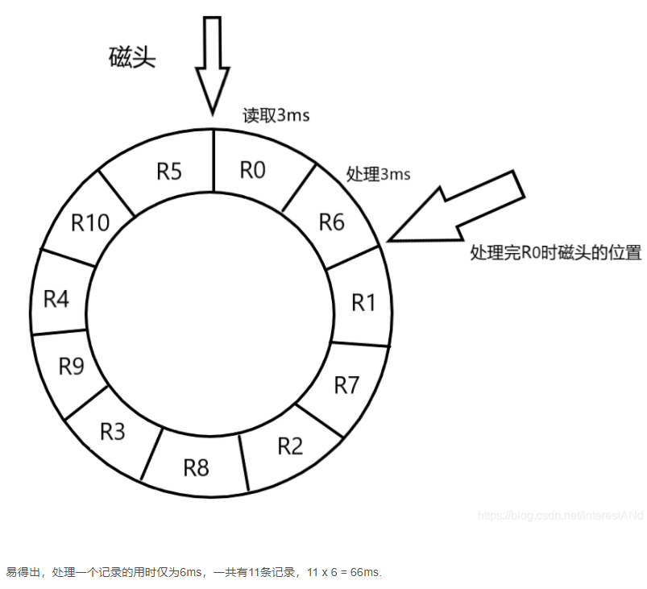
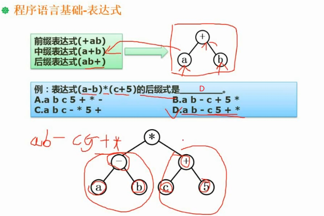

# 软件设计师

- 通过率20% - 30%
- 来自日本
- 上午下午考试时间150分钟, 选择题 + 问答题
  ```js
  软件设计师
  5-29
  9:00-11:30
  基础知识
  14:00-16:30
  应用技术
  http://www.ruankao.org.cn
  考试说明
  http://rsks.gd.gov.cn/zwgk/gzdt/content/post_3248561.html

  网上缴费成功的考生在规定时间内（上半年5月24日9:00－5月28日 17:00，下半年11月1日 9:00－11月5日17:00）登录中国计算机技术职业资格网（http://www.ruankao.org.cn）下载并打印准考证。考生打印准考证后，须认真核对姓名、证件号码、性别等个人信息，如发现有误，要在规定时间（上半年5月28日17:00，下半年11月5日17:00）前通过广东人事考试网“广东省专业技术人员职业资格考试业务办理系统”（http://182.92.48.72:82/）在线申办更正。

  《基础知识》、《综合知识》科目为客观题，在答题卡上填涂作答；《应用技术》、《案例分析》和《论文》科目为主观题，在专用答题卡上作答。信息处理技术员《基础知识》和《应用技术》2个科目合并组织，采用上机方式进行考试。
  　　（一）所有应试人员须严格按照防疫相关要求（详见广东人事考试网－工作动态栏目）参加考试。
  　　（二）报考期间，全省各地级以上市人事考试机构开通咨询服务电话（详见附件）。

  系统架构设计师：11 - 6 日，2021年8月13日9:00－8月23日17:00；
  ```

## 计算机组成与体系结构
### 数据的表示
- R进制转换为十进制的方法都是`按权展开法`, 具体操作方式为：
  * 将R进制的每一位数值用R^k形式表示, 即幂的底数是R, 指数为k, 
  * k与该位和小数点之间的距离有关
    - 当该位位于小数点左边, k值是该位和小数点之间数码的个数
    - 当该位位于小数点右边, k值是负值, 其绝对值是该位和小数点之间数码的个数加1
- 十进制转换为二进制的方法
  ```js
  // 如: 11 转换为 1011
  11 除以 2, 商 5, 余数 1    // 这里的 商5 将作为下一次的被除数
   5 除以 2, 商 2, 余数 1
   2 除以 2, 商 1, 余数 0
  // 将所有的`余数`逆序排列, 最前面加上最后一个`商数`, 即为答案, 如上述的 `1-0-1-1`
  ```
- 将二进制快速转换为八进制或十六进制
  * 从右到左, 每3个二进制位对应一个8进制位
  * 从右到左, 每4个二进制位对应一个16进制位
  * 例如
    ```js
      二进制 = ' 10 001 110'
      八进制 = '  2   1   6'
      二进制 = ' 1000 1110'
    十六进制 = '    8    E'
    ```
- 原码
  * 把一个数转换成二进制
  * 最左边的那一位是符号位, 0 表示 正数, 1 表示 负数
  * 一般是8位数字
- 反码: (`方便原码和补码的相互转换`)
  * 正数的`原码`与`反码`与`补码`是一样的
  * 负数除了`符号位`,其他位上的数字全部取反
- 补码: (`将加减运算统一为加法运算`)
  * 正数的`原码`与`反码`与`补码`是一样的
  * 负数的`补码`是在其`反码`的基础上加`1`
- 移码: (`用作浮点数的阶码`)
  * 将`正数`与`负数`的最高位(符号位)取反
- 数值的表示范围
  ```js
  // 限整数
  // 一个字节, 8个位, 下面的 n 表示 8
  原码：-(2^(n - 1) - 1) ~ 2^(n - 1) - 1
  反码：-(2^(n - 1) - 1) ~ 2^(n - 1) - 1
  补码：-2^(n - 1) ~ 2^(n - 1) - 1
  // 
  ```
- 浮点数运算
  * 浮点数表示：即数学中的科学计数法, `1000`的浮点数是`1.0 x 10^3`
  * 浮点数的加法
    ```js
    // 例如: 1.0 * 10^3 + 1.19 * 10^2
    // 第一步：对阶, 将 1.19 * 10^2 变为 0.119 * 10^3
    1.0 * 10^3 + 0.119 * 10^3
    // 第二步：尾数计算, 1.119*10^3 与 1.0*10^3 与 0.119*10^3 中的 1.0、 0.119、1.119 称为尾数
    1.0 + 0.119 = 1.119
    // 第三步：结果格式化
    尾数的整数部分是`几点几`, 且十进制的尾数的整数部分最大不能超多9
    ```
### 计算机结构
- 结构包括
  ```js
  - 主机
    * 主存储器(内存)
    - CPU
      * 运算器
        - 算术逻辑单元 ALU
        - 累加寄存器 AC
        - 数据缓冲寄存器 DR
        - 状态条件寄存器 PSW
      * 控制器
        - 程序计数器 PC
        - 指令寄存器 IR
        - 程序译码器
        - 时序部件
  ```
- Flynn分类法
  * Flynn根据不同的指令流和数据流组织方式，把计算机系统分成如下4类
  * 单指令流单数据流（SISD）
    - 结构：控制部分 一个; 处理器：一个; 主存部分：一个
    - 特性：
    - 代表：单核处理器系统、386、486、大多数单片机
  * 单指令流多数据流（SIMD）
    - 结构：控制部分 一个; 处理器：多个; 主存部分：多个
    - 特性：各处理器以异步的形式执行同一条指令
    - 代表：并行处理器、`阵列处理器`(典型, 用于处理数组)、超级向量处理器
  * 多指令流单数据流（MISD）
    - 结构：控制部分 多个; 处理器：一个; 主存部分：多个
    - 特性：被证明是不可能, 至少是不实际的
    - 代表：目前不存在, 有文献称流水线计算机为此类
  * 多指令流多数据流（MIMD）
    - 结构：控制部分 多个; 处理器：多个; 主存部分：多个
    - 特性：能够实现作业、任务、指令等各级全面并行
    - 代表：多处理机系统、多计算机
- CISC与RISC
  * CISC
    - Complex Instruction Set Computers, 复杂指令集计算集
    - 指令：数量多, 使用频率差别大, 可变长格式
    - 寻址方式：支持多种
    - 实现方式：微程序控制技术（微码）
    - 其他：研制周期长
  * RISC
    - Reduced Instruction Set Computers, 精简指令集计算集
    - 指令：数量少, 使用频率差别小, 定长格式, 大部分为单周期指令，操作寄存器，只有`Load / Store`操作内存 
    - 寻址方式：支持方式少
    - 实现方式：增加了通用寄存器; 硬布线逻辑控制为主; 适合采用流水线;
    - 其他：优化编译, 有效支持高级语言
- 流水线
  * 考察流水线的计算问题
  * 概念
    ```js
    // 未使用流水线执行指令情况
    —— 取址 ——————— 取址 ————————— 取址
    ——————— 分析 ——————— 分析 ———————— 分析
    —————————— 执行 ————————— 执行 ———————— 执行
    // 使用流水线执行指令情况
    —— 取址-分析-执行
    ———— 取址-分析-执行
    —————— 取址-分析-执行
    ```
  * 例题
    ```js
    // 若指令流水线把一条指令分为取值、分析和执行三部分,且三部分的时间分别是t取值=2ns,t分析=2ns,t执行=1ns。
    // 则流水线周期是多少? 100条指令全部执行完毕需()ns?
    
    流水线周期 = 执行时间最长的一段 = 2纳秒、2纳秒、1纳秒, 这里面最长的是 2纳秒, 故流水线周期是 2纳秒;
    // 优先使用理论情况的公式
    (理论)流水线的计算公式为 = 1条指令执行的时间 + (指令条数 - 1) * 流水线周期 = (2 + 2 + 1) + (100 - 1) * 2 = 203 纳秒
    (实际)流水线的计算公式为 = (一条指令被分成几个部分 + 指令条数 - 1) * 流水线周期 = (3 + 100 - 1) * 2 =  204 纳秒
    该流水线的吞吐率 = 100 / 203
    ```
- 流水线的吞吐率(`单位时间内流水线所完成的任务数量或输出的结果数量`)
  * 公式：
    - 吞吐率 = 指令条数 / 流水线执行时间
    - 最大吞吐率 = 1 / 流水线周期
- 流水线的加速比计算(`完成同样的一批任务, 不使用流水线所用的时间与使用流水线所用的时间之比, 称为流水线的加速比`)
  * 不使用流水线所用的时间
    - 以上述例题为背景, 不使用流水线所用的时间 = (2 + 2 + 1) * 100 = 500
  * 加速比越大越好
- 流水线的效率
  * 例题
    ```js
    // 若指令流水线把一条指令分为4部分,各部分消耗的时间分别是：1纳秒、1纳秒、1纳秒、3纳秒, 执行4条该指令, 则其流水线效率为?
    // 方案：画时空图, 图中的数字表示真正工作的时间, 数字相同表示同一条指令
    流水线效率 = 有数字的格子的面积 / 全部格子的面积 = (1ns + 1ns + 1ns + 3ns) * 4 / 15 * 4 = 2 / 5
    ```
  * 
- 层次化存储结构
  * 速度由快到慢
    - `寄存器`(位于CPU)
    - `Cache`(不是必须的, 因为CPU可以直接与内存交换数据; 但没有Cache, 交换速度极慢)
    - `内存`(主存)
    - `外存`(辐存)：硬盘、光盘、U盘
- Cache
  * 功能
    - 提高CPU数据输入输出的速率,突破冯诺伊曼瓶颈(即CPU与存储系统间数据传送带宽限制)
    - 在计算机存储体系中, Cache是访问速度最快的层次(选项中有`寄存器`的时候,选择`寄存器`)
    - Cache改善系统性能依据的是程序的局部性原理
  * 公式
    - 如果以`h`代表对Cache的访问命中率，`t1`代表Cache的周期时间，`t2`代表主存储器周期的时间，以读操作,使用'Cache＋主存储器'的系统的平均周期为`t3`，则
      * t3 = h * t1 + (1 - h) * t2
    - 其中：`1 - h`又称为失效率
- 局部性原理
  * 概念：相当于程序运行到一个函数体内时,此时访问的变量都是局部作用域里的变量,这些局部变量会被频繁访问
  * 时间局部性：被引用过一次的存储器位置在未来会被多次引用 (将经常被访问的变量声明为全局变量,让所有函数都能访问)(通常是在循环体中)  
  * 空间局部性：如果一个存储器的位置被引用，那么将来他附近的位置也会被引用 (操作数组时, 程序先访问其中一个元素, 又立即访问该元素相邻的元素) 
  * 工作集理论：工作集是进程运行时被频繁访问的页面的集合
- 主存 - 分类
  * 随机存取存储器 `RAM` (断电后存储的信息就丢失)
    - DRAM (Dynamic RAM, 动态RAM) SDRAM
    - SRAM (Static RAM, 静态RAM)
  * 只读存储器 `ROM`
    - MROM
    - PROM
    - EPROM
    - 闪存存储器(flash memory, 闪存)
- 主存 - 编址
  * 概念
    - 内存编址：存储器由一块块存储单元组成，对每一存储单元进行标识，即为内存编址
    - 存储器由若干个芯片组成
    - `存储器大小 = 芯片个数 x 每个芯片的容量`
    - `每个芯片的容量 = 一个地址代表的容量 x 编址总数`
    - 数据总线：
      * 计算机一次处理`n位`的数据,其数据总线的长度为`n`;
      * 数据总线的长度，并不一定代表一个地址的长度
      * 数据总线`宽度`有`z位`，一个`字`就由`z位`组成，如`64位`计算机，一次可以处理`64位`数据
    - 地址总线
      * 需要`x位`二进制数来表示所有的地址, 则地址总数的个数为`x`;
  * 题目
    - 一
      ```js
      // 假如某个存储器只有一个芯片（8*4bit），该芯片的容量为32bit（位）；
      // 计算机每次处理4bit（位）数据；
      // 内存按4bit（位）来编址，那个该芯片有多少个地址，数据总线的长度和地址总线的个数分别是多少？
      - 题目中的`内存按4bit（位）来编址`表示`一个地址代表的容量`;若没有提及,则按`8bit`;
      - 内存容量 = 一个地址代表的容量 * 地址的个数
      - 故,地址的个数 = 32 / 4 = 8个
      - `计算机每次处理4bit（位）数据`, 表示数据总线的长度是`4`
      - 求`地址总数的个数`，需先求`地址的个数`(8个), 看`8`是`几个二进制`表示的, 答案就是`几`
      ```
      * 
      * 
    - 二
      ```js
      // 内存按字节编址，地址从 A4000H 到 CBFFFH ，共有多少个字节?
      CBFFF - A4000 + 1 = 28000 (十六进制)
      28000 (十六进制) 转化为 十进制 = 2 * 16^4 + 8 * 16^3 = 163840 个
      163840 个 / 1024 = 160k 个地址
      // 若用存储容量为32k x 8bit 的存储芯片构成该内存, 至少需要几片?
      因为内存按字节编址, 故总存储 160k * 8bit
      32k x 8bit 表示单片芯片容量, (160k * 8bit)/ (32k * 8bit) = 5(片)
      ```
- 磁盘结构与参数
  * 磁头，磁道(存数据的圆环)，扇区（磁道的某一段）
  * 磁盘存取时间 = 寻道时间 + 等待时间 (即：平均定位时间 + 转动延迟)
    - 寻道时间：磁头移动到磁道所需的时间
    - 等待时间：等待读写的扇区转到磁头下方所用的时间
  * 题目
    - 
    - 
    - 
    - 
    - 磁盘一旦开始工作,就不会停止,会一直匀速转动
    - 题解中的最后一个特殊，其实应该理解称第一个是特殊的，磁头一开始就在`R0`,`R0`只需要`3 + 3`ms
- 总线
  * 分类(根据所处位置不同)
    - 内部总线
    - 系统总线
      * 数据总线：
      * 地址总线：
      * 控制总线：
    - 外部总线
- 系统可靠性分析(串联系统与并联系统)
  * 常考计算题
  * 串联：R1与R2与R3与R4串联，则其可靠性为(一直相乘)：`R = R1 * R2 * R3 * R4`
    - 因为串联中任何一个损坏，都会导致整体故障
  * 并联：R1与R2与R3并联，则可靠性 = `1 - (1 - R1) * (1 - R2) * (1 - R3)`
    - 并联部分有一个能正常运行，则系统能正常运行
  * n模冗余系统与混合系统（少考）
    - R1、R2、Rm都执行统一任务, 各自给出自己的输出接口; 表决器根据所有结果，表决哪一结果最可靠(如: 少数服从多数)
    - 
- 差错控制：CRC与海明校验码
  * 码距：
    - 一个编码系统的码距是整个编码系统中任意(所有)2个码字的最小距离
    - 若用1位长度的二进制编码。若A=1，B=0。这样A,B之间的最小码距为1(`无法检错`)    
    - 若用2位长度的二进制编码。若A=11，B=00。这样A,B之间的最小码距为2(`若`发送了`10`过来,则发现了错误,无法检错)    
    - 若用3位长度的二进制编码。若A=111，B=000。这样A,B之间的最小码距为3  
    - 一个码组内为了`检测`e个误码，要求最小码距d应满足：`d > e + 1`
    - 一个码组内为了`纠正`t个误码，要求最小码距d应满足：`d > 2t + 1`
- 循环校验码CRC
  * 可以检错，不能纠错
  * 二进制左移一位：`01100`左移一位为`11000`
  * 模2加减法：（异或）（相同为0，不同为1）
    ```js
    0 ± 0 = 0
    1 ± 1 = 0
    0 ± 1 = 1
    1 ± 0 = 1

      1 1 0 1
    ± 1 0 0 1
    ---------
      0 1 0 0
    ```
  * 普通的二进制除法(长除法)
    - 类似于十进制的长除法((172 / 4) === 43)
    - 从被除数的首位开始, 当被除数 > 除数, 商对应的位置上写`1`,再做二进制加减法
      * 
  * 模2除法：是指在做除法运算的过程中不计其进位的除法（不向上一位借位）
    - 步骤：
      ```js
      // 假设被除数X，除数P，余数R，
      // 1. X对P做 模2加减法，此时商对应的位置为1
      // 2. 所得余数R，不断左移，直至首位不是0，继续重复步骤1

      // 求 1111000 对 1101 的模2除法（答案 商1011，余数111）
      // 求 10111 对 110 的模2除法 （答案 商110，余数11）
      ```
  * 原始报文为`11001010101`,其生成多项式为`x^4 + x^3 + x + 1`,对其进行CRC编码后的结果为?
    ```js
    多项式为`x^4 + x^3 + x + 1` 暗示2^4、2^3、2^1、2^0位置有1，即`11011`
    再在原始报文 11001010101 的末尾添加 n 个 0，其中0的个数即为`多项式的长度 - 1`, 得到 110010101010000
    用 110010101010000 对 11011 做模2除法，得到一个余数 0011 ，余数替换被除数的末尾4位
    答案 110010101010011
    (110010101010011 对 11011 做模2除法，若其余数为0，则表示传输正确)
    ```
  * [参考1](https://zh.wikihow.com/%E5%81%9A%E4%BA%8C%E8%BF%9B%E5%88%B6%E6%95%B0%E7%9A%84%E9%99%A4%E6%B3%95%E8%BF%90%E7%AE%97)
  * [参考2](https://blog.csdn.net/qq_33411687/article/details/82593466)
- 海明校验码
  * 分为`校验位`和`信息位`
    - 校验位：位于`2^n`位，如`2^0`、`2^1`、`2^2`、`2^3`、`2^4`、`2^5`......
    - 信息位：校验位之间的空位，填充信息位;信息位放的是原信息
    - 若`2^r 刚好 >= k + r + 1`, (k 是信息位个数, r是校验位个数); 再`k + r`，即为海明码的长度
    - 校验位填入什么值?
      ```js
      1011 的海明码 1010101
      // 求校验码对应的值
      位置 3 为信息位，3 的二进制为 011,看`1`的位置，说明它影响了`校验位R0,R1`
      位置 5 为信息位，5 的二进制为 101,看`1`的位置，说明它影响了`校验位R0,R2`
      位置 6 为信息位，6 的二进制为 110,看`1`的位置，说明它影响了`校验位R1,R2`
      位置 7 为信息位，7 的二进制为 111,看`1`的位置，说明它影响了`校验位R0,R1,R2`
      
      位置 1 R0 为校验位，其中`信息位3,5,7`都影响了 R0
      对信息位上的值，做异或操作，得到：1 ⊕ 1 ⊕ 1 = 1，
      位置 1 的值为 1

      同理位置2，R1被`信息位 3,6,7`影响， 1 ⊕ 0 ⊕ 1 = 0，
      同理位置4，R2被`信息位 5,6,7`影响， 1 ⊕ 0 ⊕ 1 = 0，
      // 注意：`异或`需要按照顺序，从低位开始到高位
      最终的海明码：1010101
      ```
      * 
  * 海明码纠错
    - 对收到的`错误的海明码`,重新计算一次校验位,
    - 将原`错误的海明码`的校验位，与计算所得的校验位，按位做异或
    - 如正确的校验码为`001`, 错误的校验码为`000`,按位一一做异或,得到`001`,说明错误的位置是`1`号位
    - 纠正：将该位取反即可
  
  

## 操作系统基本原理
### 概述
- 功能
  * 管理系统的硬件、软件、数据资源
  * 控制程序运行
  * 人机之间的接口
  * 软件与硬件之间的接口
- 包括
  * `进程管理`
    - 进程的状态
    - `前趋图`
    - `PV操作`
    - 死锁问题
  * `存储管理`
    - `段码式存储`
    - 页面置换算法
  * `文件管理`
    - 索引文件
    - `位示图`
  * 作业管理
  * 设备管理
  * `微内核操作系统`
    - 虚设备与SPOOLING技术
### 进程管理 - 进程的状态
- 三态模型：
  * 运行态、
  * 等待态(还差很多资源)
  * 就绪态(还差CPU调度,就能进入运行态(万事具备,只欠东风))
- 五态模型：
  * 运行态
  * 活跃就绪
  * 活跃阻塞
  * 静止就绪
  * 静止阻塞
### 前趋图与PV操作
- 前趋图常结合PV操作一起考察
- 进程同步：
  * 进程具有异步性的特征(各并发执行的进程以各自独立的、不可预知的速度向前推进)
  * 进程同步的例子：要求A指令必须在B指令之前完成
- 进程互斥：
  * 如：同一时间只能有一个进程使用打印机资源
- PV操作
  * 临界资源：一个时间段内只允许一个进程使用的资源称为临界资源。许多物理设备（比如摄像头、打印机）都 属于临界资源。此外还有许多变量、数据、内存缓冲区等都属于临界资源
  * 临界区：访问临界资源的那段代码。进入区和退出区是负责实现互斥的代码段
  * 信号量：是一种特殊的变量，信号量可表示系统中某种资源的数量，其值等于这种资源的剩余数量。信号量的值如果小于0，说明此时有进程在等待这种资源
  * P(S), P表示申请资源, S表示信号量; P(S)的操作流程：
    - 将S = S - 1;
    - `S < 0`, 则 将进程放入`进程队列`,该进程进入`等待态`
    - `S >= 0`, 继续执行当前进程
  * V(S), V表示释放资源, S表示信号量; V(S)的操作流程：
    - 将S = S + 1;
    - `S <= 0`, 在`进程队列`中取出一个进程,唤醒它,令其继续执行
    - `S > 0`, 继续执行当前进程
  * 题目套路
    * 某书店最多允许n个人进入, 则必有`P(Sn)`与`V(Sn)`这一对操作
    * 顾客付款,收银员收款, 这过程有同步操作
      - 必须有顾客提出收费, 收银员才能收费,故收银员进程一开始有`P`操作,该`P操作`显然需要由顾客对应的`V操作`(付款)唤醒
      - 顾客付款需要等待收银员结算,收费,消磁等操作后,才能完成,这中间也存在同步操作,因此顾客发起`V操作(付款)`之后,也发起`P操作(等待收银员完成收银)`
    * 
  * 题目套路二
    - 将前趋图转换成PV操作
      * 注意题目的`P1、P2、P3`对应的信号量并非`S1、S2、S3`
      * 首先,根据待选项与题目的提示,选择各箭头线对应的`信号量`
      * 其次,箭头的`尾部`对应`V操作`,箭头的`箭头部分`对应`P操作`
      * 
      * 
### 死锁
* 概念
  - 各进程互相等待对方手里的资源，导致各进程都阻塞，无法向前推进的现象
  - 至少有2个或2个以上的进程发生死锁
  - 发生死锁时必然处于阻塞态
* 题目：系统有3个进程：A、B、C。这3个进程都需要5个系统资源。如果系统至少有多少个资源, 则不可能发生死锁
  - 答案是`13` = 4 + 4 + 4 + 1
  - 解题思路是：令每一进程还差一个资源就可完成, 求此时的所需资源数, 再加`1`即可
* 产生死锁的4个必要条件(必须同时满足以下4个条件)
  - `互斥条件`：只有对必须互斥使用的资源的争抢才会导致死锁（如哲学家的筷子、打印机设备）。
  * 像内存、扬声器这样可以同时让多个进程使用的资源是不会导致死锁的（因为进程不用阻塞等待这种资源）。
 - `不剥夺条件`：进程所获得的资源在未使用完之前，不能由其他进程强行夺走，只能主动释放。
 - `请求和保持条件`：进程已经保持了至少一个资源，但又提出了新的资源请求，而该资源又被其他进程占有，此时请求进程被阻塞，但又对自己已有的资源保持不放。
 - `循环等待条件`：B进程等待A进程释放资源, C进程等待B进程释放资源, A进程等待C进程释放资源
   * 注意!发生死锁时一定有循环等待，但是发生循环等待时未必死锁
    * 循环等待是死锁的必要不充分条件
  * 如果同类资源数大于1，则即使有循环等待，也未必发生死锁。但如果系统中每类资源都只有一个，那循环等待就是死锁的充分必要条件了
* 死锁的预防
  - 破坏死锁的4个条件
  - 银行家算法
    * 该算法需要检查申请者对资源的最大需求量，如果系统现存的各类资源可以满足申请者的请求，就满足申请者的请求
    * 这样申请者就可以很快完成其计算，然后释放它占用的资源，从而保证了系统中的所有进程都能完成，可避免死锁
  - 安全序列
   * 如果系统按照这种序列分配资源，则每个进程都能顺利完成。
   * 只要能找出一个安全序列，系统就是安全状态
   * 安全序列可能有多个
* 银行家算法题目
  - 
  - 计算系统还剩多少资源
  - 计算进程各自还需多少资源
  - 看先执行哪一进程, 能另该进程完成
### 存储管理 - 分区存储组织
- 分配内存：某计算机系统的内存大小为128K，采用可变分区分配方式进行内存分配，当前系统的内存分块情况如下图所示，现有作业4申请内存9k，几种不同的存储分配算法在分配中，会产生什么样的结果呢？
  * 
  * 首次适应法
    - 遇到第一个空白分区, 若大小适合,立即分配
  * 最佳适应法
    - 将空白分区按大小排序, 从最小空白分区开始尝试,若大小合适,立即分配
    - 缺点：容易产生很多1kb, 2kb的零碎无法利用的空间
  * 最差适应法
    - 将空白分区按大小排序, 从最大空白分区开始尝试,若大小合适,立即分配
  * 循环首次适应法
    - 将内存收尾相连成环, 第一次从25k这一区块开始匹配, 下一次就从28k区块开始匹配
    - 好处是每一区块都有可能被考虑到,避免总盯着几个区块匹配

### 存储管理 - 页式存储组织
- 掌握逻辑地址与物理地址的转化
  * 分为逻辑地址和物理地址是因为，一个`4G`的程序想在`2G`内存上运行,只能逻辑上占用`4G`,实际按需物理载入不大于`2G`,因此会有2个地址
  * 高级语言使用逻辑地址，真实存在与内存的地址称物理地址
  * 分页的最大作用就在于：使得进程的物理地址空间可以是非连续的。
  * 物理内存被划分为一小块一小块，每块被称为帧(Frame)。分配内存时，帧是分配时的最小单位，最少也要给一帧。
  * 在逻辑内存中，与帧对应的概念就是页(Page)。
  * 逻辑地址是由`页号` + `页内地址`组成的
- 题目：逻辑地址转化为物理地址
  * 逻辑地址拆分成`页号` + `页内地址`，需要页面大小。
    - 已知页面大小`4K`，`4K`等于`2^12`,说明一个页的地址是12位,高于`12位`的即为`页号`
    - `5A29H`拆分成被拆分成`5`+`A29`
  * 查表知，页号`5`对应的`页帧号`为`6`(物理地址), `6` + `A29`得到物理地址为`6A29`
  * 页面的淘汰，只能淘汰还在内存里的，且访问位应为`0`
  * 
### 存储管理 - 段式存储组织
- 段式存储包括`段号` + `段内地址`，（`段内地址`包括`段长` + `基址`）
- 段式与页式的区别在于：
  * 页式的帧统一大小且偏小; 帧内只会被一个程序占用
  * 段式的帧不定大小; 帧内存在不同的程序
### 存储管理 - 段页式存储组织
- 缺点：先查段表，再差页表，软件复杂度高，效率低

### 存储管理 - 快表
- 一块小容量的高速缓存器，存放当前访问最频繁的少数活动页面的页号

### 存储管理 - 页面置换算法
- 最优（Optimal，OPT）算法
- 随机（RAND）算法
- （`常考`）先进先出（FIFO）算法，可能抖动
  * 抖动：页面在内存与外存储器之间频繁地调度,调度页面的时间比进程实际运行时间还要长
  * 淘汰页面时，哪一页面先载入的，就淘汰谁
  * 
- （`常考`）最近最少使用（LRU）算法，不会抖动
  * 最近使用过的页面不会被淘汰
- 
- 
  * 解析
    ```js
    由于该8位计算机系统采用虚拟页式存储管理方案，操作系统将进程的每一页离散地分配到主存的多个物理块中，因此，系统需要为每个进程建立一张页面映射表(简称页表)，用于记录每个页面在主存中对应的物理块号。通常，页表存放在主存中。

    // 没有使用快表表示每次查询都需要查询，再取值

    进程在执行时，首先查找页表，然后再取指令或者取数据。
    可见执行16位的swap指令时，首先需要取指令，即先访问页表，取指令的高字节，接着再一次访问页表，取指令的低字节，共需访问主存4次。
    然后取操作数A，访问页表，取操作数A的高字节，再访问页表，取操作数A的低字节，共需访问主存4次。
    同理，取操作数B也需要访问主存4次。
    由以上分析可知，执行swap指令共需要访问`12次主存`。

    题目条件：计算机是按`字节`编址，页面的大小是`1KB`,swap存放在`1023单元`(恰好是最好一个单元),swap是16位指令, 说明swap被存放在2个页面,由图知其一半在`页0`,一半在`页1`
    同理,操作数A位于3071单元,A是16位,操作数A存放在第2页的最后一个单元和第3页的第1个单元
    同理,操作数B位于5119单元,B是16位,操作数B存放在第4页的最后一个单元和第5页的第1个单元中

    在虚拟(请求)分页存储系统中，由CPU的地址变换机构根据页表中的状态位判断是否产生缺页中断，然后调用操作系统提供的中断处理例程。缺页中断的特殊性主要体现在以下两个方面：
    - 缺页中断在指令执行期间产生和进行处理，而不是在一条指令执行完毕之后。所缺的页面调入之后，重新执行被中断的指令。
    - 一条指令的执行可能产生多次缺页中断。
    
    指令只会产生一次缺页，操作数会产生2次缺页(上半部分一次,下半部分也一次),共`5`次
    ```

### 文件管理 - 索引文件结构
- 索引节点一般13个,编号从`0`到`12`
- 直接索引：规定`0到9的节点`为直接索引，直接存`具体内容`
- 一级间接索引：规定`10节点`为一级间接索引，存放其他内存的地址,这些地址对应的内存存放的是`具体内容`
- 二级间接索引：规定`11节点`为二级间接索引, 它存放其他内存的地址A，地址A对应的内存还是存放地址B，地址B对应的内存存放的才是`具体内容`
- 三级间接索引：同理，地址的地址的地址上才是存放的`具体内容`
- 题目
  * 
  * 答案：C |
  * 物理块大小`1KB`，一个地址`4字节`,则`1024B 除以 4B = 256个`,每个盘块能存放256个地址
  * 101号物理块存放的是`二级地址索引表`

### 文件管理 - 文件和树型目录结构
- 考察相对路径和绝对路径的概念
- 文件属性
  * R 只读文件
  * A 存档
  * S 系统文件
  * H 隐藏文件
- 文件名的组成
  * 驱动器号
  * 路径
  * 主文件名
  * 扩展名
### 文件管理 - 空闲存储空间的管理
- 空闲区表法(空闲文件目录)
  * 使用一张表，记录哪些地方是空闲的
- 空闲链表法
  * 把空间区串成一个链表，需要使用空闲区时，再从链表上寻找
- 成组链接法
- 位示图法
  * `1`表示占用,`0`表示空闲
  * 类似于电影购票时选座
  * 第几个`字`从`1`开始算,第几个`位`从`0`开始算
  * 题目
    ```js
    某文件管理系统在磁盘上建立了位示图(bitmap)，记录磁盘的使用情况。
    若磁盘上的物理块依次编号为：0、1、2、…，
    系统中字长为32位，每一位对应文件存储器上的一个物理块，取值0和1分别表示空闲和占用，
    如下图所示。
    假设将4195号物理块分配给某文件，那么该物理块的使用情况在位示图中的第__(1)__个字中描述;系统应该将__(2)__;
　　(1) A. 128          B. 129          C. 131          D. 132 
　　(2) A. 该字的第3位置'0'          B. 该字的第3位置'1';
　　    C. 该字的第4位置'0'          D. 该字的第4位置'1';
    // (正解);第`132`个字(从1开始);把该字的第`3`位置置1(从0开始)
    (解析);
    因为物理块编号是从0开始的，所以4195号物理块其实就是第4196块。
    `因为字长为32位`，也就是说，每个字可以记录32个物理块的使用情况。
    4196/32=131.125，所以，4195号物理块应该在第131个字中（字的编号也是从0开始计数）。
    那么，具体在第131个字的哪一位呢？
    到第130个字为止，共保存了131*32=4192个物理块（0～4191），所以，第4195块应该在第131个字的第3位记录（要注意：0是最开始的位）。
    因为系统已经将4195号物理块分配给某文件，所以其对应的位要置1。
    ```
### 设备管理 - 数据传输控制方式
- 内存与外存的数据传输控制
- 方式
  * 程序控制方式
    - 类似与轮询，不断检测某程序是否完成
  * 程序中断方式
    - 该程序完成，会主动发出信号，通知它已经执行完成了
  * DMA方式
    - 由专门的DMA存取控制器管理，减轻CPU负担
  * (`不考`)通道
  * (`不考`)输入输出处理机
### 设备管理 - 虚设备与SPOOLING技术
- 类似于`虚拟内存`
- 类似于`缓冲区`

### 微内核操作系统
- 把内核做得更小的操作系统，内核更小，出错的可能性更小
- 大内核/单内核/宏内核
	* 将操作系统的主要功能模块都作为系统内核，运行在核心态
	* 优点：高性能；缺点：内核代码庞大，结构混乱，难以维护
- 微内核
	* 只把最基本的功能保留在内核
	* 优点：内核功能少，结构清晰，方便维护；缺点：需要频繁地在核心态和用户态之间切换，性能低
- 非内核功能
	* Ubuntu、CentOS的开发团队，其主要工作是实现非内核功能(GUI等)，而内核都是用了Linux内核

## 数据库
### 三级模式，两级映射
- 概念
  ```js
  外模式：// 即数据库中的`视图`概念
    ↑↓
  外模式 - 概念模式映射：// 相当于不同的`SELECT`语句操作`表`,得到不同的`视图`
    ↑↓
  概念模式：// 即数据库中的`表`的概念
    ↑↓
  概念模式 - 内模式映射：// 存储结构改变，不会改变到`表`
    ↑↓
  内模式：// 数据的存储
  ```
### 数据库设计过程
```js
需求分析 //
  ↓
概念结构设计 // ER模型
  ↓
逻辑结构设计 // 关系模式
  ↓ 
物理设计
```
### E-R模型
- 符号
  * 方框：实体
  * 椭圆：属性
  * 菱形：联系（即1—1、1—N或M—N，即一对一、一对多、多对多）
  * 
- 写法
  * 先写局部E-R图，再逐步集成
- 冲突
  * 属性冲突：属性域冲突、属性取值冲突（如:同样是Teacher表, 一个`性别`字段的取值是`男女`,另一个的`性别`字段的取值是`是否`）
  * 命名冲突：在学生表, `老师`是老师;在职工表,`老师`是职工
  * 结构冲突：不同的抽象级别, `老师`可以是`表`，也可以是`字段`
- E-R模型转化为关系模式
  * 关系模式可以理解为`表`
  * 一个实体型转化为一个关系模式（即1—1、1—N或M—N）
    - `1-1`：最少2个关系模式，一个实体对应一个关系模式，把联系放入任意一个关系模式
    - `1-N`：一个实体对应一个关系模式，把联系放入`N`那一端的关系模式
    - `N-N`：一个实体对应一个关系模式，联系也必须单独一个关系模式
  * 题目：有3个实体m,n,p,它们仨之间的关系是`多对多对多`,则最少需要`4`个关系模式
### 关系代数
- 并 
  * S1 ∪ S2, 
  * S1,S2的字段应一致
- 交
  * S1 ∩ S2 
- 差 
  * S1 -S2
  * 即 S1 - (S1 ∩ S2)
  * S1有,但是S2没有的 
- 笛卡尔积
  * S1 x S2
  *  
- 投影 
  * 即选择列 (只展示所选择的`字段`)
  * 写法：Π(字段名1,字段名2)(表名)
- 选择 
  * 选择行 (只展示所选择的`记录`)
  * 写法：σ(字段名 = 字段值)(表名)
- 连接
  * 自然连接
    - 从笛卡尔积中找出符合条件的记录
    - 与笛卡尔积的区别：连接的表中，相同的字段名只保留一个
    - 注意下图连接符号的写法
    - 下图省略了连接条件：`R1.B = R2.B, R1.C = R2.C`, 连接条件写在连接符号下
    - 
  * 左连接：
    - 在自然连接的基础上加上左边表上不包含自然连接中所含元组（行）的元组
    - 
  * 右连接：
  * 外连接：
    - 左连接 + 右连接
### 规范化理论 - 函数依赖
- 函数：y = f(x) = x^2, 给定`x`就能确定`y`, (但`y不能确定x`, 如`y = 1, x = ±1`)
- X函数决定Y，或称Y函数依赖于X，记为：`X -> Y`
- 举例：学号能确定姓名
- 部分函数依赖
  * (学号, 课程号) -> 姓名
  * 但其实只要`(学号) -> 姓名`即可, `课程号`是多余的
- 传递函数依赖
  * `A -> B -> C` (A确定B, B确定C, B不能确定A(若B能确定A,说明B与A等价, 此时不存在`传递性`), 推论:`A可以确定C`)
### 规范化理论 - 价值与用途
- 非规范化的关系模式，可能存在的问题：数据冗余、更新异常、插入异常、删除异常
### 规范化理论 - 键(候选键)
```js
超键 // 要求最低，能唯一标识元组，可以是单一属性，也可以是属性的组合（可能存在冗余属性）
  ↓ 
候选键 // 消除冗余属性的超键(相当于竞选总统时,候选人有多个;每一个候选键都能充当唯一标识元组)
  ↓ 
主键 // 主键只能有一个(相当于总统)

外键 // 别的表的主键(用于表的关联)
```
- 求解候选键
  * 将关系模式的函数依赖用`有向图`表示
  * 找入度为0的属性，并以该属性为起点，尝试遍历有向图。若能正常遍历图中所有节点，则该属性为该关系模型的候选键
  * 若入度为0的属性集不能遍历图中所有节点，则需要尝试将一些中间节点（既有入度，又有出度）并入入度为0的属性集中，直至该集合能遍历所有节点，该集合为候选键
- 题目
  ```js
  // 给定关系R(A1，A2，A3，A4)上的函数依赖集F={A1→A2，A3→A2，A2→A3，A2→A4}，
  // R的候选关键字为（ ）。
  解：A1
  画图，
  A1 -> A2 -> A3 -> A4 (节点可以重复走)


  // 有关系模式P(A，B，C，D，E，F，G，H，I，J)，
  // 根据语义有函数依赖集FD=(ABD→E，AB→G；B→F，C→J，CJ→I，G→H),求候选码?
  解：ABCD
  画图
  ABD→E 这里的画法不能画成: A→E、B→E、D→E;应该是`ABD`先汇集到一个节点,再连向`E`
  

  // 有关系模式R(A，B，C)，
  // 根据语义有函数依赖集F=(B→C，B→A；A→BC),求R的候选码?
  解：B 或 A
  ```
### 规范化理论 - 范式
- 范式越高，数据粒度越小，表被拆分得越多，会带来性能问题
- 第一范式（最低）
  * 属性值都是不可分的原子值
- 第二范式
  * 在第一范式的基础上，消除了（非主属性对候选键的）部分依赖
  * 即`主键是单属性`
- 第三范式
  * 在第二范式的基础上，消除了（非主属性对候选键的）传递依赖
- BC范式
  * 将关系模式里所有的函数依赖写出来, 函数依赖的左边必须是候选键
- 范式解决的问题：
  * 数据冗余、更新异常、插入异常、删除异常
- 在候选键中出现过的属性都是`主属性`
### 规范化理论 - 第一范式
- 不符合第一范式的例子：多级表头
### 规范化理论 - 例题
- 
  * 部门关系不属于第三范式的原因：只消除了非主属性对码的部分函数依赖，而未消除传递函数依赖（存在"责任人一电话"样的函数依赖）
### 规范化理论 - 模式分解
- 模式分解，即将一个关系模式(表格),拆分成若干个关系模式(表格)
- 模式拆解，需要保证拆解之后，函数依赖不改变(冗余性质的函数依赖可以不管,改不改变无所谓)
- 模式拆解，分为`有损(不能还原)`与`无损`
- 无损分解：表格法
  * 
  * 首行是原表格中的属性;第一列是拆分后的表格(列上的每一元素是一个拆分后的表格)
  * 填充表格：
    - 下面的第几行第几列不算抬头
    - `a`表示当前行所表示的表格的属性包含当前列属性，a的下标1表示这是第一列
      * 如图中`a2`, 表示`AB`中包含`B`
    - `b`表示当前行所表示的表格的属性不包含当前列属性，b的下标表示这是第几行第几列
      * 如图中`b32`表示`CE`中不包含`B`;`32`表示这是第3行第2列
  * 根据每一个函数依赖(`F={A->D,E->D,D->B,BC->D,DC->A}`)对表进行更新
    - 如`A→D`
    - 
    - 看`A`列与`D`列
    - 因为`A`决定`D`，看`A`列中值为`a`的那些行。
      * 如果这些行对应的`D`列也存在`a`，则将这些行对应的`D`列都改成`a`
      * 如果这些行对应的`D`列不存在`a`，则将这些行对应的`D`列都改成第一个`b`(下标同第一个b)
    - 
    - 最终表存在全为`a`的行，因此这是无损分解

### 数据库并发控制
- 事务
  * 原子性：要么全部执行成功，要么全部执行失败并rollback
  * 一致性：事务执行前后，数据保持一致（如转账前后,A账户钱少了,B账户钱多了,但转账前后的钱总数不变）
  * 隔离性：并发事务之间存在隔离，互补干扰
  * 持续性：事务完成后，他对系统的影响是永久的
- 并发产生的问题
  * 丢失更新
  * 不可重复读
  * 读出脏数据
- 解决并发产生的问题
  * 一级封锁协议
    - 防止丢失更新
    - 事务T在修改数据R之前对其加X锁,`直至事务结束才释放`
  * 二级封锁协议
    - 防止丢失更新，还可防止读`脏`数据
    - 一级封锁协议的基础上，事务T在修改数据R之前对其加S锁,`读完后即可释放`
  * 三级封锁协议
    - 防止丢失更新，还可防止读`脏`数据，还可防止重复读
    - 一级封锁协议的基础上，事务T在修改数据R之前对其加S锁,`直至事务结束才释放`
  * 两段锁协议
    - 可串行化的，可能发生死锁
- 封锁协议
  * S封锁：读锁
  * X封锁：写锁
- 死锁问题
  * 预防法
  * 死锁的解除法

### 数据库完整性约束
- 实体完整性: 针对表中行数据（主键不为空或不重复）
- 区域完整性：针对表中列数据（CHECK或数据类型）（例如：年龄只能是1 ~ 120）
- 参照完整性：外键（表与相关联的表的数据的正确）

### 数据库安全
- 用户标识与鉴定
  * 最外层的安保措施，即账号、密码
- 存取控制
  * 对用户的授权，如操作(增、删、查、改)和数据范围
- 密码存储和传输
  * 加密传输数据
- 视图的保护
  * 对视图进行授权
- 审计
  * 使用一个专门的文件，记录用户对数据库的全部操作

### 数据库备份与恢复
- 冷备份：静态备份，在数据库关闭的情况下备份
  * 备份快速，只要复制粘贴即可
  * 只能恢复到某一时间，恢复时要停机
- 热备份：动态备份，在数据库运行的情况下备份
  * 可恢复到任意时间点
- 完全备份
- 差量备份：仅备份上一次完全备份之后变化的数据
- 增量备份：备份上一次备份之后变化的数据
- 静态海量转储：在系统中无运行事务时进行，每次转储全部数据库
- 静态增量转储：在系统中无运行事务时进行，每次只转储上一次转储后更新过的数据
- 动态海量转储：转储期间允许对数据库进行存取或修改，每次转储全部数据库
- 动态增量转储：转储期间允许对数据库进行存取或修改，每次只转储上一次转储后更新过的数据
- 故障与恢复
  * 事务本身的可预期的故障：rollback
  * 事务本身不可预期的故障：内存溢出等
  * 系统故障：停电停机
  * 介质故障：机房失火
### 数据仓库与数据挖掘
- 随时间推移，数据库存储的数据会越来越多，性能越来越低，需要定期清理数据
- 被清理的数据一般需要被转移到数据仓库中
- 方法：决策树、神经网络、遗传算法、关联规则挖掘算法
- 分类：
  * 关联分析：挖掘处隐藏在数据间的相互关系
  * 序列模式分析：侧重分析数据的前后关系（因果关系）
  * 分类分析：为每一个记录添加标识后再标记分类
  * 聚类分析：分类分析法的逆过程

### 反规范化技术
- 数据库越规范化，表越多，性能变差

### 大数据基本概念

-------------------------------------------------------------
## 第六章 系统安全分析与设计
### 信息系统安全属性
- 保密性：最小授权原则(不过多授权)、信息加密
- 完整性：校验码、数字签名、安全协议
- 可用性：IP过滤
- 不可依赖性：数字签名
### 非对称加密
- 加密、解密的钥不一样
- 常见的非对称加密算法（速度慢、强度高）：
  * RSA：512位（1024位）密钥、计算量大、难破解
  * Elgamal：基于`Diffie-Hellman`密钥交换算法
  * 其他非对称加密：背包算法、Rabin、D-H、ECC椭圆曲线算法
- 常见的对称加密算法：
  * DES
    - `替换字符 + 字符移位`，速度快，容易产生密钥
  * 三重DES
    - 有2个56位的密钥K1,K2
    - 加密：K1加密 → K2解密 → K1加密
    - 解密：K1解密 → K2加密 → K1解密
  * AES
  * RC-5
  * IDEA算法
### 信息摘要
- 即信息的特征值，原始信息改变，特征值也改变
- MD5、SHA
  * 单向散列(hash)函数，明文可以生成特征值，但特征值不能恢复为明文
  * SHA的散列值比MD5更长，安全性更高
- 用于验证信息是否被篡改
  * 客户端接收到`明文+摘要1`,客户端根据收到的`明文`生成`摘要2`
  * 对比`摘要1`与`摘要2`，若相同，则明文未被篡改
  * 但可能明文被篡改，摘要也被篡改，导致无法验证，此时需要`数字签名`
### 数字签名
- 服务器发送数据时，根据明文生成摘要，对摘要进行签名：用服务器的`私钥`加密（`数字签名`的过程）
- 客户端收到数据时，用服务器的`公钥`解密（`数字签名的验证`过程）
- 数字签名只有验证身份的作用，没有加密的作用，因为它用的`公钥`解密

### 数字信封与PGP
- 数字信封
 * 发送方将明文用`对称密钥`加密，再用接收方的`公钥`加密`对称密钥`，再一起发送出去
 * 接收方用自己的`私钥`解密得到`对称密钥`，再用`对称密钥`解密获得原文
- PGP
  * PGP能用于电子邮件，云盘文件存储
  * PGP承认2种证书：PGP证书、X.509证书
    - PGP证书：
    - X.509证书：包含了`主体公钥信息`
- 数字证书上都有的：持有者的公钥，持有者的信息，证书颁发机构的数字签名，证书有效期等

### 设计邮件加密系统
- 要求邮件以加密方式传输，邮件最大附件内容可达500MB，发送者不可抵赖，若邮件被第三方截获，第三方不可篡改
  * 

### 各个网络层次的安全保障
- 

### 网络威胁与攻击
- 重放攻击(ARP)：所截获的某次合法的通信数据拷贝，出于非法的目的而被重新发送
- 拒绝服务（DOS）：对信息或其他资源的合法访问被无条件阻止
- 旁路控制：攻击者利用系统的安全缺陷或安全性上的脆弱之处获得非授权的权利或特权
- 破坏信息完整性：对传输的信息进行增删改
- 假冒身份：通过欺骗通信系统达到非法用户冒充成为合法用户，或者特权小的用户冒充成为特权大的用户的目的
- 授权侵犯/内部攻击：被授权以某一目的使用某一系统或资源的个人，却将此权限用于其他非授权目的
- 木马
- 陷阱门：当系统接收到某一数据时，触发'机关'
- 抵赖：这是一种来自用户的攻击，比如：否认自己曾经发布过的某条消息、伪造一份对方来信等等
- 窃听：用各种手段窃取系统中的信息资源和敏感信息
- 业务流分析：通过对系统进行`长期窃听`，利用统计分析方法对诸如通信频度、通信的信息流向、通信总量的变化等参数分析，从而发现有价值的信息和规律
- 非授权访问
- 信息泄漏：将信息泄漏给非授权实体
- 分类
  * 主动：直接影响源站和目的站的通信内容，如中断，篡改，伪造等
  * 被动：主要是收集信息而不是进行访问，数据的合法用户对这种活动察觉不到
### 防火墙技术
- 分类
  * 网络级（屏蔽路由器，某一IP段的网络请求就都不接受；只检查网络头部信息，不检测具体内容）
    - 包过滤
    - 状态检测
  * 应用级（会具体检查网络包内的内容）
    - 屏蔽主机
    - 屏蔽子网
      * 解决防火墙`防外不防内`的缺陷（但`DMZ`之外的内部程序不被保护）
      * 构建一个`DMZ`(非军事区,在外网与内网之间，它既不属于外部网络，也不属于内部网络)
      * `DMZ`一般放对外提供服务的服务器：web服务器、邮件服务器
      * `DMZ`内由多道防火墙组成，内部攻击`web服务器、邮件服务器`时，也会走防火墙
    - 双穴主机

## 第八章 程序设计语言与语言处理程序基础
### 编译过程
- 解释型
  * 敲完代码，一会车，IDE后台就开始运行，立刻提醒你有语法错误
- 编译型
  * 程序全部编好，点击`RUN`，IDE将其变为可执行程序，再执行
- 编译型的流程
  ```js
  源代码
    ↓
  词法分析 // `词`级别的问题能被发现(关键词是否写错)
    ↓
  语法分析 // `句`级别的问题能被发现
    ↓
  语义分析 // 例如：零除错误、循环是否有终止
    ↓
  中间代码生成
    ↓
  代码优化
    ↓
  目标代码生成 // 中间代码转成更低级的代码
    ↓
  目标程序
  ```
### 文法定义
- 一个形式文法是一个有序四元组G={V,T,S,P},其中：
  ```js
  V: 非终结符。nonterminal 。不是语言组成部分，不是最终结果，可理解为占位符
  T：终结符。Terminal 。是语言的组成部分，是最终结果。V ∩ T = ∅ 
  S：起始符。是语言的开始符号。
  P：产生式。用终结符替代非终结符的规则。
  ```
- 文法类型
  * 0型
    - 短语文法
  * 1型
    - 上下文有关文法
  * 2型
    - 上下文无关文法
  * 3型
    - 正规文法（有限自动机）
### 有限自动机(DFA, Deterministic Finite State)
- 读图
  * 一般`S`表示开始，`双圈`表示结束
  * 常考`该自动机可识别`，结束时必须到`终态`
- 
### 正规式
- 对`有限自动机`的另一种表达形式
- 正规式：正则表达式，表示正规集的工具。
- 一个正规式对应一个正规文法（3型文法）,之间能够进行准换
  * 三个基本规则：
  * A → xB, B → y  则 A = xy。
  * A → xA|y  则A = x*y  ( `x*` 代表 x 从 0到无穷 多个）
  * A → x, A → y 则A = x|y
- 正规式主要用到了递归的思想，无论遇到多复杂的正规式都可以拆分成上面这三种形式，然后进行解题。
- 概念
  * 正规式a，表示单一字符a，对应的正规集{a}。
  * 正规式a|b，表示单一字符a或者b，对应有2个元素的正规集{a,b}。
  * 正规式ab，表示由两个字符ab的元素，对应只有1个元素的正规集{ab}。
  * 正规式ab(a|b)，ab是确定的部分，然后再添加a或b，对应正规集{aba,abb}。
  * 正规式a*，*表示任意个，对应正规集{Φ,a,aa,aaa,...}。
  * 正规式(a|b)*，可以表示任意由a、b组成的串的集合，对应正规集{Φ,a,b,ab,aa,bb...}。
- 题目
  ```js
  下面文法G[S]它无法识别(D),
  此文法对应正规式为()。 
  G[S]: 
  S → aA|bB 
  A → bS|b 
  B → aS|a
  A. ababab B.bababa C. abbaab D. babbaA

  // 解题思路
  先写成：
  S → aA
  S → bB 
  A → bS
  A → b 
  B → aS
  B → a
  将D选项`babbaA`代入
  起点S
  ba 看`S → bB`
  bab 中 ab 看 `B → aS`
  babb 中 bb 走不下去了
  即：
  b B
    a S
      b B
  ```
- [参考](https://blog.csdn.net/kafmws/article/details/96999372)

### 表达式
- 前缀表达式(+ab)
- 中缀表达式(a+b)
- 后缀表达式(ab+)
- 其实对应`先序 中序 后序`遍历
-   
### 函数调用-传值与传址
- 略
### 多种程序语言特点
- Fortran语言(第一个高级程序设计语言，科学计算，执行效率高）
- Pascal语言（结构化程序设计语言，表达能力强，Delphi）
- C语言（通用、结构化程序设计语言，指针操作能力强，高效）
- Lisp语言（函数式程序语言，符号处理，人工智能）
- C++语言（C语言基础上增加了类机制，面向对象，高效，与C兼容）
- Java语言（面向对象，中间代码，跨平台，通用的程序设计语言）
- Python（面向对象，解释型程序设计语言，胶水语言，通用的脚本语言）
- PHP（服务器端脚本语言，制作动态网页）
- Ruby（简单快捷、面向对象、脚本语言）
- Delphi（快速应用程序开发工具，可视化编程环境）
- COBOL（数据处理领域最为广泛的程序设计语言，高级编程语言）
- XML（可扩展标记语言，标准通用标记语言的子集 ）
- PROLOG（逻辑式语言，间接性，表达能力强，建造专家系统、数据库、自然语言理解、智能知识库等）
- 注：C/C++常被用于操作系统开发；脚本语言是解释性语言。
